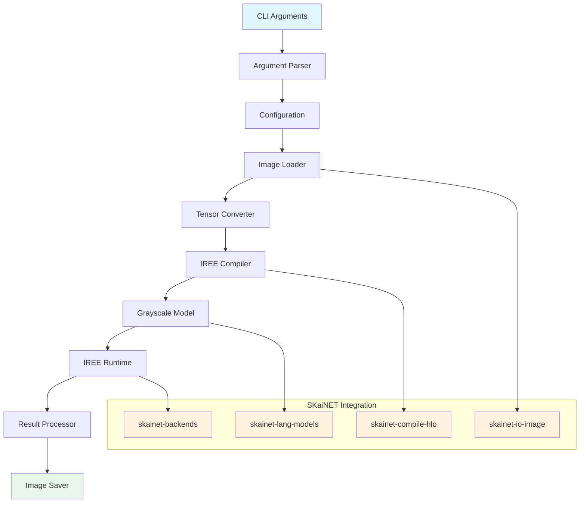
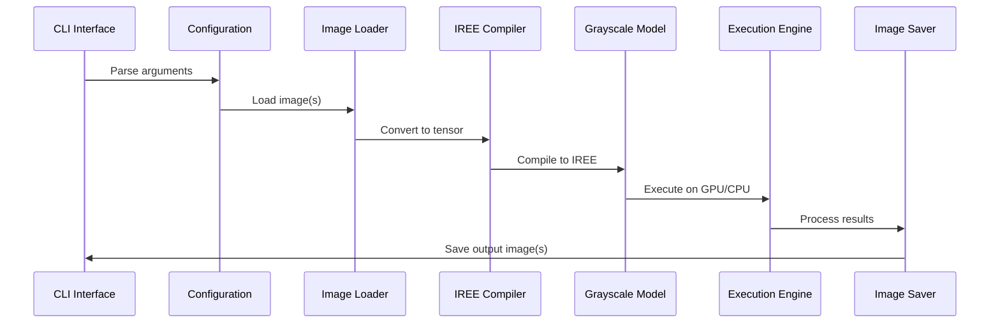

# Grayscale Image Processing CLI Design Document

## Overview

This design document outlines the implementation of a command-line interface (CLI) application for converting color images to grayscale using SKaiNET's neural network capabilities with StableHLO compilation for deployment on NVIDIA Jetson devices. The application will integrate existing SKaiNET components including grayscale conversion models, image I/O functionality, and HLO compilation to create a high-performance edge computing solution.

The CLI will serve as a practical demonstration of SKaiNET's capabilities while providing a useful tool for image processing workflows on edge devices. It leverages the MLIR/IREE compilation pipeline to achieve optimal performance on NVIDIA hardware without requiring manual CUDA kernel development.

IREE provides several advantages for Jetson deployment:
- **Direct GPU Control**: More granular control over GPU execution compared to XLA
- **Edge Optimization**: Specifically designed for edge and mobile deployment scenarios
- **Memory Efficiency**: Better memory management for resource-constrained devices
- **Flexible Backends**: Support for CUDA, Vulkan, and CPU backends with easy switching

## Architecture

### High-Level Architecture

The application follows a modular pipeline architecture that separates concerns and enables easy testing and maintenance:



### Component Architecture

The application is structured into several key components:

1. **CLI Interface Layer**: Handles command-line argument parsing and user interaction
2. **Configuration Layer**: Manages application settings and model selection
3. **Image Processing Pipeline**: Orchestrates the image processing workflow
4. **IREE Compilation Layer**: Compiles models to optimized CUDA code via IREE
5. **Execution Layer**: Manages model execution and resource allocation using IREE runtime
6. **I/O Layer**: Handles image loading and saving operations

### Data Flow Architecture



## Components and Interfaces

### CLI Interface

The main entry point that handles command-line argument parsing and orchestrates the processing pipeline:

```kotlin
public class GrayscaleImageCli {
    public fun main(args: Array<String>)
    private fun parseArguments(args: Array<String>): CliConfiguration
    private fun processImages(config: CliConfiguration): ProcessingResult
    private fun reportResults(result: ProcessingResult)
}

public data class CliConfiguration(
    val inputPath: String,
    val outputPath: String?,
    val modelType: GrayscaleModelType,
    val batchMode: Boolean,
    val useGpu: Boolean,
    val verbose: Boolean
)

public enum class GrayscaleModelType {
    RGB2GRAYSCALE,
    RGB2GRAYSCALE_MATMUL
}
```

### Image Processing Pipeline

The core processing pipeline that orchestrates the conversion workflow:

```kotlin
public class ImageProcessingPipeline(
    private val imageLoader: ImageLoader,
    private val ireeCompiler: IreeCompiler,
    private val executionEngine: ExecutionEngine,
    private val imageSaver: ImageSaver
) {
    public suspend fun processImage(
        inputPath: String,
        outputPath: String,
        config: ProcessingConfiguration
    ): ProcessingResult
    
    public suspend fun processBatch(
        inputDirectory: String,
        outputDirectory: String,
        config: ProcessingConfiguration
    ): BatchProcessingResult
}

public data class ProcessingConfiguration(
    val modelType: GrayscaleModelType,
    val useGpu: Boolean,
    val executionContext: ExecutionContext
)
```

### Image Loader

Handles loading images from various formats and converting them to tensors:

```kotlin
public class ImageLoader {
    public fun loadImage(path: String): LoadedImage
    public fun loadImagesFromDirectory(directory: String): List<LoadedImage>
    public fun imageToTensor(image: LoadedImage, context: ExecutionContext): Tensor<FP16, Float>
    
    private fun validateImageFormat(path: String): Boolean
    private fun getSupportedFormats(): Set<String>
}

public data class LoadedImage(
    val path: String,
    val platformImage: PlatformBitmapImage,
    val width: Int,
    val height: Int,
    val format: String
)
```

### IREE Compiler

Compiles grayscale models to StableHLO MLIR format and then to IREE bytecode for optimal execution:

```kotlin
public class IreeCompiler {
    public fun compileModel(
        model: Model<FP16, Float, *, *>,
        context: ExecutionContext
    ): CompiledModel
    
    public fun generateStableHlo(
        graph: ComputeGraph,
        functionName: String = "grayscale_convert"
    ): StableHloModule
    
    public fun compileToIree(
        hloModule: StableHloModule,
        targetDevice: IreeTargetDevice = IreeTargetDevice.CUDA
    ): IreeBytecode
    
    private fun optimizeHlo(module: StableHloModule): StableHloModule
}

public data class CompiledModel(
    val hloModule: StableHloModule,
    val ireeBytecode: IreeBytecode,
    val executionPlan: ExecutionPlan,
    val metadata: ModelMetadata
)

public enum class IreeTargetDevice {
    CUDA,
    CPU,
    VULKAN
}

public data class IreeBytecode(
    val bytecode: ByteArray,
    val targetDevice: IreeTargetDevice,
    val metadata: Map<String, Any>
)
```

### Execution Engine

Manages model execution with IREE runtime, GPU/CPU fallback and resource management:

```kotlin
public class ExecutionEngine {
    public suspend fun executeModel(
        compiledModel: CompiledModel,
        input: Tensor<FP16, Float>,
        context: ExecutionContext
    ): Tensor<FP16, Float>
    
    public fun createExecutionContext(useGpu: Boolean): ExecutionContext
    public fun createIreeSession(bytecode: IreeBytecode): IreeSession
    private fun detectGpuCapabilities(): GpuCapabilities
    private fun fallbackToCpu(reason: String): ExecutionContext
}

public data class GpuCapabilities(
    val cudaAvailable: Boolean,
    val memoryMB: Long,
    val computeCapability: String,
    val ireeSupported: Boolean
)

public interface IreeSession {
    suspend fun invoke(inputs: List<Tensor<*, *>>): List<Tensor<*, *>>
    fun close()
}
```

### Image Saver

Handles saving processed tensors back to image files:

```kotlin
public class ImageSaver {
    public fun saveImage(
        tensor: Tensor<FP16, Float>,
        outputPath: String,
        originalFormat: String,
        context: ExecutionContext
    ): SaveResult
    
    public fun generateOutputPath(inputPath: String, suffix: String = "_gray"): String
    private fun tensorToImage(tensor: Tensor<FP16, Float>, context: ExecutionContext): PlatformBitmapImage
}

public data class SaveResult(
    val outputPath: String,
    val success: Boolean,
    val error: String? = null
)
```

## Data Models

### Processing Results

```kotlin
public data class ProcessingResult(
    val inputPath: String,
    val outputPath: String,
    val processingTimeMs: Long,
    val success: Boolean,
    val error: String? = null,
    val metadata: ProcessingMetadata
)

public data class BatchProcessingResult(
    val totalImages: Int,
    val successfulImages: Int,
    val failedImages: Int,
    val totalProcessingTimeMs: Long,
    val results: List<ProcessingResult>
)

public data class ProcessingMetadata(
    val originalSize: Pair<Int, Int>,
    val modelUsed: GrayscaleModelType,
    val executionContext: String,
    val hloCompiled: Boolean
)
```

### Error Handling

```kotlin
public sealed class GrayscaleCliError : Exception() {
    public data class ImageLoadError(
        val path: String,
        val reason: String
    ) : GrayscaleCliError()
    
    public data class CompilationError(
        val modelType: GrayscaleModelType,
        val reason: String
    ) : GrayscaleCliError()
    
    public data class ExecutionError(
        val context: String,
        val reason: String
    ) : GrayscaleCliError()
    
    public data class SaveError(
        val outputPath: String,
        val reason: String
    ) : GrayscaleCliError()
}
```

## Correctness Properties

*A property is a characteristic or behavior that should hold true across all valid executions of a system-essentially, a formal statement about what the system should do. Properties serve as the bridge between human-readable specifications and machine-verifiable correctness guarantees.*

### Property Reflection

After reviewing all properties identified in the prework, several consolidations were made:
- Properties about image format support (4.1, 4.2) were consolidated into format handling properties
- Properties about error handling (5.1, 5.2, 5.4) were grouped into comprehensive error handling properties
- Properties about batch processing (7.1-7.4) were consolidated into batch operation properties
- Properties about SKaiNET integration (8.1-8.5) were grouped into integration properties

### Core Functionality Properties

Property 1: Image Loading and Tensor Conversion
*For any* valid image file path, the system should successfully load the image and convert it to a tensor with correct shape (1, 3, H, W)
**Validates: Requirements 1.1**

Property 2: Grayscale Conversion Correctness
*For any* RGB tensor with shape (1, 3, H, W), the grayscale conversion should produce a single-channel tensor with shape (1, 1, H, W) using the correct luminance weights
**Validates: Requirements 1.2**

Property 3: Image Saving Functionality
*For any* grayscale tensor with shape (1, 1, H, W), the system should successfully save it as an image file at the specified output path
**Validates: Requirements 1.3**

### Command-Line Interface Properties

Property 4: Input Path Argument Parsing
*For any* command-line invocation with --input flag, the system should correctly extract and validate the input image file path
**Validates: Requirements 2.1**

Property 5: Output Path Argument Parsing
*For any* command-line invocation with --output flag, the system should correctly extract the output path and use it for saving results
**Validates: Requirements 2.2**

Property 6: Default Output Path Generation
*For any* input image path when no output path is specified, the system should generate an output filename with "_gray" suffix in the same directory
**Validates: Requirements 2.3**

Property 7: Model Selection Functionality
*For any* valid model type specified via --model flag, the system should instantiate and use the corresponding grayscale conversion model
**Validates: Requirements 2.4**

### HLO Compilation Properties

Property 8: StableHLO to IREE Compilation
*For any* grayscale conversion model, the system should successfully compile it to valid StableHLO MLIR format and then to IREE bytecode
**Validates: Requirements 3.1**

Property 9: GPU Context Preference
*For any* execution environment where GPU is available, the system should prefer GPU execution context over CPU
**Validates: Requirements 3.3**

Property 10: Compilation Fallback Handling
*For any* IREE compilation failure, the system should fallback to CPU execution and emit appropriate warning messages
**Validates: Requirements 3.5**

### Image Format Support Properties

Property 11: Multi-Resolution Image Handling
*For any* input image regardless of resolution, the system should process it correctly without requiring manual resizing
**Validates: Requirements 4.3**

Property 12: Format Preservation
*For any* input image format when output format is not specified, the system should preserve the original image format in the output
**Validates: Requirements 4.4**

Property 13: Unsupported Format Error Handling
*For any* unsupported image format, the system should emit clear error messages without crashing
**Validates: Requirements 4.5**

### Error Handling Properties

Property 14: Missing File Error Handling
*For any* non-existent input file path, the system should emit clear error messages and exit gracefully
**Validates: Requirements 5.1**

Property 15: Permission Error Handling
*For any* output directory that is not writable, the system should report permission errors with helpful guidance
**Validates: Requirements 5.2**

Property 16: Image Loading Error Details
*For any* image loading failure, the system should provide specific error details about the nature of the failure
**Validates: Requirements 5.4**

### Dependency and Platform Properties

Property 17: CUDA Driver Detection
*For any* system where CUDA drivers are missing, the system should provide clear installation guidance
**Validates: Requirements 6.3**

Property 18: CPU-Only Execution Support
*For any* development machine without GPU, the system should work correctly with CPU-only execution
**Validates: Requirements 6.4**

Property 19: Missing Dependency Reporting
*For any* missing system dependencies, the system should report specific missing components with helpful guidance
**Validates: Requirements 6.5**

### Batch Processing Properties

Property 20: Directory Batch Processing
*For any* directory path provided as input, the system should process all supported image files in the directory
**Validates: Requirements 7.1**

Property 21: Batch Progress Reporting
*For any* batch processing operation, the system should report progress for each processed image
**Validates: Requirements 7.2**

Property 22: Directory Structure Preservation
*For any* batch processing with output directory specified, the system should preserve the relative directory structure of input files
**Validates: Requirements 7.3**

Property 23: Batch Error Resilience
*For any* batch processing operation where some images fail, the system should continue processing remaining images
**Validates: Requirements 7.4**

### Integration Properties

Property 24: SKaiNET Model Integration
*For any* grayscale conversion operation, the system should utilize existing Rgb2GrayScale or Rgb2GrayScaleMatMul models from skainet-lang-models
**Validates: Requirements 8.1**

Property 25: Image I/O Module Integration
*For any* image loading or saving operation, the system should use functions from the skainet-io-image module
**Validates: Requirements 8.2**

Property 26: HLO Compilation Module Integration
*For any* model compilation operation, the system should use the skainet-compile-hlo module
**Validates: Requirements 8.3**

Property 27: Execution Context Consistency
*For any* execution context creation, the system should follow SKaiNET's execution model patterns and conventions
**Validates: Requirements 8.4**

Property 28: Logging Pattern Consistency
*For any* logging operation, the system should use consistent logging patterns with other SKaiNET applications
**Validates: Requirements 8.5**

## Error Handling

The application implements comprehensive error handling across all components:

### Error Categories

1. **Input Validation Errors**: Invalid file paths, unsupported formats, missing files
2. **Processing Errors**: Model compilation failures, execution errors, memory issues
3. **Output Errors**: Permission issues, disk space problems, format conversion failures
4. **System Errors**: Missing dependencies, GPU driver issues, resource constraints

### Error Handling Strategy

```kotlin
public class ErrorHandler {
    public fun handleImageLoadError(error: ImageLoadError): ErrorResponse
    public fun handleCompilationError(error: CompilationError): ErrorResponse
    public fun handleExecutionError(error: ExecutionError): ErrorResponse
    public fun handleSaveError(error: SaveError): ErrorResponse
    
    private fun generateHelpfulMessage(error: GrayscaleCliError): String
    private fun suggestSolutions(error: GrayscaleCliError): List<String>
}

public data class ErrorResponse(
    val message: String,
    val suggestions: List<String>,
    val exitCode: Int,
    val shouldContinue: Boolean = false
)
```

### Fallback Mechanisms

1. **GPU to CPU Fallback**: Automatic fallback when GPU is unavailable or insufficient
2. **Model Fallback**: Use alternative grayscale model if primary fails to compile
3. **Format Fallback**: Default to PNG output if original format is unsupported
4. **Batch Processing Resilience**: Continue processing remaining images on individual failures

## Testing Strategy

### Unit Testing Approach

Unit tests will focus on individual components with mocked dependencies:
- CLI argument parsing with various input combinations
- Image loading and tensor conversion with known test images
- HLO compilation with simple model graphs
- Error handling with simulated failure conditions

### Property-Based Testing Approach

Property-based tests will use **Kotest Property Testing** framework to verify universal properties:
- Image processing correctness across random image sizes and formats
- Command-line argument parsing across various input combinations
- Error handling consistency across different failure scenarios
- Batch processing behavior across different directory structures

Each property-based test will run a minimum of 100 iterations to ensure comprehensive coverage.

### Integration Testing

Integration tests will verify end-to-end functionality:
- Complete image processing pipeline with real images
- HLO compilation and execution on actual hardware
- Batch processing with realistic directory structures
- Performance characteristics on target hardware

### Test Data Generation

Smart generators will create:
- Random but valid image tensors with realistic dimensions
- Various command-line argument combinations
- Directory structures with mixed valid/invalid images
- Error conditions that test fallback mechanisms

## Implementation Plan

The implementation will follow an incremental approach:

1. **CLI Infrastructure**: Implement argument parsing and basic application structure
2. **Image I/O Integration**: Integrate with SKaiNET's image loading and saving capabilities
3. **Model Integration**: Integrate existing grayscale conversion models
4. **IREE Compilation**: Add StableHLO to IREE compilation for GPU optimization
5. **Batch Processing**: Implement directory-based batch processing
6. **Error Handling**: Add comprehensive error handling and fallback mechanisms
7. **Performance Optimization**: Optimize for Jetson deployment and edge computing

Each phase will include comprehensive testing and validation before proceeding to the next phase.