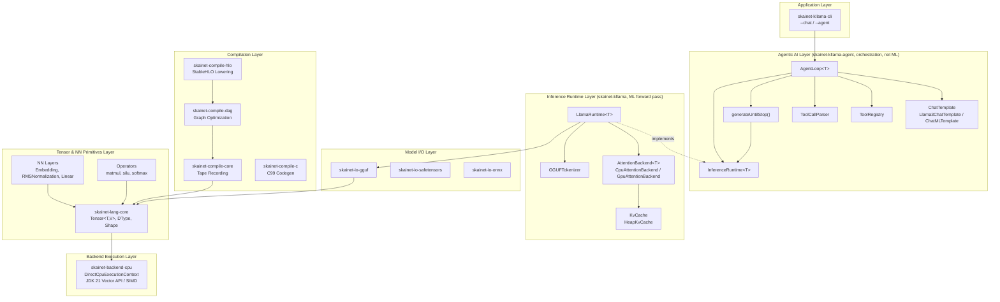
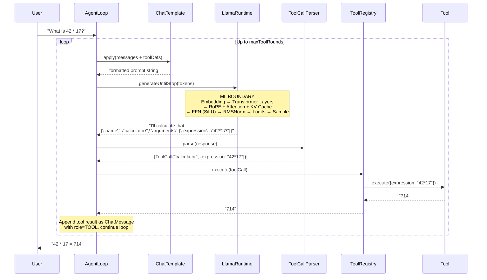

# SKaiNET Architecture: Where Agentic AI Fits

## The Core Question

After implementing tool calling support for KLlama, the question arises: **how does the agentic/tool-calling layer relate to the deep learning foundation?** Is it "real ML" or a higher-level orchestration concern?

**Answer**: Agentic AI is **not a deep learning primitive** — it's a **higher-level architectural pattern** that *consumes* the ML inference layer. The LLM (transformer forward pass, attention, embeddings) is pure deep learning. The agent loop that wraps it (chat formatting, tool parsing, execution, re-prompting) is application-level orchestration. Both are essential — one without the other is either a raw token generator or a tool executor with no intelligence.

---

## Diagram 1 — Full SKaiNET Layer Cake

All modules organized by abstraction level, with the agentic layer at the top:



---

## Diagram 2 — Agent Loop Data Flow

The generate-parse-execute cycle that makes the system "agentic":



---

## Diagram 3 — ML vs Orchestration Boundary

What is deep learning and what is application architecture:

```mermaid
graph LR
    subgraph ORCHESTRATION["Higher-Level: Orchestration"]
        direction TB
        A1["AgentLoop&lt;T&gt;<br/><i>control flow</i>"]
        A2["ChatTemplate<br/><i>string formatting</i>"]
        A3["ToolCallParser<br/><i>regex + JSON parsing</i>"]
        A4["ToolRegistry<br/><i>dispatch table</i>"]
        A5["ChatMessage / ChatRole<br/><i>data structures</i>"]
    end

    subgraph ML["Deep Learning: Math"]
        direction TB
        M1["LlamaRuntime.forward()<br/><i>transformer decoder</i>"]
        M2["Embedding lookup"]
        M3["RoPE + Multi-Head Attention"]
        M4["SiLU-gated FFN"]
        M5["RMSNormalization"]
        M6["Softmax sampling"]
        M7["KvCache management"]
        M8["Tensor&lt;T,V&gt; operations<br/><i>matmul, add, silu</i>"]
        M9["SIMD kernels<br/><i>JDK 21 Vector API</i>"]
    end

    ORCHESTRATION -->|"calls"| ML
    ML -->|"returns tokens"| ORCHESTRATION

    style ORCHESTRATION fill:#ffe0e0,stroke:#cc0000
    style ML fill:#e0ffe0,stroke:#00aa00
```



---

## Key Design Insights

### The agent layer adds no trainable parameters

It's pure control flow. The "intelligence" comes entirely from the LLM weights loaded from GGUF files via `LlamaWeightLoader`. `AgentLoop` decides *when* to call the model, not *what* the model says. The orchestration layer is stateless in the ML sense — it holds conversation history (`List<ChatMessage>`) but no learned weights.

### Why it matters anyway

Without the agent loop, the model is a one-shot text completer — you feed it tokens, it predicts the next ones, done. With it, the model can reason over multiple steps, call external tools, and incorporate real-world data. The same `LlamaRuntime<T>` that powers `--chat` mode becomes an autonomous agent in `--agent` mode, simply by wrapping it in `AgentLoop<T>`.

### The clean boundary

`InferenceRuntime<T>.forward(tokenId: Int): Tensor<T, Float>` is the ML boundary. The agent module (`skainet-kllama-agent`) defines this interface, and concrete runtimes like `LlamaRuntimeInterface<T>` extend it. Everything below (tensors, attention, SIMD kernels in `skainet-backend-cpu`) is deep learning. Everything above (chat formatting in `ChatTemplate`, tool parsing in `ToolCallParser`, the agent loop in `AgentLoop`) is software engineering orchestration.

```
         ┌──────────────────────────────────┐
         │  AgentLoop / ChatTemplate / CLI   │  ← orchestration (skainet-kllama-agent)
         ├──────────────────────────────────┤
         │  InferenceRuntime<T>.forward()   │  ← THE BOUNDARY
         ├──────────────────────────────────┤
         │  LlamaRuntimeInterface<T>        │  ← extends InferenceRuntime (skainet-kllama)
         │  Attention / FFN / KvCache        │  ← deep learning
         │  Tensor<T,V> / SIMD kernels       │
         └──────────────────────────────────┘
```

### Both layers are in `commonMain`

The agent layer is multiplatform Kotlin, not JVM-specific. `AgentLoop`, `ChatTemplate`, `ToolRegistry`, `ToolCallParser`, and all supporting types live in `skainet-kllama-agent/src/commonMain/`. The same agent loop runs on JVM (with Vector API SIMD), Native, and WASM targets — the only platform-specific code is the backend execution layer (`skainet-backend-cpu`) and the CLI entry point (`skainet-kllama-cli`).

---

## Module Reference

| Layer | Module | Key Types |
|-------|--------|-----------|
| Application | `skainet-apps:skainet-kllama-cli` | `Main.kt` (`--chat`, `--agent`) |
| Agentic | `skainet-apps:skainet-kllama-agent` | `InferenceRuntime<T>`, `AgentLoop<T>`, `ChatTemplate`, `Llama3ChatTemplate`, `ChatMLTemplate`, `ToolRegistry`, `ToolCallParser`, `ToolCall`, `Tool`, `ToolDefinition`, `ChatMessage`, `ChatRole`, `GenerateResult`, `generateUntilStop()`, `sampleFromLogits()` |
| Inference | `skainet-apps:skainet-kllama` | `LlamaRuntime<T>`, `LlamaRuntimeInterface<T>` (extends `InferenceRuntime<T>`), `AttentionBackend<T>`, `CpuAttentionBackend<T>`, `GpuAttentionBackend<T>`, `KvCache`, `HeapKvCache`, `GGUFTokenizer` |
| Model I/O | `skainet-io:skainet-io-gguf`, `skainet-io:skainet-io-safetensors`, `skainet-io:skainet-io-onnx` | `LlamaWeightLoader`, `LlamaRuntimeWeights<T>` |
| Compilation | `skainet-compile:skainet-compile-core`, `skainet-compile-dag`, `skainet-compile-hlo`, `skainet-compile-c` | Tape recording, graph optimization, StableHLO lowering, C99 codegen |
| Tensor/NN | `skainet-lang:skainet-lang-core` | `Tensor<T,V>`, `Shape`, `DType`, `Embedding`, `Linear`, `RMSNormalization` |
| Backend | `skainet-backends:skainet-backend-cpu` | `DirectCpuExecutionContext`, `DefaultCpuOps` |
