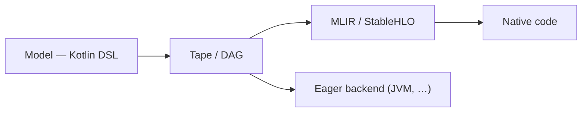

[](LICENCE)
[](https://central.sonatype.com/artifact/sk.ainet.core/skainet-lang-core)
[](https://github.com/SKaiNET-developers/SKaiNET/graphs/contributors)
[](https://deepwiki.com/SKaiNET-developers/SKaiNET)


> For architecture details see [ARCHITECTURE.md](ARCHITECTURE.md).

---

## Start in 5 minutes

SKaiNET is a Kotlin Multiplatform AI framework. New here? Choose the path that
matches what you want to try first.

| Goal | Start here | Time |
|---|---|---:|
| Run tensor operations | [Quickstart](#quickstart) (below) | 2–5 min |
| Build and train a neural net | [Hello Neural Net](#hello-neural-net) (below) | 5 min |
| Run a local GGUF model | [SKaiNET Transformers starter](https://github.com/SKaiNET-developers/SKaiNET-transformers#start-in-5-minutes) | 5 min after model setup |
| Export a secure MCU bundle | [Minerva getting started](docs/modules/ROOT/pages/tutorials/minerva-getting-started.adoc) | 10 min without firmware flashing |

Working in Java? SKaiNET ships first-class Java support — see the
[Java getting-started guide](docs/modules/ROOT/pages/tutorials/java-getting-started.adoc).

Use the version shown in this README as the source of truth for first-run snippets.
If another page shows a different version, please open an issue or PR.

---

## Quickstart

Add the core dependencies (Gradle Kotlin DSL):

```kotlin
dependencies {
    // Recommended: import the umbrella BOM and drop versions on the engine modules.
    implementation(platform("sk.ainet:skainet-bom:0.32.4"))

    implementation("sk.ainet.core:skainet-lang-core")
    implementation("sk.ainet.core:skainet-backend-cpu")
}
```

> The BOM was first correctly published to Maven Central in 0.22.2 — earlier versions
> shipped at the wrong coordinates and could not be imported. Pin versions directly if
> you need an older release.

### Hello Neural Net

```kotlin
val model = nn {
    input(28 * 28)
    dense(out = 128)
    relu()
    dense(out = 10)
}
```

### Core Tensor Ops

```kotlin
val a = tensor(shape(2, 2)) { float(1f, 2f, 3f, 4f) }
val b = tensor(shape(2, 2)) { float(5f, 6f, 7f, 8f) }

val c = a matMul b
val d = c.relu()
```

### GGUF Model Loading

```kotlin
// Recommended: streaming reader — memory-efficient, supports quantized types
val source = JvmRandomAccessSource.open("model.gguf")
StreamingGGUFReader.open(source).use { reader ->
    println("Tensors: ${reader.tensorCount}")

    // Load specific tensor on demand (no whole-file loading)
    val bytes = reader.loadTensor("token_embd.weight")

    // Or get a TensorStorage descriptor with encoding/placement metadata
    val storage = reader.loadTensorStorage("token_embd.weight")
}
```

> **More examples:** [SKaiNET-examples](https://github.com/SKaiNET-developers/SKaiNET-examples) | [SKaiNET-notebook](https://github.com/SKaiNET-developers/SKaiNET-notebook)

---

## Ecosystem

SKaiNET is a modular ecosystem. While this repository contains the core engine, specialized high-level libraries are maintained in standalone repositories:

| Project | Description |
|---|---|
| [SKaiNET-transformers](https://github.com/SKaiNET-developers/SKaiNET-transformers) | Pre-built transformer architectures and layers |
| [SKaiNET-examples](https://github.com/SKaiNET-developers/SKaiNET-examples) | Sample projects and integration demos |

---

## Explore

| Goal | Start here |
|---|---|
| Examples and sample projects | [SKaiNET-examples](https://github.com/SKaiNET-developers/SKaiNET-examples) |
| Interactive notebooks | [SKaiNET-notebook](https://github.com/SKaiNET-developers/SKaiNET-notebook) |
| Eager backends & kernels (what runs where) | [Backends & kernels mindmap](docs/eager-execution-backends-and-kernels.md) |
| Design proposals and long-lived API decisions | [SKEEP proposals](docs/modules/skeep/pages/index.adoc) |

---

## Contributing and Design Proposals

Small fixes can go straight through the normal contribution flow described in
[CONTRIBUTING.md](CONTRIBUTING.md) and [GITFLOW.adoc](GITFLOW.adoc).

Use a SKEEP when a change affects public APIs, DSL syntax, tensor semantics,
compiler/runtime integration, storage behavior, compatibility policy, or other
decisions that need a durable design record. SKEEP files live under
`docs/modules/skeep/pages/` and use three-digit numbering, starting with
`001`.

---

## Official Benchmarks

SKaiNET ships an official Phoronix-Test-Suite-compatible benchmark
program for the compute engine. See the
[methodology and replay docs](docs/modules/ROOT/pages/contributing/benchmarks.adoc),
the [release manifest](benchmarks/manifests/engine-release.yml), and the
[CI workflow](.github/workflows/engine-benchmarks.yml). Smoke runs fire
on every PR via `ubuntu-latest`; full publishable runs fire on a
self-hosted Linux x86 runner on release.

Quick local replay:

```bash
./gradlew :skainet-backends:benchmarks:jvm-cpu-publish:shadowJar
./scripts/run_engine_smoke.sh
```

---

## Architecture goal

SKaiNET is built around one path: **a model is defined once in the Kotlin DSL,
then either compiled to native code or executed eagerly — without rewriting it.**

1. **Define** the model with the DSL (`nn { }` / `dag { }`).
2. **Capture** it as a *tape* (traced execution) or a *DAG* (explicit graph).
3. **Run** it one of two ways:
   - **Compile** — lower the graph to MLIR / StableHLO (`HloGenerator`) and
     compile to **native** code (IREE-compatible) for native / edge targets.
   - **Eager** — execute directly on an available backend. On the **JVM this is
     the primary, go-to path.**



The same DSL model feeds both paths — eager execution for development and JVM
deployment, the StableHLO path for native and edge targets.

---

## Important Addition: Minerva Secure MCU Export

SKaiNET now includes a Minerva export backend for secure MCU deployment. It is a sibling to StableHLO and Arduino/C99 export: it starts from a supported `ComputeGraph`, lowers static MLPs to a Minerva compiler input, invokes libminerva when configured, and packages generated weights, host fixtures, firmware skeletons, and a fingerprinted `manifest.json`.

Start here:

- [Minerva getting started](docs/modules/ROOT/pages/tutorials/minerva-getting-started.adoc) — run the maintained tiny MLP dry sample, then the real libminerva runtime profile.
- [Minerva export how-to](docs/modules/ROOT/pages/how-to/minerva-export.adoc) — configure compiler paths, keys, calibration, CMake/CTest host verification, and troubleshooting.
- [How Minerva secure MCU export fits](docs/modules/ROOT/pages/explanation/minerva-secure-mcu-export.adoc) — understand why Minerva is not an Arduino replacement and when to choose StableHLO instead.

Runnable examples:

```bash
./gradlew :skainet-compile:skainet-compile-minerva:runMinervaSecureMcuExamples
./gradlew :skainet-compile:skainet-compile-minerva:runMinervaSecureMcuExamples \
  -Pminerva.example=sensor-classifier
```

---

## Features

### Kotlin Multiplatform

- Targets: JVM, macOS (Native), JS, WASM (Browser + WasmWasi)
- Single codebase shared across all platforms via Kotlin Multiplatform

### Optimized Execution

- **ComputeGraphExecutor**: Optimized engine with fusion passes and trace-to-DAG bridging.
- **SDPA & Gather**: High-performance Scaled Dot-Product Attention and indexing operations.
- **TurboQuant**: Runtime KV-cache compression (~8x at 4-bit) for long-context LLM inference. Presets: `safe-lowbit`, `balanced`, `experimental-max`. See `TurboQuantUsage` for integration guide.

### Neural Network DSL

- **Sequential**: `nn { input(); dense(); relu(); dense() }`
- **DAG / Graph**: arbitrary wiring with `dag { }` for ResNet, YOLO-style architectures
- Layers: Dense, Conv1d/2d/3d, MaxPool, AvgPool, BatchNorm, Dropout, LeakyReLU, ELU
- KAN (Kolmogorov–Arnold Networks) layer (experimental)
- Autograd engine with reverse-mode gradients, SGD and Adam/AdamW optimizers

### Data and I/O

- Built-in loaders: MNIST, Fashion-MNIST, CIFAR-10
- Formats: GGUF, ONNX, SafeTensors, JSON, Image (JPEG, PNG)
- Type-safe transform DSL: resize, crop, normalize, toTensor


### Edge AI: Arduino / C99 Export

- Export trained models to standalone, optimized C99 with static memory allocation
- Ready-to-use Arduino library output

### Edge AI: Minerva Secure MCU Export

- Export supported static MLP graphs to Minerva project bundles for secure MCU inference
- Emits compiler NPZ input, libminerva weights, a fingerprinted manifest, host harness, firmware example, and host verification results
- Start with the [Minerva getting started guide](docs/modules/ROOT/pages/tutorials/minerva-getting-started.adoc)

### Compiler: MLIR / StableHLO

- Lower Kotlin DSL to MLIR StableHLO dialect
- Optimization passes: constant folding, operation fusion, dead code elimination
- Valid IREE-compilable output with streaming API and public `HloGenerator`

### Choosing an Export Path

- Use **StableHLO** when you want portable MLIR/IREE-compatible graphs for native, accelerator, or ecosystem compiler flows.
- Use **Arduino / C99 export** when you want standalone generated C with static memory allocation and no external secure runtime.
- Use **Minerva export** when you need a secure MCU project bundle that goes through libminerva packaging and host verification.

---

## What's New in 0.32.4

- **Streaming detokenization keeps word spaces (`Tokenizer.decodeToken`).** Decoding generated tokens
  one at a time no longer runs words together (`"the process"` → `"theprocess"`). The new
  `decodeToken(id)` keeps each SentencePiece piece's leading space (llama.cpp `token_to_piece`
  semantics); `decode(IntArray)` still strips the single sequence-leading space as before.

## What's New in 0.32.3

- **Graph-output pruning for export (`ComputeGraph.prunedToOutputs`).** Trims a traced decoder's
  StableHLO/IREE export to just the designated outputs (e.g. the logits), eliminating the dozens of
  dangling per-layer tensors and dead op subgraphs a full trace otherwise emits as `func` returns —
  via new `OutputDesignatedGraph` (compile-dag) + `prunedToOutputs` (compile-opt) running
  `DeadCodeEliminationPass`. (PR #760)
- **SDPA causal mask** now emits a large finite fill (`-1e30`) instead of `-inf`, matching
  `buildSlidingCausalMask` and avoiding a `-inf` splat in the exported IR (numerically equivalent
  after softmax). (`AttentionOperationsConverter`)

## What's New in 0.32.2

- **`ExecutionContext.isRecording`.** A default-`false` flag (overridden by the graph/tape context)
  so a module with an eager fast-path that bypasses `ops.*` — e.g. RoPE's raw-array INTERLEAVED
  rotation — can detect tracing and emit a graph-traceable `ctx.ops.*` path instead, exporting to
  StableHLO while keeping the eager fast path. Backward-compatible. (PR #757)
- **Docs:** Antora version-currency + broken-link fixes across all pages (PR #758).
- **Dependency:** `ch.qos.logback:logback-classic` → 1.5.35 (#756).

## What's New in 0.32.1

- **GroupNorm compiles on stock IREE.** The 0.32.0 GroupNorm converter emitted `@reduce_mean` /
  `@reduce_variance` custom_calls that `iree-compile` can't lower; it now emits real `stablehlo.reduce`
  (variance as `E[x²] − E[x]²`, ddof=0), like `sum` / `mean` / `variance`. Verified end-to-end through
  the [`skainet-iree-conformance`](https://github.com/SKaiNET-developers/skainet-iree-conformance) harness
  (`iree-compile` + `iree-run-module` + numpy validate → PASS, `max_abs_err = 1.2e-7`). (PR #754)

### Recent releases

- **0.32.0** — **GroupNorm StableHLO converter** (#752): `groupNorm` lowers to real `stablehlo.*` ops; plus a SKEEP proposals docs module (#750), a quantization-process explanation (#747), and dependency bumps.

- **0.31.2** — `RowDequantSource` + `ops.gather` row-dequant: a packed/oversized embedding (a Q-quantised `token_embd`) stays packed and is looked up via `ops.gather`, dequantising only the touched rows. (PR #741)
- **0.31.0** — `ops.transpose` lazily handles every packed matmul dtype (Q8_0/Q4_0 added, completing the Q4_K/Q5_K/Q6_K/Q5_0/Q5_1/Q8_0/Q4_0 set); `json-schema-validator` → 3.0.4. (PRs #736, #737, #733)

- **0.30.0** — First-class **Q5_K packed in-kernel dequant-matmul** across the CPU backends (`Q5_KBlockTensorData` + `Q5KMatmulKernel` SPI: scalar / Panama Vector / native-C), **hand-written ARM NEON kernels** (fp32/q8_0/q4k/q5k, `-march=armv8.2-a+fp16+dotprod`), and **Kotlin/Native consumption of the C kernels via cinterop** (`skainet-backend-native-cpu` static archive + `linuxX64`/`linuxArm64` `KernelProvider`). (PR #734)

- **0.29.1** — `sk.ainet.core:skainet-compile-minerva` now publishes to Maven Central (packaging fix for the Minerva export module shipped in 0.29.0).
- **0.29.0** — **Minerva secure-MCU export module**: an end-to-end pipeline that lowers a SKaiNET model through shared graph-export contracts → Minerva IR → an `.npz` compiler input → a libminerva-packaged secure MCU project bundle, with host-side runtime verification and fingerprinted manifest artifacts (runnable sample, examples, ONNX workflow, getting-started docs). Plus **packed-quant matmul kernels with Kotlin/Native parity** (Q5_0/Q5_1/Q4_K/Q6_K — commonMain scalar + SPI, packed-quant dispatch in `DefaultCpuOpsBase`, Panama Vector for Q5_1/Q5_0 and Q6_K via the `KernelRegistry`), and an **auto-generated, CI-gated kernel × platform support matrix**. (PRs #697–#726)
- **0.28.1** — Kotlin DSL → StableHLO → IREE is green end-to-end for the whole conformance suite (7/7 models, 27/27 ops compile to a `vmfb`): `inferDagOutputSpecs` now infers correct output shapes for shape-changing ops, and `reduce_window` (pooling) emits IREE's generic region form. (PRs #674, #676)
- **0.28.0** — Four StableHLO export bugs fixed (reshape #666, concatenate #667, constants/reductions #663, `HloGenerator` tracing #668) plus non-JVM image runtime support (#671). (PRs #664, #670, #671)
- **0.27.0** — A full gemma3 network lowers to StableHLO and compiles to an IREE `vmfb` (zero op gaps, verified by `GemmaTraceTest`): new `scaledDotProductAttention` (with causal + explicit additive mask), `permute`, `narrow`, and multi-output `split` converters, plus boxing-free `FloatArray` weight externalization for `.irpa` baking. (PRs #661 et al.)
- **0.26.0** — Q4_0 promoted to a first-class quantized format across the provider stack, `tanh` as a first-class activation primitive, and a CPU tensor `convert` op, plus test/build/CI hygiene. (PRs #648–#651, #631, #636)
- **0.25.0** — BF16 and Q8_0 matmul kernels end-to-end across the provider stack, autograd completeness for `pow`/`log` and the conv/pool/upsample/split family, the hybrid adaptive dtype-constraint DSL, the `@DarcValidated` operator-doc flag, and the SentencePiece special-token splitter. (PRs #595, #605–#628)
- **0.23.0** — Real-model GGUFs no longer OOM at network construction (lazy `TensorDataFactory.placeholder(...)`); Kotlin/Native can finally load GGUFs over 2 GiB via the new POSIX-`pread`-backed `PosixPreadRandomAccessSource`. (Issues #587, #589; PRs #588, #591)
- **0.22.2** — `sk.ainet:skainet-bom` now resolves from Maven Central (earlier versions shipped at the wrong coordinates). (Issue #584)
- **0.22.1** — `StreamingShardedSafeTensorsReader.loadTensorStorageMapped` for zero-copy reads of multi-shard tensors above the 2 GB JVM `ByteArray` limit. (PR #582)
- **0.22.0** — Native (FFM) CPU kernel provider: **4–6× faster Q4_K matmul, 1.5–1.8× FP32 SGEMM** vs Panama Vector; auto-selected via `KernelRegistry.bestAvailable()`. (PR #571)

See [CHANGELOG.md](CHANGELOG.md) for the full release history.

---

## Roadmap

- **Q1 2026**: Comprehensive documentation ✅
- **Q2 2026**: TurboQuant KV-cache compression ✅ (shipped in 0.18.0); Qwen/LLaMA tokenizers ✅ (shipped in 0.20.0)
- **Q3 2026**: Agentic AI enhancements ✅ (tool calling shipped in 0.13.0; ongoing)
- **Q4 2026**: Federated learning support for multi-device training

---


## Contributing & Community

We love contributions! Whether it's a new operator, documentation, or a bug fix:

1. Read our [Contribution Guide](CONTRIBUTING.md).
2. Check the [Good First Issues](https://github.com/SKaiNET-developers/SKaiNET/labels/good%20first%20issue).
3. Open a discussion or issue on [GitHub](https://github.com/SKaiNET-developers/SKaiNET/issues).

Browse the full codebase documentation on [DeepWiki](https://deepwiki.com/SKaiNET-developers/SKaiNET).

### Contributors (0.14.0)

- **Dhia Chemingui** ([@dhiaspaner](https://github.com/dhiaspaner)) — Android KMP plugin migration (#385, #386)

---

## License

MIT — see [LICENCE](LICENCE).
