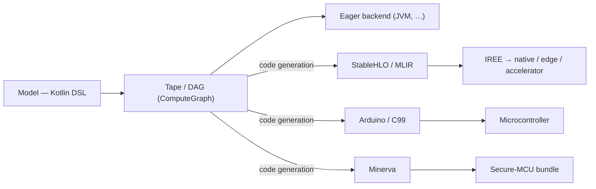

[](LICENCE)
[](https://central.sonatype.com/artifact/sk.ainet.core/skainet-lang-core)
[](https://github.com/SKaiNET-developers/SKaiNET/graphs/contributors)
[](https://deepwiki.com/SKaiNET-developers/SKaiNET)


> For architecture details see [ARCHITECTURE.md](ARCHITECTURE.md).

---

## Start in 5 minutes

SKaiNET is a Kotlin Multiplatform AI framework. New here? Choose the path that
matches what you want to try first.

| Goal | Start here | Time |
|---|---|---:|
| Run tensor operations | [Quickstart](#quickstart) (below) | 2–5 min |
| Build and train a neural net | [Hello Neural Net](#hello-neural-net) (below) | 5 min |
| Run a local GGUF model | [SKaiNET Transformers starter](https://github.com/SKaiNET-developers/SKaiNET-transformers#start-in-5-minutes) | 5 min after model setup |
| Export a secure MCU bundle | [Minerva getting started](docs/modules/ROOT/pages/tutorials/minerva-getting-started.adoc) | 10 min without firmware flashing |

Working in Java? SKaiNET ships first-class Java support — see the
[Java getting-started guide](docs/modules/ROOT/pages/tutorials/java-getting-started.adoc).

Use the version shown in this README as the source of truth for first-run snippets.
If another page shows a different version, please open an issue or PR.

---

## Quickstart

Add the core dependencies (Gradle Kotlin DSL):

```kotlin
dependencies {
    // Recommended: import the umbrella BOM and drop versions on the engine modules.
    implementation(platform("sk.ainet:skainet-bom:0.34.0"))

    implementation("sk.ainet.core:skainet-lang-core")
    implementation("sk.ainet.core:skainet-backend-cpu")
}
```

### Hello Neural Net

```kotlin
val model = nn {
    input(28 * 28)
    dense(out = 128)
    relu()
    dense(out = 10)
}
```

### Core Tensor Ops

```kotlin
val a = tensor(shape(2, 2)) { float(1f, 2f, 3f, 4f) }
val b = tensor(shape(2, 2)) { float(5f, 6f, 7f, 8f) }

val c = a matMul b
val d = c.relu()
```

### GGUF Model Loading

```kotlin
// Recommended: streaming reader — memory-efficient, supports quantized types
val source = JvmRandomAccessSource.open("model.gguf")
StreamingGGUFReader.open(source).use { reader ->
    println("Tensors: ${reader.tensorCount}")

    // Load specific tensor on demand (no whole-file loading)
    val bytes = reader.loadTensor("token_embd.weight")

    // Or get a TensorStorage descriptor with encoding/placement metadata
    val storage = reader.loadTensorStorage("token_embd.weight")
}
```

> **More examples:** [SKaiNET-examples](https://github.com/SKaiNET-developers/SKaiNET-examples) | [SKaiNET-notebook](https://github.com/SKaiNET-developers/SKaiNET-notebook)

---

## Ecosystem

SKaiNET is a modular ecosystem. While this repository contains the core engine, specialized high-level libraries are maintained in standalone repositories:

| Project | Description |
|---|---|
| [SKaiNET-transformers](https://github.com/SKaiNET-developers/SKaiNET-transformers) | Pre-built transformer architectures and layers |
| [SKaiNET-examples](https://github.com/SKaiNET-developers/SKaiNET-examples) | Sample projects and integration demos |

---

## Explore

| Goal | Start here |
|---|---|
| Examples and sample projects | [SKaiNET-examples](https://github.com/SKaiNET-developers/SKaiNET-examples) |
| Interactive notebooks | [SKaiNET-notebook](https://github.com/SKaiNET-developers/SKaiNET-notebook) |
| Eager backends & kernels (what runs where) | [Backends & kernels mindmap](docs/eager-execution-backends-and-kernels.md) |
| Design proposals and long-lived API decisions | [SKEEP proposals](docs/modules/skeep/pages/index.adoc) |

---

## Contributing and Design Proposals

Small fixes can go straight through the normal contribution flow described in
[CONTRIBUTING.md](CONTRIBUTING.md) and [GITFLOW.adoc](GITFLOW.adoc).

Use a SKEEP when a change affects public APIs, DSL syntax, tensor semantics,
compiler/runtime integration, storage behavior, compatibility policy, or other
decisions that need a durable design record. SKEEP files live under
`docs/modules/skeep/pages/` and use three-digit numbering, starting with
`001`.

---

## Official Benchmarks

SKaiNET ships an official Phoronix-Test-Suite-compatible benchmark
program for the compute engine. See the
[methodology and replay docs](docs/modules/ROOT/pages/contributing/benchmarks.adoc),
the [release manifest](benchmarks/manifests/engine-release.yml), and the
[CI workflow](.github/workflows/engine-benchmarks.yml). Smoke runs fire
on every PR via `ubuntu-latest`; full publishable runs fire on a
self-hosted Linux x86 runner on release.

Quick local replay:

```bash
./gradlew :skainet-backends:benchmarks:jvm-cpu-publish:shadowJar
./scripts/run_engine_smoke.sh
```

---

## Architecture goal

SKaiNET is built around one path: **a model is defined once in the Kotlin DSL,
then either compiled or executed eagerly — without rewriting it.**

1. **Define** the model with the DSL (`nn { }` / `dag { }`).
2. **Capture** it as a *tape* (traced execution) or a *DAG* (explicit graph) — a `ComputeGraph`.
3. **Run** it one of two ways:
   - **Compile** — lower the captured `ComputeGraph` through one of several
     **sibling code-generation backends**, each emitting code for a different target
     from the *same* graph:
     - **StableHLO / MLIR** (`HloGenerator`) → IREE-compilable, for native / edge /
       accelerator targets and the wider MLIR ecosystem.
     - **Arduino / C99** → standalone, statically-allocated C for microcontrollers.
     - **Minerva** → a secure-MCU bundle (weights + firmware skeleton + fingerprinted
       manifest).
   - **Eager** — execute directly on an available backend. On the **JVM this is
     the primary, go-to path.**

StableHLO/MLIR is therefore **one code-generation backend among siblings** — the
IREE/native path next to the C99/Arduino and Minerva MCU paths — not a separate
pipeline.



The same DSL model feeds every path: eager execution for development and JVM
deployment, and the code-generation backends — StableHLO/MLIR (→ IREE), Arduino/C99,
and Minerva — as **sibling alternatives** for native, edge, and secure-MCU targets.

---

## Important Addition: Minerva Secure MCU Export

SKaiNET now includes a Minerva export backend for secure MCU deployment. It is a sibling to StableHLO and Arduino/C99 export: it starts from a supported `ComputeGraph`, lowers static MLPs to a Minerva compiler input, invokes libminerva when configured, and packages generated weights, host fixtures, firmware skeletons, and a fingerprinted `manifest.json`.

Start here:

- [Minerva getting started](docs/modules/ROOT/pages/tutorials/minerva-getting-started.adoc) — run the maintained tiny MLP dry sample, then the real libminerva runtime profile.
- [Minerva export how-to](docs/modules/ROOT/pages/how-to/minerva-export.adoc) — configure compiler paths, keys, calibration, CMake/CTest host verification, and troubleshooting.
- [How Minerva secure MCU export fits](docs/modules/ROOT/pages/explanation/minerva-secure-mcu-export.adoc) — understand why Minerva is not an Arduino replacement and when to choose StableHLO instead.

Runnable examples:

```bash
./gradlew :skainet-compile:skainet-compile-minerva:runMinervaSecureMcuExamples
./gradlew :skainet-compile:skainet-compile-minerva:runMinervaSecureMcuExamples \
  -Pminerva.example=sensor-classifier
```

---

## Features

### Kotlin Multiplatform

- Targets: JVM, macOS (Native), JS, WASM (Browser + WasmWasi)
- Single codebase shared across all platforms via Kotlin Multiplatform

### Optimized Execution

- **ComputeGraphExecutor**: Optimized engine with fusion passes and trace-to-DAG bridging.
- **SDPA & Gather**: High-performance Scaled Dot-Product Attention and indexing operations.
- **TurboQuant**: Runtime KV-cache compression (~8x at 4-bit) for long-context LLM inference. Presets: `safe-lowbit`, `balanced`, `experimental-max`. See `TurboQuantUsage` for integration guide.

### Neural Network DSL

- **Sequential**: `nn { input(); dense(); relu(); dense() }`
- **DAG / Graph**: arbitrary wiring with `dag { }` for ResNet, YOLO-style architectures
- Layers: Dense, Conv1d/2d/3d, MaxPool, AvgPool, BatchNorm, Dropout, LeakyReLU, ELU
- KAN (Kolmogorov–Arnold Networks) layer (experimental)
- Autograd engine with reverse-mode gradients, SGD and Adam/AdamW optimizers

### Data and I/O

- Built-in loaders: MNIST, Fashion-MNIST, CIFAR-10
- URI-backed data sources: `file://`, `https://`, `hf+https://`, and `hf://...`
- Dataset operations: deterministic shuffle/split, stratified split, filter/map/transform views, batch flows, and epoch flows
- Raw dataset parsers: CSV, TSV, JSON arrays/objects, JSON Lines (`.jsonl`, `.ndjson`)
- Type-safe transform DSLs: image/tensor transforms plus suspendable raw data pipelines
- Formats: GGUF, ONNX, SafeTensors, JSON, Image (JPEG, PNG)

```kotlin
val raw = JvmDataSourceResolver().rawDataset {
    from("hf://datasets/org/repo@main/train.jsonl")
    format(DataFormat.JSON_LINES)
    cachePolicy(CachePolicy.Use)
}

val withoutLabel = dataPipeline<RawDataset>()
    .stage(
        dataTransformer(
            name = "drop-label",
            outputSchema = { schema -> DataSchema(schema.columns - "label") }
        ) { dataset ->
            val columns = dataset.schema.columns - "label"
            dataset.copy(
                schema = DataSchema(columns),
                rows = dataset.rows.map { row ->
                    RawDataRow(row.values.filterKeys { key -> key in columns })
                }
            )
        }
    )
    .execute(raw)
```

- Start with the [data sources getting started guide](docs/modules/ROOT/pages/tutorials/data-sources-getting-started.adoc)

### Edge AI: Arduino / C99 Export

- Export trained models to standalone, optimized C99 with static memory allocation
- Ready-to-use Arduino library output

### Edge AI: Minerva Secure MCU Export

- Export supported static MLP graphs to Minerva project bundles for secure MCU inference
- Emits compiler NPZ input, libminerva weights, a fingerprinted manifest, host harness, firmware example, and host verification results
- Start with the [Minerva getting started guide](docs/modules/ROOT/pages/tutorials/minerva-getting-started.adoc)

### Compiler: MLIR / StableHLO

- Lower Kotlin DSL to MLIR StableHLO dialect
- Optimization passes: constant folding, operation fusion, dead code elimination
- Valid IREE-compilable output with streaming API and public `HloGenerator`

### Choosing an Export Path

- Use **StableHLO** when you want portable MLIR/IREE-compatible graphs for native, accelerator, or ecosystem compiler flows.
- Use **Arduino / C99 export** when you want standalone generated C with static memory allocation and no external secure runtime.
- Use **Minerva export** when you need a secure MCU project bundle that goes through libminerva packaging and host verification.

---

## What's New in 0.34.0

- **URI-backed data sources** — new `skainet-data-source` module: `file://`, `https://`, and Hugging Face URIs, raw-format parsers (CSV/TSV/JSON/JSONL), suspendable data pipelines
- **Dataset views and richer batches** — seeded shuffle, stratified split, filter views, batch/epoch flows, batch indices + metadata
- **bf16-native DSL → StableHLO export** — weights reach the matmuls as bf16, verified down to an aarch64 vmfb
- **Pluggable per-phase, per-target compile optimization** (`TargetOptimizers`, `OpGranularityPolicy`)
- **2.07× Q4_K NEON matmul on Cortex-A55** — plus LayerNorm statistics now computed in f32 (bf16-safe)

See [CHANGELOG.md](CHANGELOG.md) for details and the full release history.

---

## Roadmap

- **Q1 2026**: Comprehensive documentation ✅
- **Q2 2026**: TurboQuant KV-cache compression ✅ (shipped in 0.18.0); Qwen/LLaMA tokenizers ✅ (shipped in 0.20.0)
- **Q3 2026**: Agentic AI enhancements ✅ (tool calling shipped in 0.13.0; ongoing)
- **Q4 2026**: Federated learning support for multi-device training

---


## Contributing & Community

We love contributions! Whether it's a new operator, documentation, or a bug fix:

1. Read our [Contribution Guide](CONTRIBUTING.md).
2. Check the [Good First Issues](https://github.com/SKaiNET-developers/SKaiNET/labels/good%20first%20issue).
3. Open a discussion or issue on [GitHub](https://github.com/SKaiNET-developers/SKaiNET/issues).

Browse the full codebase documentation on [DeepWiki](https://deepwiki.com/SKaiNET-developers/SKaiNET).

### Contributors (0.14.0)

- **Dhia Chemingui** ([@dhiaspaner](https://github.com/dhiaspaner)) — Android KMP plugin migration (#385, #386)

---

## License

MIT — see [LICENCE](LICENCE).
