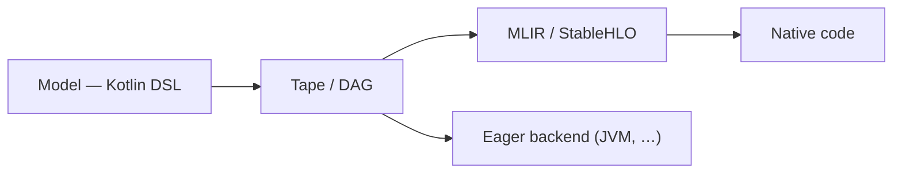

[](LICENCE)
[](https://central.sonatype.com/artifact/sk.ainet.core/skainet-lang-core)
[](https://github.com/SKaiNET-developers/SKaiNET/graphs/contributors)
[](https://deepwiki.com/SKaiNET-developers/SKaiNET)


> For architecture details see [ARCHITECTURE.md](ARCHITECTURE.md).

---

## Start in 5 minutes

SKaiNET is a Kotlin Multiplatform AI framework. New here? Choose the path that
matches what you want to try first.

| Goal | Start here | Time |
|---|---|---:|
| Run tensor operations | [Quickstart](#quickstart) (below) | 2–5 min |
| Build and train a neural net | [Hello Neural Net](#hello-neural-net) (below) | 5 min |
| Run a local GGUF model | [SKaiNET Transformers starter](https://github.com/SKaiNET-developers/SKaiNET-transformers#start-in-5-minutes) | 5 min after model setup |

Working in Java? SKaiNET ships first-class Java support — see the
[Java getting-started guide](docs/modules/ROOT/pages/tutorials/java-getting-started.adoc).

Use the version shown in this README as the source of truth for first-run snippets.
If another page shows a different version, please open an issue or PR.

---

## Quickstart

Add the core dependencies (Gradle Kotlin DSL):

```kotlin
dependencies {
    // Recommended: import the umbrella BOM and drop versions on the engine modules.
    implementation(platform("sk.ainet:skainet-bom:0.26.0"))

    implementation("sk.ainet.core:skainet-lang-core")
    implementation("sk.ainet.core:skainet-backend-cpu")
}
```

> The BOM was first correctly published to Maven Central in 0.22.2 — earlier versions
> shipped at the wrong coordinates and could not be imported. Pin versions directly if
> you need an older release.

### Hello Neural Net

```kotlin
val model = nn {
    input(28 * 28)
    dense(out = 128)
    relu()
    dense(out = 10)
}
```

### Core Tensor Ops

```kotlin
val a = tensor(shape(2, 2)) { float(1f, 2f, 3f, 4f) }
val b = tensor(shape(2, 2)) { float(5f, 6f, 7f, 8f) }

val c = a matMul b
val d = c.relu()
```

### GGUF Model Loading

```kotlin
// Recommended: streaming reader — memory-efficient, supports quantized types
val source = JvmRandomAccessSource.open("model.gguf")
StreamingGGUFReader.open(source).use { reader ->
    println("Tensors: ${reader.tensorCount}")
    
    // Load specific tensor on demand (no whole-file loading)
    val bytes = reader.loadTensor("token_embd.weight")
    
    // Or get a TensorStorage descriptor with encoding/placement metadata
    val storage = reader.loadTensorStorage("token_embd.weight")
}
```

> **More examples:** [SKaiNET-examples](https://github.com/SKaiNET-developers/SKaiNET-examples) | [SKaiNET-notebook](https://github.com/SKaiNET-developers/SKaiNET-notebook)

---

## Ecosystem

SKaiNET is a modular ecosystem. While this repository contains the core engine, specialized high-level libraries are maintained in standalone repositories:

| Project | Description |
|---|---|
| [SKaiNET-transformers](https://github.com/SKaiNET-developers/SKaiNET-transformers) | Pre-built transformer architectures and layers |
| [SKaiNET-examples](https://github.com/SKaiNET-developers/SKaiNET-examples) | Sample projects and integration demos |

---

## Explore

| Goal | Start here |
|---|---|
| Examples and sample projects | [SKaiNET-examples](https://github.com/SKaiNET-developers/SKaiNET-examples) |
| Interactive notebooks | [SKaiNET-notebook](https://github.com/SKaiNET-developers/SKaiNET-notebook) |

---

## Official Benchmarks

SKaiNET ships an official Phoronix-Test-Suite-compatible benchmark
program for the compute engine. See the
[methodology and replay docs](docs/modules/ROOT/pages/contributing/benchmarks.adoc),
the [release manifest](benchmarks/manifests/engine-release.yml), and the
[CI workflow](.github/workflows/engine-benchmarks.yml). Smoke runs fire
on every PR via `ubuntu-latest`; full publishable runs fire on a
self-hosted Linux x86 runner on release.

Quick local replay:

```bash
./gradlew :skainet-backends:benchmarks:jvm-cpu-publish:shadowJar
./scripts/run_engine_smoke.sh
```

---

## Architecture goal

SKaiNET is built around one path: **a model is defined once in the Kotlin DSL,
then either compiled to native code or executed eagerly — without rewriting it.**

1. **Define** the model with the DSL (`nn { }` / `dag { }`).
2. **Capture** it as a *tape* (traced execution) or a *DAG* (explicit graph).
3. **Run** it one of two ways:
   - **Compile** — lower the graph to MLIR / StableHLO (`HloGenerator`) and
     compile to **native** code (IREE-compatible) for native / edge targets.
   - **Eager** — execute directly on an available backend. On the **JVM this is
     the primary, go-to path.**



The same DSL model feeds both paths — eager execution for development and JVM
deployment, the StableHLO path for native and edge targets.

---

## Features

### Kotlin Multiplatform

- Targets: JVM, macOS (Native), JS, WASM (Browser + WasmWasi)
- Single codebase shared across all platforms via Kotlin Multiplatform

### Optimized Execution

- **ComputeGraphExecutor**: Optimized engine with fusion passes and trace-to-DAG bridging.
- **SDPA & Gather**: High-performance Scaled Dot-Product Attention and indexing operations.
- **TurboQuant**: Runtime KV-cache compression (~8x at 4-bit) for long-context LLM inference. Presets: `safe-lowbit`, `balanced`, `experimental-max`. See `TurboQuantUsage` for integration guide.

### Neural Network DSL

- **Sequential**: `nn { input(); dense(); relu(); dense() }`
- **DAG / Graph**: arbitrary wiring with `dag { }` for ResNet, YOLO-style architectures
- Layers: Dense, Conv1d/2d/3d, MaxPool, AvgPool, BatchNorm, Dropout, LeakyReLU, ELU
- KAN (Kolmogorov–Arnold Networks) layer (experimental)
- Autograd engine with reverse-mode gradients, SGD and Adam/AdamW optimizers

### Data and I/O

- Built-in loaders: MNIST, Fashion-MNIST, CIFAR-10
- Formats: GGUF, ONNX, SafeTensors, JSON, Image (JPEG, PNG)
- Type-safe transform DSL: resize, crop, normalize, toTensor


### Edge AI: Arduino / C99 Export

- Export trained models to standalone, optimized C99 with static memory allocation
- Ready-to-use Arduino library output

### Compiler: MLIR / StableHLO

- Lower Kotlin DSL to MLIR StableHLO dialect
- Optimization passes: constant folding, operation fusion, dead code elimination
- Valid IREE-compilable output with streaming API and public `HloGenerator`

---

## What's New in 0.26.0

- **Q4_0 is now a first-class quantized format.** The older GGML 4-bit format joins Q8_0 / Q4_K across the full provider stack: a heap `Q4_0TensorData` any loader can produce, a `Q4_0MatmulKernel` SPI with scalar / Panama-Vector / native-FFM implementations auto-selected by `KernelRegistry`, and a `Q4_0Quantizer` to pack dense FP32 weights into canonical ggml Q4_0 without going through GGUF. (PRs #648–#651)
- **`tanh` is now a first-class activation primitive.** Promoted from a `NotImplementedError` stub to a fully wired `@Diff @ActivationDsl` op — `TensorOps` interface, `Tensor.tanh()` extension, CPU backend, recording decorator, and autograd backward (`1 - output^2`) — so downstream consumers no longer re-derive the `2*sigmoid(2x)-1` polyfill. Pinned end-to-end by a micrograd tanh-MLP training test on the moons dataset. (Issue #630, PR #631)
- **CPU tensor `convert` op.** Dtype conversion now has a real CPU backend implementation. (PR #636)
- Plus test, build, and CI hygiene: portable KMP `@Ignore` for common tests, restored BatchNorm coverage, Gradle build-warning cleanup, and narrower feature-PR CI triggers. (PRs #633, #634, #638, #640, #645)

### Recent releases

- **0.25.0** — BF16 and Q8_0 matmul kernels end-to-end across the provider stack, autograd completeness for `pow`/`log` and the conv/pool/upsample/split family, the hybrid adaptive dtype-constraint DSL, the `@DarcValidated` operator-doc flag, and the SentencePiece special-token splitter. (PRs #595, #605–#628)
- **0.23.0** — Real-model GGUFs no longer OOM at network construction (lazy `TensorDataFactory.placeholder(...)`); Kotlin/Native can finally load GGUFs over 2 GiB via the new POSIX-`pread`-backed `PosixPreadRandomAccessSource`. (Issues #587, #589; PRs #588, #591)
- **0.22.2** — `sk.ainet:skainet-bom` now resolves from Maven Central (earlier versions shipped at the wrong coordinates). (Issue #584)
- **0.22.1** — `StreamingShardedSafeTensorsReader.loadTensorStorageMapped` for zero-copy reads of multi-shard tensors above the 2 GB JVM `ByteArray` limit. (PR #582)
- **0.22.0** — Native (FFM) CPU kernel provider: **4–6× faster Q4_K matmul, 1.5–1.8× FP32 SGEMM** vs Panama Vector; auto-selected via `KernelRegistry.bestAvailable()`. (PR #571)

See [CHANGELOG.md](CHANGELOG.md) for the full release history.

---

## Roadmap

- **Q1 2026**: Comprehensive documentation ✅
- **Q2 2026**: TurboQuant KV-cache compression ✅ (shipped in 0.18.0); Qwen/LLaMA tokenizers ✅ (shipped in 0.20.0)
- **Q3 2026**: Agentic AI enhancements ✅ (tool calling shipped in 0.13.0; ongoing)
- **Q4 2026**: Federated learning support for multi-device training

---


## Contributing & Community

We love contributions! Whether it's a new operator, documentation, or a bug fix:

1. Read our [Contribution Guide](CONTRIBUTING.md).
2. Check the [Good First Issues](https://github.com/SKaiNET-developers/SKaiNET/labels/good%20first%20issue).
3. Open a discussion or issue on [GitHub](https://github.com/SKaiNET-developers/SKaiNET/issues).

Browse the full codebase documentation on [DeepWiki](https://deepwiki.com/SKaiNET-developers/SKaiNET).

### Contributors (0.14.0)

- **Dhia Chemingui** ([@dhiaspaner](https://github.com/dhiaspaner)) — Android KMP plugin migration (#385, #386)

---

## License

MIT — see [LICENCE](LICENCE).
