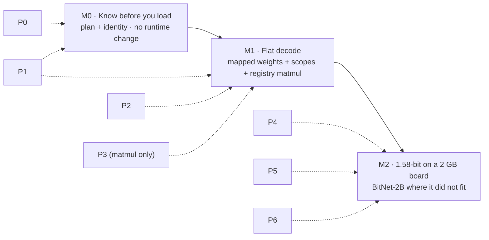

# PRD — SKaiNET memory architecture milestones M0 · M1 · M2

Status: accepted 2026-08-22 · tracked in [#932](https://github.com/SKaiNET-developers/SKaiNET/issues/932) → [#1001 M0](https://github.com/SKaiNET-developers/SKaiNET/issues/1001) · [#1002 M1](https://github.com/SKaiNET-developers/SKaiNET/issues/1002) · [#1003 M2](https://github.com/SKaiNET-developers/SKaiNET/issues/1003) (one `sub-issue` per slice = one feature branch)
Companion documents: [memory-architecture-proposal.md](memory-architecture-proposal.md) (design, all decisions recorded in §10); the kernel contract sample `Int4MatmulKernelSample.kt` is a deliverable of [#1027](https://github.com/SKaiNET-developers/SKaiNET/issues/1027)

---

## 1. Purpose

Deliver the decided storage architecture (SKEEP-003, end-state A via B mechanics) as three milestones, each demonstrated by a **small sample app whose output is a number that was bad before and is good after**. Every milestone's sample app doubles as the acceptance test for the phases it consumes.



Phases P0–P8 are defined in the proposal §9. P7 (compiled parity) and P8 (façade removal) are outside these three milestones and follow M2.

Note (2026-08-22): the LLM models and decode loop (Llama/Qwen/Gemma, `PreTransposed*` weights) live in [SKaiNET-transformers](https://github.com/SKaiNET-developers/SKaiNET-transformers); SKaiNET core holds the engine, IO and KV-cache stores. The home of the `skainet-decode` sample is decided in [#1032](https://github.com/SKaiNET-developers/SKaiNET/issues/1032).

## 2. Users and the problem

| User | Today | After M1/M2 |
|---|---|---|
| App developer targeting a 2 GB Android / SBC device | finds out at runtime (OOM, stall, or crash in layer 17) whether a model fits | gets a memory plan from the file header before loading; decode memory is flat by construction |
| Contributor writing a kernel | adds another arm to an `is`-ladder; rank-1 and packed-dtype edge cases are each a new special case (#991, #993) | registers one function under a `KernelKey`; never sees `TensorData` subclasses |
| Maintainer debugging a memory report | reconstructs which tensor allocated what from stack traces | reads `TensorId · Scope · StorageId` in a watch window or a Perfetto track |

Reference hardware for all acceptance numbers: **2 GB board** (Cortex-A55-class Android device or equivalent SBC) and a **JVM with `-Xmx256m`** as the desktop stand-in.

## 3. Non-goals

- No change to the public 0.39 DSL surface; everything additive or behind façades (proposal, Compatibility section).
- No device/GPU backend. `Storage.Device` stays a placeholder.
- No IDE plugin or live inspector (follow-up SKEEP, decision #12).
- No compiled-path (`HloGenerator`/IREE) changes before M2 is done (P7).

---

## 4. M0 — "Know before you load"

### 4.1 Goal
Answer *will this model fit on this device at this context length?* from the GGUF header alone, and give every weight a stable `TensorId`. No runtime behaviour changes.

### 4.2 Consumes
P0 (two-way dtype bridge, `StorageSpec` → allocation spec, `DType` merge started) · P1 partial (`Format` reported by readers, `TensorId` + `NameMap` for GGUF, `toString()` renderer).

### 4.3 Sample app: `skainet-plan`
CLI in `skainet-apps` (JVM + K/Native macOS), plus the same function exposed as a library call for the Android sample.

```
$ skainet plan Llama-3.2-1B-Instruct-Q4_K_M.gguf --ctx 2048 --budget 1.3G
Llama-3.2-1B-Instruct · Q4_K_M · 16 layers · ctx 2048 · profile: 2GB-device
  weights   Mapped, packed        812 MB   resident
  kv cache  bf16                   68 MB   (17 MB with TurboQuant 4-bit)
  forward   prefill chunk 256      35 MB
  heap      headroom               64 MB
  total                           979 MB   of 1300 MB  ✔ fits

$ skainet plan … --budget 0.9G
  total                           979 MB   of  900 MB  ✘ does not fit
  suggestions: --ctx 1024 (−34 MB) · --kv turboquant (−51 MB) · Qwen2.5-0.5B-Q4_K_M (−400 MB)

$ skainet plan … --list layers[3].*
  layers[3].attn.q_proj.weight   F32/Q4_K  [2048,2048]   2.4 MB   ← blk.3.attn_q.weight
  layers[3].attn.k_proj.weight   F32/Q4_K  [512,2048]    0.6 MB   ← blk.3.attn_k.weight
  …
```

### 4.4 Functional requirements
| ID | Requirement |
|---|---|
| M0-F1 | Plan is computed from shapes + encodings only; no tensor bytes are read. |
| M0-F2 | Plan covers weights (resident), KV at `--ctx` in bf16 and TurboQuant, `Forward` slab for the prefill chunk, heap headroom; totals against `--budget` or the platform-detected budget (decision #11 reserve defaults). |
| M0-F3 | On "does not fit", print at least two concrete suggestions with their savings. |
| M0-F4 | Every GGUF tensor maps to a structured `TensorId` via `NameMap`; unmapped names are listed, never silently dropped. |
| M0-F5 | `Tensor`/`TensorView`/storage descriptor `toString()` prints `TensorId · Format · Shape · storage kind · origin · scope · StorageId` (scope/StorageId shown as `—` until M1). |
| M0-F6 | Runs on JVM, macOS native, and as a library call from the Android sample. |

### 4.5 Acceptance criteria
- A1: plan for Llama-3.2-1B Q4_K_M at ctx 2048 is within ±10 % of measured resident memory after M1 lands (recorded now, verified at M1).
- A2: all tensors of three reference GGUFs (Llama-3.2-1B, Qwen2.5-0.5B, Gemma-3-1B) map to `TensorId`s with zero unmapped names.
- A3: `Q4_K` tensors report `Format(F32, Q4_K)`; no reader reports a packed tensor as `Byte`.
- A4: unit tests for plan arithmetic; golden test for the three reference plans.
- A5: existing benchmarks unchanged (no runtime code path touched).

### 4.6 Deliverables
`skainet-plan` CLI; `NameMap` for GGUF; `TensorId`; merged `DType` (or the two-way bridge with merge scheduled); renderer; README screenshot.

---

## 5. M1 — "Flat decode"

### 5.1 Goal
Run a real 1B-class model with weights mapped outside the heap and a recycled `Forward` scope so that memory over 1 000 decode steps is a flat line, and single-token decode on packed weights goes through the kernel registry with no special cases.

### 5.2 Consumes
P1 complete · P2 (`Storage` Heap/OffHeap/Mapped, `Owner`, `Scope` Model/Forward/Ambient, `TensorView`, `TensorData` façades, `TraceSink` + allocation events) · P3 for **matmul only** (`KernelRegistry`, rank normalization, adapters, reference kernel; sdpa/elementwise still via façades) · the Phase 2 prototype benchmark (decision #6) passed.

### 5.3 Sample app: `skainet-decode`
CLI (JVM, K/Native) and a minimal Android activity (Compose, one text field, one button). Runs prefill on a fixed prompt, then N decode tokens, prints a table, and writes a Perfetto trace.

```
$ skainet decode Llama-3.2-1B-Instruct-Q4_K_M.gguf --tokens 1000 --trace out.json
                                before (develop 0.39)     after (M1)
  peak RSS during load          2.9 GB                    0.95 GB
  RSS at step 1000              2.4 GB (rising)           0.98 GB (flat, Δ < 1 %)
  allocations / decode step     ~4 200 objects            0 (Forward) · 3 (Ambient, tokens)
  rank-1 decode on Q4_K         ClassCastException (#993) ok · registry: matmul[F32×Q4_K]
  adapters / step               n/a                       0 (listed if any, with TensorId)
  TTFT (prefill 64 tok)         1.42 s                    1.31 s
  decode tok/s                  8.9                       9.1
  effective bandwidth           7.2 GB/s (of ~12)         7.4 GB/s
```
("before" numbers are illustrative; the app measures both branches with the same harness.)

### 5.4 Functional requirements
| ID | Requirement |
|---|---|
| M1-F1 | Weights load as `Storage.Mapped`, packed, into `Scope.Model`; no dequantize-to-dense on this profile. |
| M1-F2 | KV cache preallocated in `Scope.Model` to `--ctx`; ring semantics per decision #4 (head/tail pair; gather adapter fallback). |
| M1-F3 | Activations allocate in `Scope.Forward` (bump allocator, `reset()` per step); escape requires explicit `retain()`. |
| M1-F4 | `Ambient` scope remains the default outside the generation loop; notebook code unchanged. |
| M1-F5 | All matmul dispatch goes through `KernelRegistry`; rank normalization happens once before lookup; no `is`-check on `TensorData` subclasses remains in the matmul path. |
| M1-F6 | `TensorView.get()` on a packed view decodes; the reference kernel is correct on any `Format`. |
| M1-F7 | `TraceSink` emits phase, kernel, adapter and allocation events; Perfetto exporter and JFR (JVM) / `android.os.Trace` (Android) bindings. |
| M1-F8 | Memory-plan vs actual comparison printed; a difference > 10 % fails the CI acceptance run. |
| M1-F9 | `SKAINET_MEMORY_DEBUG=1` enables allocation-site tagging, use-after-close with the closing stack, and adapter logging. |

### 5.5 Acceptance criteria
- A1: **Flat RSS** — over 1 000 decode steps, RSS at step 1000 is within 1 % of RSS at step 50, on JVM (`-Xmx256m`) and on the reference Android device.
- A2: Peak RSS during load ≤ packed file size + KV + `Forward` slab + 100 MB.
- A3: Zero `Forward`-scope allocations per decode step after warm-up (allocation events assert this).
- A4: The #993 repro (rank-1 activation × `PreTransposedQ4_K`) runs through the registry with no special-casing and finite output; #991's strict-subtype case likewise.
- A5: Decode tok/s and effective bandwidth ≥ `develop` baseline − 3 % (decision #6); matmul microbenchmarks within noise.
- A6: Golden parity: packed matmul outputs bit-identical to `develop` for all seven GGML encodings + ternary + TurboQuant.
- A7: Perfetto trace shows one track per scope, a flat live-bytes counter, kernel spans labelled by `TensorId`.
- A8: Plan-vs-actual within 10 % (closes M0-A1).
- A9: `develop` stays green throughout; `TensorData` public API source-compatible (BCV dumps).

### 5.6 Deliverables
`skainet-decode` CLI + Android sample; `Storage`/`Scope`/`TensorView`; matmul registry; `TraceSink` + three exporters; debug memory mode; before/after table and Perfetto screenshot in the release notes.

---

## 6. M2 — "1.58-bit on a 2 GB board"

### 6.1 Goal
Run BitNet-b1.58-2B on the reference device — a model that does not fit today — with mapped ternary weights, a dispatcher-inserted I8 requant adapter, and a NEON kernel shipped as a kernel pack.

### 6.2 Consumes
P4 (one view mechanism; sliding-window KV demo) · P5 (IO pipeline; Android mmap as a config; 2 GB profile planner + fit check; exporters) · P6 (`BITNET_B1_58` encoding with `Encoding.activation`; requant adapter; reference kernel; NEON kernel pack).

### 6.3 Sample app
`skainet-decode` from M1, pointed at a BitNet GGUF, run on the reference device, plus `skainet-plan` showing the fit. Same table, plus:

```
  encoding                      BITNET_B1_58 (ternary, ~1.6 bpw)
  activation adapter            F32 → I8 absmax, 4 KB/step, Forward scope
  kernel                        bitnet_gemv · pack: skainet-kernels-android-neon
  resident                      1.18 GB of 1.30 GB budget
```

### 6.4 Functional requirements
| ID | Requirement |
|---|---|
| M2-F1 | `Encoding.BITNET_B1_58` (and `TQ1_0`/`TQ2_0`) defined with block spec, bpw, scale placement, and `activation = Format(I8, DENSE_I8_ABSMAX)`. |
| M2-F2 | Reference decoder and parity fixtures generated from the `Encoding` descriptor (ties into #988). |
| M2-F3 | Requant adapter inserted by the dispatcher, allocated in `Forward`, visible in trace and debug log. |
| M2-F4 | NEON `bitnet_gemv` registered from an optional artifact (`skainet-kernels-android-neon`); removing the artifact falls back to the reference kernel with a warning, not a crash. |
| M2-F5 | Sliding-window KV with ring wrap-around runs zero-copy through the (head, tail) pair in SKaiNET's sdpa kernel. |
| M2-F6 | Planner 2 GB profile active by default on Android; TurboQuant KV auto-enabled when the plan exceeds 80 % of budget. |

### 6.5 Acceptance criteria
- A1: BitNet-2B decodes on the reference device within budget; resident ≤ 1.3 GB; RSS flat per M1-A1.
- A2: Reference vs NEON `bitnet_gemv` parity within 1e-5 relative on fixtures; NEON ≥ 3× reference on Cortex-A55.
- A3: Page-fault rate per decode step after warm-up ≈ 0 (weights resident).
- A4: Ring wrap-around at ctx boundary produces identical logits to a non-ring run over the same window.
- A5: Android mmap path (#921/#922) closes: load of Llama-1B Q4_K_M on a 2 GB device with no OOM.
- A6: All M1 acceptance criteria still pass.

### 6.6 Deliverables
Ternary encodings + kernel pack; requant adapter; IO pipeline configs; 2 GB profile; release post with the M1 and M2 tables side by side.

---

## 7. Cross-milestone requirements

- **Compatibility**: 0.39 public API preserved; deprecate with `ReplaceWith`, never delete before a major; dead code with zero consumers may be removed with evidence in the PR.
- **Encoding preservation**: golden parity tests for all encodings run in CI from M0 onward and gate every phase.
- **Benchmarks**: `StorageBenchmarks`, matmul microbenches and the Phoronix program run on every milestone; regressions beyond decision #6's budget block the milestone.
- **Tracking**: one tracking issue per milestone, `sub-issue`-labelled children per phase slice, in the style of #984–#988.

## 8. Risks

| Risk | Mitigation |
|---|---|
| Element-access indirection costs more than 3 % | Prototype benchmark before P2 on JVM and Android (decision #6); redesign access path if exceeded. |
| Migration stalls mid-way, producing a third layer | Façade phase keeps `develop` green; M1 is scoped to matmul only so the first visible win arrives early. |
| `Forward`-scoped tensor escapes into model state | Debug-mode scope tagging + leak check at `reset()`; `retain()` is the only escape API. |
| Plan arithmetic drifts from reality as kernels change | Plan-vs-actual assertion in CI (M1-F8). |
| Reference device availability for CI | Self-hosted Android runner (one device) for milestone acceptance; smoke on emulator per PR. |

## 9. Open items
- Choice of reference Android device (Cortex-A55 class, 2 GB) — needed before the P2 prototype benchmark → decided in [#1016](https://github.com/SKaiNET-developers/SKaiNET/issues/1016).
- Whether `skainet-plan` ships inside `skainet-apps` or as a separate `skainet-tools` artifact → `skainet-apps/skainet-plan` (JVM CLI; planner in `commonMain`), [#1013](https://github.com/SKaiNET-developers/SKaiNET/issues/1013).
- Home of the `skainet-decode` sample (core vs SKaiNET-transformers) → [#1032](https://github.com/SKaiNET-developers/SKaiNET/issues/1032).
