# SKaiNET memory & storage architecture — analysis and proposal (rev. 2)

Input for the SKEEP-003 decision. Status: **accepted 2026-08-22** — SKEEP-003 (`docs/modules/skeep/pages/003-unified-tensor-storage.adoc`) records the decision; the roadmap is tracked in [#932](https://github.com/SKaiNET-developers/SKaiNET/issues/932) → [#1001 M0](https://github.com/SKaiNET-developers/SKaiNET/issues/1001), [#1002 M1](https://github.com/SKaiNET-developers/SKaiNET/issues/1002), [#1003 M2](https://github.com/SKaiNET-developers/SKaiNET/issues/1003). Milestone scoping and sample apps: [memory-architecture-milestones-prd.md](memory-architecture-milestones-prd.md).
Revision 2: coherent naming (`Storage` / `TensorView` / `Tensor`), terminology section added.

Sources read: ZML `concepts.md`, SKaiNET README/ARCHITECTURE, SKEEP-003 (unified tensor storage), open issues incl. #993, #991/#992, #921/#922, #782, #988.

---

## 0. Terminology

The vocabulary below is used consistently in every diagram and rule. Names were chosen so that a Java, Kotlin or PyTorch developer's first guess is the right one, and so that nothing collides with `java.nio`, `java.lang.foreign` or the Kotlin stdlib.

| Term | One-line definition | Owns bytes? | Closest familiar thing | Why this name |
|---|---|---|---|---|
| **Shape** | Dimensions (and optional axis labels) of an n-d array. Pure metadata. | no | numpy `shape`, ZML `Shape` | Already exists in SKaiNET. |
| **DType** | The *logical* element type: what a value means when you read it (F32, BF16, F16, I8, …). | no | `torch.dtype` | Already exists. The proposal's change is that it is never erased. |
| **Encoding** | How bytes are *laid out* for that dtype: `DENSE`, `Q4_0`, `Q4_K`, `Q6_K`, `TQ1_0` (ternary), `BITNET_B1_58`, `TURBOQUANT_4`, … Carries block size, bits per element, scale placement, and optionally the activation format its fast kernel requires. | no | `ggml_type`, the existing `TensorEncoding` | Already exists; promoted to a real descriptor. |
| **Format** | The pair `(DType, Encoding)`. "A Q4_K weight" is `Format(F32, Q4_K)`: logically F32, stored as Q4_K. Dispatch keys on Formats. | no | — | New; the pair needs one name because it appears in every kernel key. |
| **Layout** | Strides, byte offset and contiguity of a view over storage. | no | numpy strides, `torch.stride()` | Standard term. |
| **Storage** | The one and only owner of bytes. Sealed: `Heap` (Kotlin arrays, `java.nio.ByteBuffer`), `OffHeap` (`MemorySegment` / native pointer), `Mapped` (file region), `Device` (accelerator handle). Has an `Owner`, a `Scope` and a `Domain`. Closing it invalidates every view over it. | **yes** | `torch.Storage`, `ggml_context` arena, ZML `Slice`/`Buffer` | PyTorch-familiar, and truthful: a `java.nio.Buffer`, a `MemorySegment`, an mmap are all *kinds of storage*. Not named `Buffer` precisely because `java.nio.Buffer` is a flat typed cursor that this layer wraps. |
| **Owner** | How a `Storage` came to hold its bytes: `Owned(scope)` (we allocated it, the scope frees it), `Borrowed(external)` (caller's array / nio buffer / mmap; we never free), `Alias(parent)` (a view's storage reference; keeps the parent alive, cannot free or resize). | — | Rust `Box`/`&`/slice, ZML owned-vs-borrowed `Slice` | Ownership as an enum makes it a constructor argument instead of a field nobody reads. |
| **Scope** | A lifetime that `Owned` storage belongs to. Three kinds: `Model` (weights, KV backing; closed on unload), `Forward` (activations; recycled per forward pass), `Ambient` (GC-managed; the default). `AutoCloseable`. | — | Java `Arena`, Kotlin `use {}`, structured concurrency | "Arena" was avoided because `java.lang.foreign.Arena` is the JVM *implementation* of a scope, not the concept. |
| **Domain** | Where the bytes physically are: `HOST_HEAP`, `HOST_OFFHEAP`, `MMAP_FILE`, `DEVICE_LOCAL`, `UNIFIED`, `HOST_PINNED`. | — | the existing `MemoryDomain` | Already exists. |
| **MemoryPlanner** | The policy object that answers "which `Storage` kind, in which `Scope`, for this allocation?" from size, scope, platform and developer overrides; also computes the pre-load memory plan from shapes. One per `ExecutionContext`. | — | ONNX Runtime arena planner | Already exists (constructed per property read, never consulted); made the single placement authority. See §4.8. |
| **TensorView** | `Shape + Format + Layout + Storage`. The *interpretation* of some bytes as an n-d typed array. Never owns bytes. Slicing, transposing, unsqueezing a `TensorView` yields another `TensorView` over the same `Storage`. **This is the only thing a kernel receives.** | no | numpy `ndarray` (minus ownership), PyTorch `Tensor` (minus autograd), ZML `Buffer` | The word "view" states the ownership rule in the name. Not `Buffer` (nio collision), not `Array` (Kotlin collision), not `NDArray` (numpy's owns data). |
| **Tensor** | The developer-facing DSL handle: `Shape + Format + Value + autograd state`. `Value` is either `Materialized(TensorView)` (eager) or `Symbolic(GraphNode)` (tracing/compiling). One type serves both modes. | no (through its view) | `torch.Tensor`, ZML `Tensor` (symbolic half only) | Already exists; gains `Format` and a sealed `Value`. |
| **Kernel** | A function `(inputs: List<TensorView>, out: TensorView) -> Unit` registered under a `KernelKey`. | — | `ggml` op impl, XLA custom call | Standard. |
| **KernelKey** | `(op, input Formats, layout class, placement, platform capabilities)`. What the dispatcher looks up. | — | — | New. Replaces `is`-ladders over Kotlin classes. |
| **Adapter** | A dispatcher-inserted conversion between Formats or Layouts (dequantize block→dense, requantize F32→I8 absmax, gather strided→contiguous). Allocates into the active `Forward` scope. Always visible in debug logs and memory tracking. | — | TVM/XLA layout conversion passes | New as a named concept; today these happen implicitly inside kernels or not at all. |
| **materialize()** | The single copy point: `TensorView.materialize(targetFormat, scope)` → a new `Owned` storage. Everything else is a view. | — | `.contiguous()` / `.to()` | Already exists as `MaterializationStrategy`; made the *only* copy path. |
| **TensorId** | Stable, human-readable identity of a tensor derived from the DSL structure: `model.layers[3].attn.q_proj.weight`; activations get a discriminator (`…attn.scores#step=17`). The *same* id whether the tensor is `Materialized` or `Symbolic`, eager or compiled. Optional — anonymous tensors in a notebook have none. | — | PyTorch `named_parameters()` keys, MLIR `loc()` | One name that survives every representation; see §4.7. |
| **NodeId** | Identity of a node in one `ComputeGraph`. One `TensorId` maps to many `NodeId`s (a tape per call). Carries its `TensorId` as a label. | — | graph node handle | Already exists implicitly; made to carry `TensorId`. |
| **StorageId** | Monotonic per-process identity of one allocation, with scope, allocation site and size. One `TensorId` maps to many `StorageId`s over time (Forward scope recycled each step); one `Storage` may back many `TensorId`s (views, KV ring). | — | allocation handle | Ephemeral; what the memory debugger keys on. |
| **NameMap** | Bidirectional mapping between a checkpoint's naming (`blk.3.attn_q.weight` in GGUF, HF `model.layers.3.self_attn.q_proj.weight`) and `TensorId`. One per format, in `skainet-io`. | — | HF weight-name converters | Replaces string munging spread across loaders. |

The whole model in one sentence: **`Storage` owns bytes, `TensorView` interprets them, `Tensor` is the DSL handle over a view or a graph node, and kernels take views.**

Mapping to the current codebase (for migration reading): `TensorData` → becomes a façade over `TensorView`; `TensorStorage` + `BufferHandle` → `Storage` + `Owner`; `SlicedTensorView`, `BufferHandle.Aliased`, packed-transpose rewrap → `TensorView` with a `Layout`; `LogicalDType` + `DType` → one `DType`; `TensorEncoding` → `Encoding`; `Placement.Residency` → `Scope`; `MemoryDomain` → `Domain`.

---

## 1. SKaiNET in one page — architecture and philosophy

SKaiNET is a Kotlin Multiplatform AI framework whose identity rests on one sentence from the README: *a model is defined once in the Kotlin DSL, then either compiled or executed eagerly — without rewriting it.*

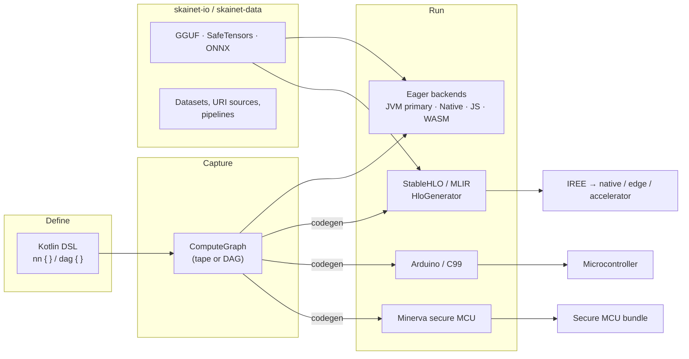

The philosophical commitments, as read from the repo and the SKEEPs:

| Commitment | What it means in practice |
|---|---|
| **Developer-friendly first** | Kotlin DSL, Java support, notebooks, 5-minute starts. A developer should never need to know what a `MemorySegment` is to run a model. |
| **One model, many targets** | Eager on the JVM is the development loop; StableHLO/IREE, C99 and Minerva are *siblings*, not a separate pipeline. Anything added to the storage model must make sense for all of them. |
| **On-device is the point** | Android, iOS, WASM, MCUs. Memory is the scarcest resource; the failure that matters is "OOM on a phone". |
| **Packed encodings are first-class** | Seven GGML block formats, ternary, TurboQuant KV compression — as *storage types with block accessors*. SKEEP-003 correctly calls this the crown jewel that must survive any refactor bit-identically. |
| **Design is recorded** | SKEEP process, deprecate-don't-delete, BCV tracking. Architecture change arrives as reviewable slices. |

The tension driving this document: commitments 3 and 4 require a precise, enforced memory model; commitment 1 requires that precision to be invisible by default.

---

## 2. What ZML actually teaches (and what it doesn't)

ZML's `concepts.md` is short, and its lesson is not "use Zig". It is a **type-level separation of four things that most frameworks conflate**. ZML's own names are kept here; the SKaiNET equivalent is in parentheses.

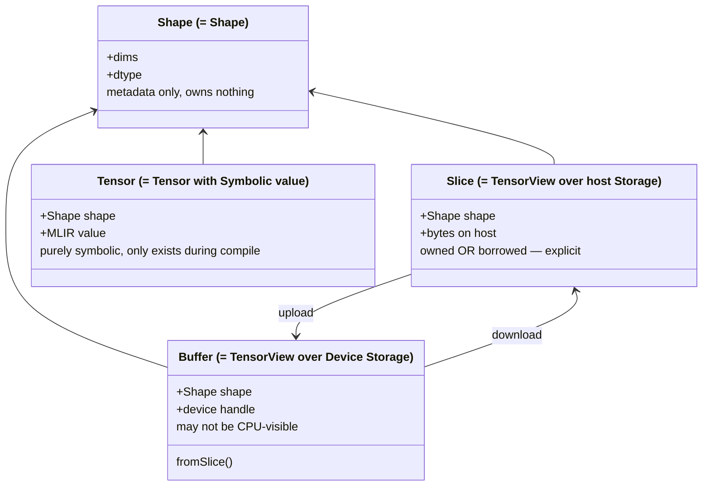

And a **lifecycle that never touches bytes until it has to**:

1. Open the model file, read **shapes only**.
2. Build the model struct from shapes (pure symbolic `Tensor`s).
3. Compile `forward` — still no weights in memory.
4. Load weights (`Bufferize(Model)` mirrors the struct with `Tensor` replaced by `Buffer`).
5. Run, fetch outputs, free.

Three transferable ideas:

- **Ownership is a constructor argument, not a field that someone may read later.**
- **Compile-time and run-time objects are different types.** You cannot pass host bytes into a compiler by accident, or do arithmetic on a symbolic tensor in eager code.
- **Weight loading and compilation are independent and parallel**, because step 1 only needs shapes. This is the single largest startup-time win available to SKaiNET's compiled path.

What ZML does *not* have and SKaiNET must not copy-away: no first-class packed encodings, no eager mode to keep simple, no multiplatform constraint (WASM can't mmap, Apple has no `O_DIRECT`, JS can't block). SKEEP-003 says it exactly: *the goal is wiring, not imitation.*

---

## 3. Diagnosis — why the bugs cluster where they do

SKEEP-003's audit is accurate; this compresses it and connects it to the live issues.

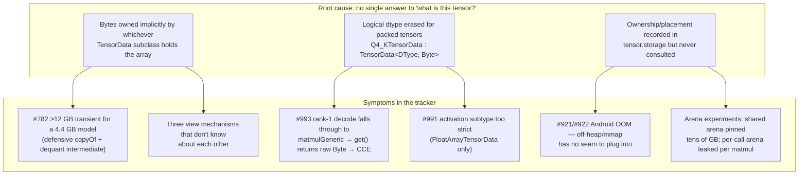

The pattern worth naming: **every quantisation bug is a dispatch bug**, and every dispatch bug exists because kernel selection keys on *Kotlin class + ad-hoc shape guard* instead of on a declared `Format` + `Layout`. #993 is the textbook case: the quantised path has a `rank >= 2` guard; nothing tells the generic path "this operand is not dense, you may not `get()` it"; so it does, and gets a byte. A correct storage model makes that crash impossible by construction, not by adding a `rank < 1` patch and a defensive fallback (#992 — reasonable hotfix, third special case in those two functions).

The two arena failures share one shape: weights and activations were given one lifetime. The vocabulary to separate them (`Residency.PERSISTENT/TRANSIENT`) exists and is unused.

---

## 4. Proposal — the SKaiNET memory model

### 4.1 Decision on the SKEEP-003 end-states

**Recommendation: End-state A (storage-first), delivered with End-state B's incremental mechanics.** Introduce the new types *beside* the existing ones, turn every `TensorData` implementation into a thin façade over `TensorView`, migrate dispatch sites one kernel at a time, delete façades at the next major. Pure B leaves the erased packed dtype and the `is`-ladder in place, so #993-class bugs keep arriving; pure A as a big-bang rewrite risks the "third layer" failure SKEEP-003 warns about.

New names (`Storage`, `TensorView`) rather than evolving `TensorStorage`/`TensorData` in place, so the migration state is visible in code review ("this kernel still takes `TensorData`").

### 4.2 The types

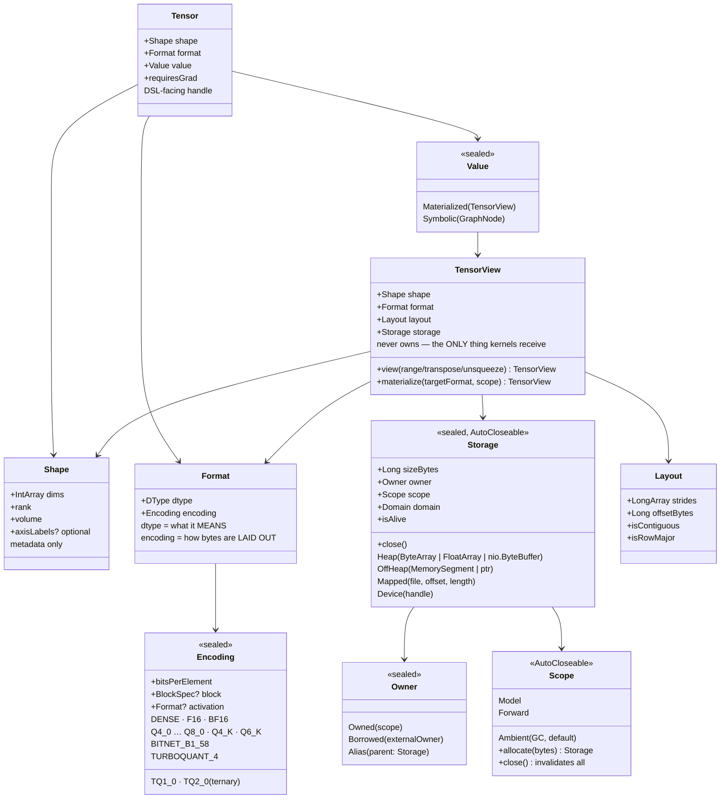

SKaiNET additions that ZML lacks: `Format` with a real `Encoding`, `Layout` for zero-copy views, `Scope` for lifetimes, and a `Tensor` that can be *either* materialized or symbolic so eager and traced code share one DSL surface.

### 4.3 Rules (the part that prevents bug classes)

1. **Exactly one byte owner.** `Storage` owns bytes. `TensorView` never does; `Tensor` never does. Every byte comes from `Storage.allocate(spec, scope)` or `Storage.wrap(existing, Owner.Borrowed)` — there is no implicit copy anywhere.
2. **Ownership is an argument, then it is enforced.** `Borrowed` storage cannot be closed or resized; `Alias` keeps its parent alive and delegates mutability; closing a `Scope` invalidates every `Owned` storage in it, and any subsequent access throws `StorageClosedException` carrying the allocation site (debug) — not a JVM crash, not silent corruption.
3. **Logical dtype is never erased.** A Q4_K weight is `Format(F32, Q4_K)`. A BitNet weight is `Format(F32, BITNET_B1_58)`. Anything that needs a `KClass<T>` witness gets it from `dtype`, not from the Kotlin class of the storage.
4. **`TensorView.get(i)` on a non-dense encoding returns the decoded logical value or throws `NonDenseAccess`.** It never returns a raw byte. The slow path is correct; the fast path is a kernel. This single rule kills #993 and #991.
5. **A view is a `TensorView` with the same `Storage`, different `Layout`.** Slice, transpose, unsqueeze, squeeze, narrow, sliding window: all produce views, all zero-copy, all `Owner.Alias`. The existing packed-transpose trick becomes "a view whose `Layout` says transposed and whose `Encoding` says blocked" — same bytes, bit-identical.
6. **`materialize()` is the only copy point**, and it takes a target `Scope` and `Format`. It is what the dispatcher inserts as an adapter when a kernel cannot consume a view or an encoding directly.
7. **Compile reads `Shape + Format` only.** `HloGenerator` must be callable on a model whose `Tensor.value` is entirely `Symbolic` — no `Storage` exists yet. Weight loading runs in parallel.

### 4.4 Ownership lifecycle

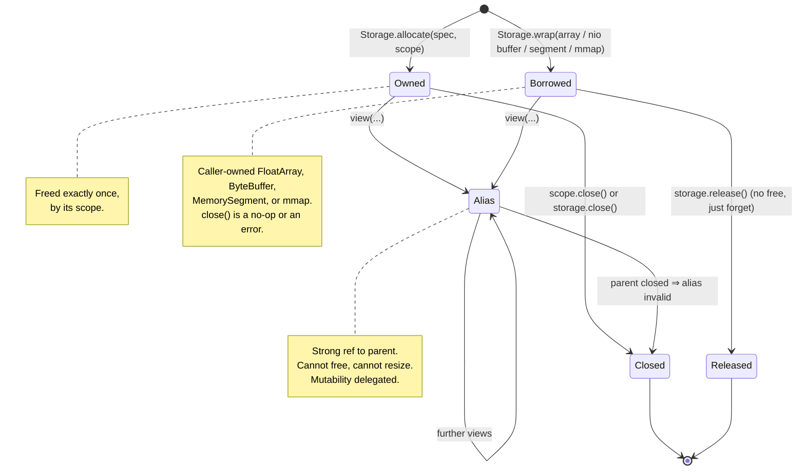

### 4.5 Scopes — fixing both arena failures

```mermaid
flowchart LR
    subgraph MODEL["Scope.Model — lives until model.close()"]
        W["Weights (Mapped or OffHeap storage)"]
        KV["KV cache backing (preallocated ring)"]
        EMB["Embedding table (RowDequantSource)"]
    end
    subgraph FWD["Scope.Forward — recycled every forward()"]
        A1["Activations"]
        A2["Attention scratch"]
        A3["Adapter outputs (e.g. I8 requantized activations)"]
    end
    subgraph AMB["Scope.Ambient — GC, default for notebooks & tests"]
        T["Ad-hoc tensors: a matMul b"]
    end
    W -. read-only views .-> FWD
    KV <-. views in/out .-> FWD
    FWD -->|outputs escape only by explicit<br/>.retain(scope) or .toAmbient()| AMB
```

- **Shared-arena failure** (tens of GB pinned): activations were allocated in a model-lifetime arena. Now they cannot be unless the developer says so.
- **Per-call-arena failure** (leak per matmul): op outputs escape a single call but not a forward pass. `Forward` scope matches that lifetime exactly. On the JVM it rides on `Arena.ofShared()` that is *recycled*, not freed — a ring/bump allocator, so steady-state allocation in decode is zero.
- **Escape hazard**: a `Forward`-scoped storage stored into model state. Debug mode tags every allocation with its scope and throws on cross-scope assignment into `Model`-scoped structures; the public API for "keep this" is an explicit `retain()`. Same discipline as Kotlin structured concurrency.
- **Ambient stays the default.** `val c = a matMul b` in a notebook works exactly as today, GC-backed. Scopes are opt-in per `ExecutionContext`. This meets "truly easy eager" without a second API.

### 4.6 Zero-copy views and sliding windows

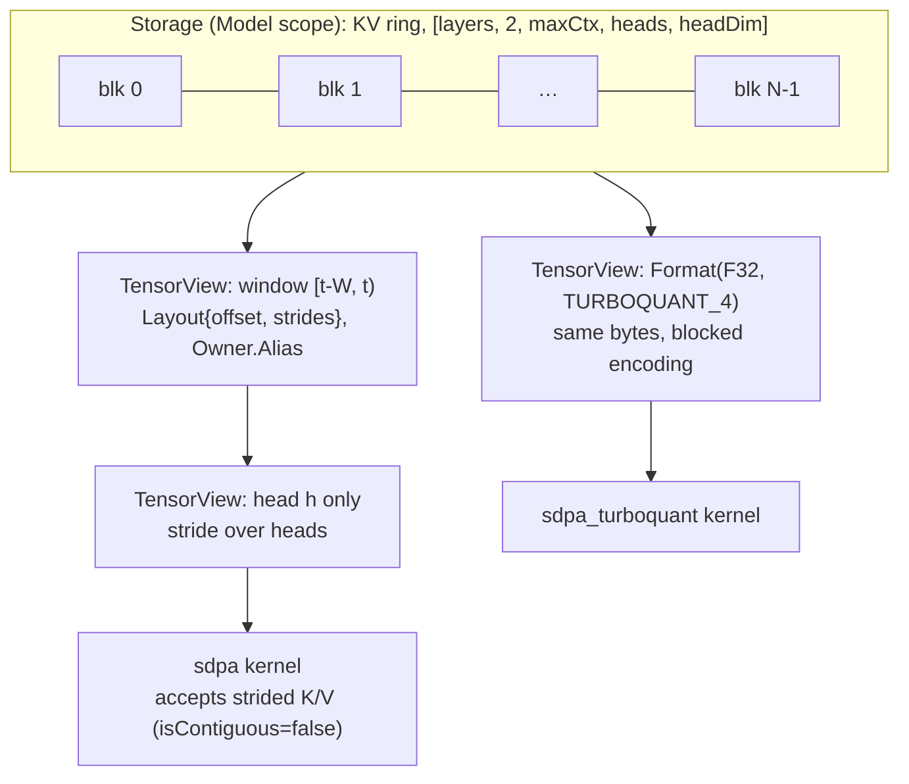

Rules 5 and 6 make this routine: the window is a view. No copy per token. Kernels declare whether they accept non-contiguous input; the dispatcher inserts a gather adapter only when they don't.

**Ring wrap-around — decided (2026-08-22):** `Layout` stays single-segment. `KVCache.window(from, to)` returns a `WindowedKV(head: TensorView, tail: TensorView?)` pair; SKaiNET's attention kernels accept the pair and iterate two ranges. A kernel that declares it does not accept a pair gets the ordinary gather adapter, which materializes the window contiguously into `Forward` scope. Rationale: a true ring with zero extra memory and no copy spikes (both matter on-device); `Layout` stays trivial; the compiled lowering is exactly two `dynamic_slice` + `concatenate`, matching the eager loop; TurboQuant-encoded KV is unchanged since each half is a normal view. Rejected: segmented `Layout` (touches every strided-capable kernel and the exporter), copy-down (2× KV memory, periodic stall), double-write (2× memory and 2× write bandwidth).

### 4.7 Identity — one name across every representation

Today a weight has three disconnected labels: a GGUF name at load time, a `ComputeGraph` node at capture time, and `@Weights`/`@Place` annotations that nothing reads. That is the identity version of the storage split: the same thing, named differently in each layer, with nothing tying them together. Almost every debugging and round-trip question ("which tensor is this?", "where did this 96 MB come from?", "which DSL line does this IREE error belong to?") reduces to crossing those layers.

Identity splits into three because the lifetimes differ:

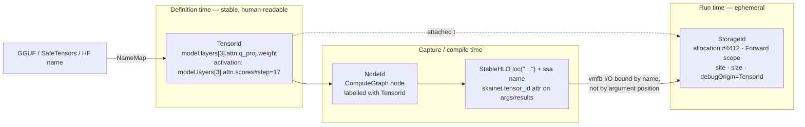

Rules:

1. **`TensorId` is assigned by the DSL**, from the module tree + parameter name inside `nn {}` / `dag {}`. It is the same id whether `Tensor.value` is `Materialized` or `Symbolic`. Views derive ids from their parent (`kv.layers[3].k[1024..2048)`), so a printed view says *what part of what* it is.
2. **Ids are optional.** `a matMul b` in a notebook is anonymous and free. In debug mode, or always when tracing for compile, `ExecutionContext` auto-numbers anonymous activations.
3. **`HloGenerator` emits `loc("…")` and a `skainet.tensor_id` attribute** on function arguments and results. IREE preserves `loc` through lowering, so a crash or numeric diff in a `.vmfb` maps back to a DSL line. Weights are bound to the compiled function **by `TensorId`, not by positional order** — this is what makes "load weights in parallel with compile" (rule 7) safe.
4. **`Storage` carries only its own `StorageId`**, plus a `debugOrigin: TensorId?` in debug builds. Identity is a property of the interpretation, not of the bytes.
5. **One `NameMap` per checkpoint format** in `skainet-io` does GGUF/HF/SafeTensors ↔ `TensorId`. Hot-swapping a LoRA or a requantized weight is `model[tensorId] = newView`.

#### The debugger experience

This is where identity stops being plumbing and becomes a feature no comparable framework offers out of the box. Four surfaces, cheapest first:

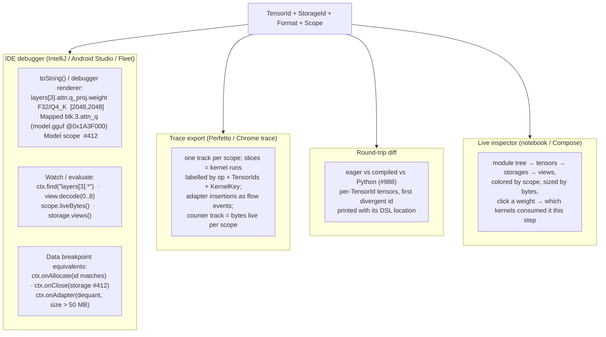

- **Debugger renderer** is nearly free: a `toString()` that prints `TensorId · Format · Shape · Storage kind · origin · scope · StorageId`, plus an IntelliJ custom renderer (shipped as an IDE plugin later) that lazily decodes the first few elements via `TensorView.get()` — rule 4 guarantees that decoding a packed weight in the watch window shows floats, never raw bytes. Today a `Q4_KTensorData` in a watch window is an opaque byte array.
- **Breakpoint-like hooks** on `ExecutionContext`: *break when a storage with origin `layers[3].*` is allocated in Forward scope*, *break when storage #412 is closed*, *break when an adapter larger than 50 MB is inserted*. These are ordinary callbacks that throw a `DebugBreak` exception or call `Thread.sleep` under the IDE; no JVMTI needed.
- **Trace export**: every kernel run and adapter insertion is an event keyed by `TensorId`s; scopes are tracks; live bytes per scope is a counter. Open it in Perfetto and the #782 "12 GB for a 4.4 GB model" is a visible staircase with the responsible `TensorId` on each step.
- **Round-trip diff**: run the same input eagerly and through the `.vmfb` (or the Python reference from #988), compare per `TensorId`, stop at the first divergence and print the DSL location from `loc()`. Turns "logits differ" into "`layers[7].mlp.gate_proj` differs, max abs 3e-2, eager Q6_K kernel vs compiled dequant path".
- **Live inspector** is the expensive one and last: a module-tree UI colored by scope and sized by bytes. Worth it for on-device developers staring at an Android memory budget, but it is a product, not a prerequisite.

Cost: one optional `String`-backed value class on `Tensor` and `TensorView`, one `Long` on `Storage`, one attribute emitted by `HloGenerator`. Everything above is built on those three fields.

### 4.8 Platform bindings — heap, off-heap, mapped, on every target

`Storage` kinds and `Scope`s are declared in `commonMain`; each platform binds them to what it has. The principle is the same everywhere: **where bytes live is a policy decision made by the `MemoryPlanner`; how long they live is a `Scope` decision; neither is made by a layer, a loader or a kernel.**

#### 4.8.1 JVM (primary eager target)

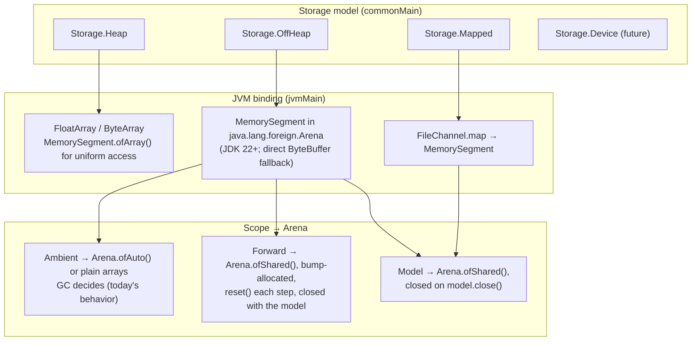

| Storage | Backing | Strengths | Limits | Default use |
|---|---|---|---|---|
| `Heap` | `FloatArray` / `ByteArray` | JIT-friendliest, Vector API `fromArray`, zero setup, every JVM | 2 GB per array; large arrays live in old-gen / G1 humongous regions and are copied by the GC; pauses scale with live bytes; no mmap | small tensors, notebooks, tests, anything in `Ambient` |
| `OffHeap` | `MemorySegment` (FFM) or direct `ByteBuffer` | no GC copying or scanning, > 2 GB, native alignment, handed to IREE/JNI zero-copy, freed deterministically by its `Arena` | needs a `Scope`; bounds-checked access has a small JIT-proven cost; `MaxDirectMemorySize` for the `ByteBuffer` variant | activations in `Forward`, dequantized weights and KV ring in `Model` |
| `Mapped` | `FileChannel.map` → `MemorySegment` | weights never enter any heap; OS pages them; resident set = pages touched; page cache shared across processes | read-only / copy-on-write; cold-touch page-fault latency | packed GGUF weights, embedding tables (`Owner.Borrowed` from the OS) |

The rule that follows: **weights go mapped or off-heap in `Model`; activations go off-heap in a recycled `Forward` arena; ad-hoc tensors stay on the heap in `Ambient`.** Both historical arena failures were violations of exactly this split.

How `Scope` maps to `java.lang.foreign.Arena`:

- `Ambient` — plain arrays or `Arena.ofAuto()`. GC-managed, identical to today; the notebook path never changes.
- `Forward` — one `Arena.ofShared()` per `ExecutionContext`, used as a **bump allocator**: `allocate()` advances an offset in a pre-reserved slab sized by the memory plan (shapes × context length, grow-by-chunk fallback); `reset()` at the end of each forward pass returns the offset to zero. Nothing is freed per op, nothing leaks per op, steady-state decode allocates zero bytes.
- `Model` — one `Arena.ofShared()` closed in `model.close()`; mapped segments live in it, so closing the model unmaps the file.
- A closed `Arena` already makes every segment throw `IllegalStateException`; `Storage` wraps that into `StorageClosedException` carrying `StorageId`, `TensorId` and (debug) the closing stack.

Views and borrowing are native to `MemorySegment`: a `TensorView` with a new `Layout` is `segment.asSlice(offset, len)` — zero-copy, bounds-checked, cannot outlive its arena (that *is* `Owner.Alias`); `Owner.Borrowed` is `MemorySegment.ofArray(floatArray)` / `ofBuffer(byteBuffer)` — the caller's memory, wrapped, never freed by us, replacing the defensive `copyOf()` behind #782.

Kernels don't care, but may ask: the JIT handles both segment and array access, the Vector API has `fromMemorySegment` next to `fromArray`; for hot loops `storage.asHeapArray()` (array or `null`) and `storage.segment()` give the direct path, and the `KernelKey` platform-capabilities field lets a pack register `Heap`-only or `OffHeap`-only variants. The existing `MemorySegment` matmul arms in `DefaultCpuOpsJvm.kt` become ordinary registered kernels instead of a parallel dispatch ladder.

#### 4.8.2 Android (JVM/ART)

The same three kinds, bound to what ART offers:

- `Heap` — Kotlin arrays on the ART heap. Subject to the per-app heap limit (`largeHeap` or not), which is the root of #922's load OOM; the planner must treat heap as *small and precious* here.
- `OffHeap` — direct `ByteBuffer` (`ByteBuffer.allocateDirect`) below the API level that ships FFM; `MemorySegment` where available. Outside the ART heap, counted by the OS against the process, not against the app heap limit.
- `Mapped` — `FileChannel.map` → `MappedByteBuffer`. Weights outside ART entirely; this is SKEEP-002 / #921, landing as a `Storage` implementation rather than a special `MmapTensorData`.
- `Scope` — `Forward` and `Model` hold lists of direct buffers and release them on close; the bump-allocator strategy is identical. The memory plan is even more valuable here: it can be checked against `ActivityManager.getMemoryInfo()` *before* loading.
- Kernels — NEON via JNI or (later) `MemorySegment` + FFM downcalls; `dotprod`/`i8mm` detection feeds the `KernelKey` capabilities field (#920).

#### 4.8.3 Kotlin/Native (macOS, iOS, Linux)

- `Heap` — Kotlin arrays; pinned (`usePinned`) when handed to a C kernel. Kotlin/Native's GC is not generational and array copies are expensive, so the planner prefers off-heap for anything large.
- `OffHeap` — `malloc` / `posix_memalign` through cinterop; alignment requested from the `Encoding`'s block spec (NEON wants 16 B, some AMX paths 64 B).
- `Mapped` — `mmap(2)`; Apple has no `O_DIRECT`, `fcntl(F_NOCACHE)` is the closest analog for direct staging and stays behind a per-platform capability flag.
- `Scope` — an allocator list with `free`/`munmap` on close; `Forward` is a bump slab as on the JVM.
- Kernels — C/NEON via cinterop (#958/#959, validation tracked in #979). `TensorView` hands the kernel a raw pointer + byte offset; the kernel pack is a `.klib` with a `cinterop` definition, no JNI.
- iOS note: memory pressure, not a hard limit, ends the process. `Mapped` weights are the only safe shape for models near the device budget, since the OS can evict clean pages instead of killing the app.

#### 4.8.4 WASM (browser, WasmWasi) and JS

- `Heap` is the only kind: linear memory, `ByteArray`/`FloatArray` in Kotlin. No mmap, no off-heap, no pointers.
- `OffHeap` and `Mapped` requests resolve to `Heap` with a planner note; code written against the common API runs unchanged.
- `Scope` is advisory (GC-backed); `Forward` still pre-sizes a slab so per-step allocation stays flat, which matters in a browser where GC pauses are visible.
- IO: JS/WASM cannot block, so the `suspend` variant of `RandomAccessSource` (SKEEP-003 open question) is required here; weights arrive via fetch + range requests into heap slabs.
- Kernels — WASM SIMD128 pack; 4 GB linear-memory ceiling (or Memory64 where available) is a planner input.

#### 4.8.5 Compiled targets (IREE, C99/Arduino, Minerva)

- **IREE**: `OffHeap` and `Mapped` segments are imported as externally-owned HAL buffers (`Owner.Borrowed` from IREE's point of view); on unified-memory devices (Apple silicon, most Android SoCs) that is zero-copy. Outputs come back as `Storage.Device` or host segments in `Forward` scope. Binding is by `TensorId`.
- **C99/Arduino**: no runtime `Storage` at all — the memory plan *is* the output: static arrays sized from shapes, `Forward` scratch as one static slab reused across ops. The same planner that sizes the JVM `Forward` slab emits the static layout.
- **Minerva**: weights are packaged into the bundle; `Format` (including packed encodings) goes into the manifest so the secure runtime knows how to read them.

#### 4.8.6 Summary matrix

| | JVM | Android | Kotlin/Native | WASM / JS | IREE | C99 / MCU |
|---|---|---|---|---|---|---|
| `Heap` | arrays | arrays (small heap limit) | arrays, pinned for C | **only option** | — | static arrays |
| `OffHeap` | `MemorySegment` / direct BB | direct BB / FFM | `malloc` | → Heap | HAL buffer | static slab |
| `Mapped` | `FileChannel.map` | `FileChannel.map` | `mmap` | → Heap | imported | — |
| `Forward` scope | `Arena.ofShared` bump | buffer list, bump | slab, `free` | pre-sized slab, GC | per-invoke | static scratch |
| `Model` scope | `Arena.ofShared` | buffer list | allocator list | GC | external buffers | ROM / flash |
| Memory plan used for | slab sizing, thresholds | fit check vs OS budget | slab sizing | 4 GB ceiling check | buffer import | **generated layout** |

What to measure before committing (the Phase 2 prototype benchmark, decision #6): element-access overhead of the new path vs raw arrays on elementwise kernels — `MemorySegment` on JVM, direct `ByteBuffer` on Android — with a **≤ 3 % budget on both**; and flat RSS over a few thousand decode steps with `Forward` bump + `reset()` on the Llama-1B Q4_K_M repro, on JVM and on one Android device.

### 4.9 Observability — one event stream for performance and memory

The three identities (`TensorId`, `StorageId`, `Scope`) give one event model; stage performance measurement and allocation tracking are two consumers of it, and the debugger surfaces of §4.7 are a third.

```mermaid
flowchart LR
    subgraph SRC["Instrumentation points (commonMain)"]
        PH["Phase markers<br/>load · compile · prefill · decode(step=n) · sample"]
        OP["Kernel run<br/>op · KernelKey · TensorIds · bytes read/written · duration"]
        AD["Adapter inserted<br/>kind · size · target TensorId"]
        AL["Allocation / free / reset<br/>StorageId · Scope · size · site · origin TensorId"]
        PF["Platform counters<br/>page faults · RSS · heap · direct memory"]
    end
    SINK["TraceSink (interface)<br/>no-op when disabled — one null check per event"]
    subgraph OUT["Exporters"]
        PER["Perfetto / Chrome JSON<br/>tracks per scope, flow events for adapters"]
        JFR["JFR custom events (JVM)<br/>opens in IntelliJ Profiler / JMC"]
        AT["android.os.Trace (Android)<br/>next to the OS in Perfetto / systrace"]
        SP["os_signpost (Apple)<br/>Instruments timeline"]
        BM["Benchmark report<br/>feeds the existing Phoronix program"]
    end
    SRC --> SINK --> OUT
```

**Stage performance.** Phases are explicit spans emitted by the generation loop (`prefill(tokens=512)`, `decode(step=17)`), with nested kernel spans labelled from the module tree (`layer[3].attn`, `layer[3].mlp`). Derived metrics need no extra instrumentation:

| Metric | Derived from | Why it matters on-device |
|---|---|---|
| Time-to-first-token | load → end of prefill | the number a user feels |
| Prefill tok/s, decode tok/s | phase span ÷ tokens | the headline |
| Per-layer / per-op breakdown | nested kernel spans | where a kernel actually helps |
| **Effective memory bandwidth** | bytes read by kernels ÷ decode-step time, vs device peak | decode is bandwidth-bound; this ratio says whether a kernel has headroom |
| Adapter cost | adapter spans and bytes per step | the silent-dequant budget (#782's class) |
| Page-fault rate on `Mapped` weights | platform counter per step | the model is not resident — the 2 GB failure mode, seen before it stalls |

Effective bandwidth is the metric to publish on the benchmark page: comparable across devices, and honest for quantized decode.

**Allocation tracking.** Every `Storage.allocate` / `close` / `Scope.reset` is an event with `StorageId`, scope, size, allocation site (debug) and origin `TensorId`. Consumers: live-bytes counter tracks and per-phase high-water marks; a leak check at `Forward.reset()` that names any activation still referenced from outside the scope; a **plan-vs-actual** comparison (the §4.8 memory plan predicted X, tracking saw Y — a difference above a threshold fails CI, which keeps the planner honest as kernels change); and a runtime budget guard that lets the planner refuse an adapter that would cross the budget mid-decode instead of letting the OS kill the process.

**Cost and placement.** Plain Kotlin: span start/end is a `Long` timestamp, events are small value objects in a ring buffer flushed by the exporter; no agents, no bytecode weaving. JFR and `android.os.Trace` are one-file platform bindings of the sink. `StorageBenchmarks` and the Phoronix benchmark program consume the same events, so benchmark and debugger numbers come from one code path and cannot drift apart.

---

## 5. Kernel dispatch — from class-ladder to declared contracts

### 5.1 Dispatch on descriptors, with explicit adapters

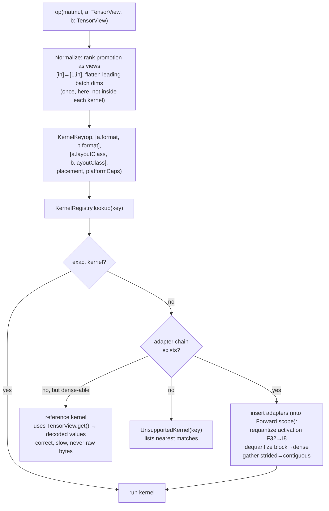

What changes relative to today:

- **Rank handling happens once**, before dispatch, as zero-copy views. #993's `rank >= 2` guard disappears because no kernel sees rank-1 input.
- **Activation format is part of the key**, so `(F32 act) × (Q4_K weight)` and `(I8 act) × (BITNET weight)` are different, explicit entries — not a `when` inside one function.
- **Adapters are first-class and visible.** An inserted requantize/dequantize is logged in debug mode and counted in the memory tracker. The "hidden 12 GB" of #782 would have been a visible adapter insertion.
- **The reference path is correct by rule 4.** No fast kernel → slow and right plus a warning, not a `ClassCastException` in layer 17.
- **The same registry serves the compiled path**: in `HloGenerator`, "adapter" means "emit a dequant/quant sub-graph or a `custom_call`", keyed on the identical `KernelKey`. One decision table for both modes.

### 5.2 Kernel provider SPI (platform packs)

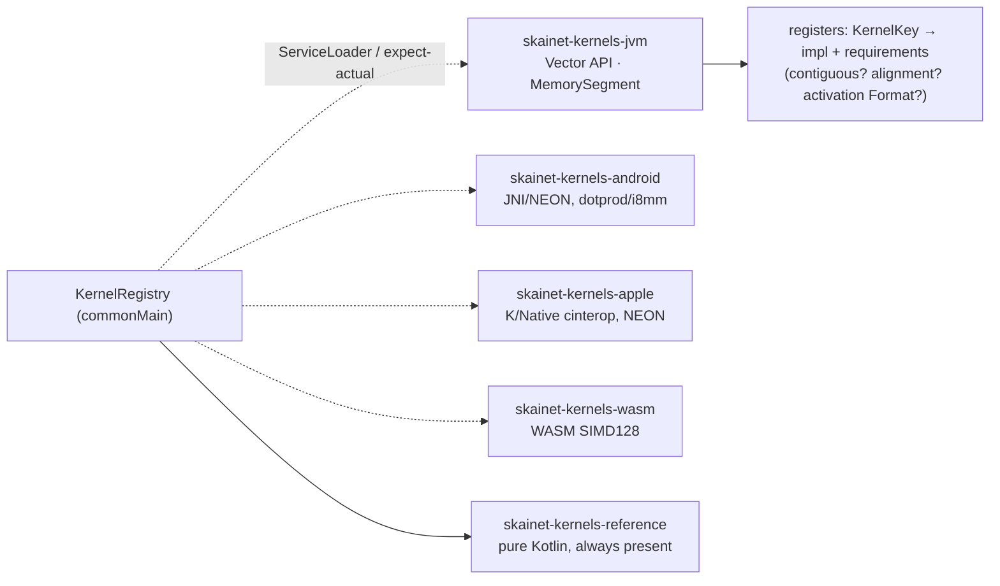

A custom kernel author writes one function taking `TensorView`s, declares its key and requirements, and registers it. They never touch `TensorData` subclasses. A complete scalar Q4_0 matmul under this contract (`Int4MatmulKernelSample.kt`) is a deliverable of the KernelKey slice ([#1027](https://github.com/SKaiNET-developers/SKaiNET/issues/1027)).

### 5.3 Worked example — BitNet b1.58 ternary matmul

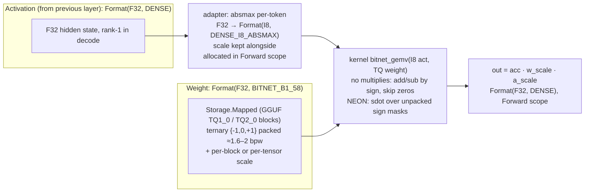

The architectural payload:

- `Encoding.activation` is a real field: *"this encoding's fast kernel wants I8 absmax activations"*. The dispatcher reads it and inserts the adapter. Without it, every BitNet kernel re-implements activation quantisation inline.
- The weight never leaves the mmap. Rule 1 + `Storage.Mapped` + a kernel that reads packed bytes directly = a 1.58-bit model whose resident set is activations plus the pages the OS keeps hot. That is the on-device story.
- In the compiled path the *same* `KernelKey` says: emit StableHLO for the absmax requant, keep the weight as a packed `ui8` constant with the existing `skainet.tensor_encodings` attribute, and either emit the unpack as StableHLO ops (IREE can fuse) or a `custom_call`. The seam already exists.

---

## 6. Eager and compiled on one `Tensor`

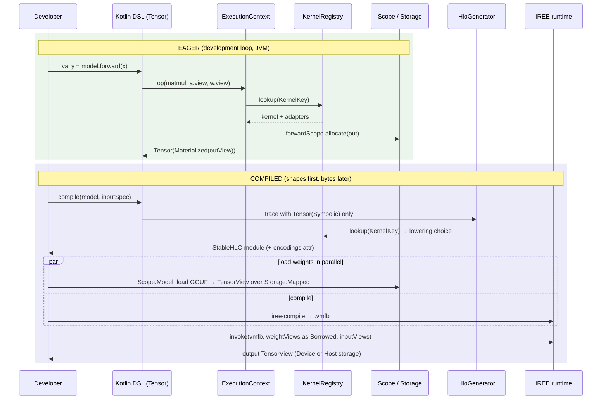

The developer-facing surface is one `Tensor` type. `Tensor.value` says which world you're in; layers and the DSL don't care.

For IREE: `Storage.Mapped`/`OffHeap` can be handed to IREE's HAL as externally-owned host buffers (zero-copy on unified-memory devices — Apple silicon, most Android SoCs). Ownership stays with `Scope.Model`; IREE gets `Owner.Borrowed`. That cannot be expressed today.

---

## 7. IO as a pipeline (source × staging × placement)

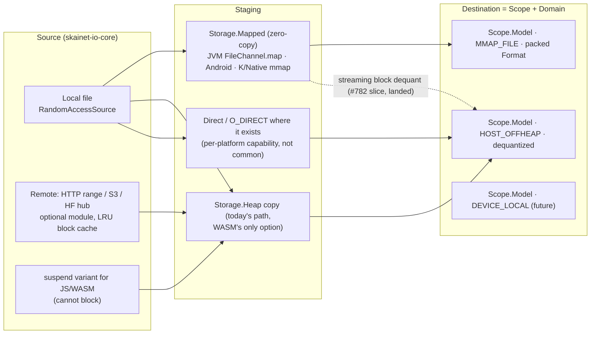

Outcome: the streaming-dequant slice (#782) and the Android mmap slice (#921/SKEEP-002) become two *configurations* of one loader (`quantPolicy = KEEP_PACKED | DEQUANTIZE_TO(F32|BF16)`, `staging = MAPPED | HEAP`), not two code paths.

---

## 8. What makes this uniquely SKaiNET

| Capability | PyTorch | ggml / llama.cpp | ZML | SKaiNET (proposed) |
|---|---|---|---|---|
| Explicit owned/borrowed bytes | refcount, implicit | `ggml_context` arena | yes (Slice) | **yes, enforced + scoped** |
| First-class packed encodings in the type system | no (ao extension) | yes (`ggml_type`) | no | **yes, logical dtype kept** |
| Zero-copy views over packed data | n/a | limited | n/a | **yes (`Layout` over blocked `Encoding`)** |
| Eager and compiled share one model definition | torch.compile (fragile) | no | compile-only | **yes, by design** |
| Multiplatform incl. mobile + WASM | partial | C, portable | Zig targets | **KMP, one codebase** |
| Pre-load memory plan from shapes | no | partial | implicit | **proposed** |
| Kernel contract declares activation requirement | no | hand-wired | n/a | **yes (`Encoding.activation`)** |

Additional improvements, each small given the model above:

1. **Memory plan before load.** Because compile reads shapes only, SKaiNET can say *before allocating anything*: "this model needs 1.0 GB resident at ctx=2048; your budget is 1.3 GB → OK" (or "→ reduce ctx or enable TurboQuant KV"). For on-device developers this is a design-time decision instead of a crash report. Worked example — the 2 GB reference profile (approximate figures from published architectures; usable budget ≈ 1.2–1.4 GB after a ~700 MB OS/app reserve):

   | Model | Packed weights | KV @ ctx 2048 bf16 | KV TurboQuant 4-bit | Forward slab decode / prefill-256 | Fits 1.3 GB? |
   |---|---|---|---|---|---|
   | Qwen2.5-0.5B Q4_K_M | ~0.40 GB | ~50 MB | ~13 MB | ~5 / ~25 MB | yes, comfortably |
   | Llama-3.2-1B Q4_K_M | ~0.80 GB | ~70 MB | ~17 MB | ~8 / ~35 MB | yes, ~1.0 GB |
   | Gemma-3-1B Q4 | ~0.75 GB | ~130 MB | ~35 MB | ~8 / ~35 MB | yes, tight |
   | BitNet-b1.58-2B | ~1.1 GB | ~100 MB | ~25 MB | ~10 / ~45 MB | borderline — the case the ternary kernels exist for |
   | Llama-3.2-1B Q8_0 / 3B Q4 | ≥ 1.3 GB | — | — | — | no — the planner says so before load |
2. **`use {}`-scoped models.** `Model.load(...).use { m -> m.generate(...) }` — weights and KV cache freed deterministically at scope exit. Idiomatic Kotlin.
3. **Storage donation for in-place ops** (JAX-style `donate()`): KV append, residual add, RMSNorm-in-place without allocation in eager decode. Opt-in, only inside a `Forward` scope.
4. **Debug memory mode** (`SKAINET_MEMORY_DEBUG=1`): allocation-site tagging, use-after-close with the closing stack, adapter-insertion log ("inserted dequant Q6_K→F32, 96 MB, at layer.3.mlp.down"), per-scope high-water marks. The tool that would have found #782 in one run.
5. **`Encoding` descriptor doubles as ground truth.** Issue #988 wants a single-source DSL for Kotlin + Python fixtures. The `Encoding` spec (block size, bpw, scale layout, decode formula) *is* that source: generate the reference decoder and parity fixtures from it; every fast kernel is tested against the reference kernel by construction.
6. **Kernel packs as artifacts.** `skainet-kernels-neon`, `-avx2`, `-wasm-simd` as optional dependencies discovered at runtime. A contributor ships a 1.58-bit kernel as a jar/klib without touching core.
7. **Axis labels on `Shape`**: yes, additive, used by attention code and by the dispatcher's rank normalization ("batch" and "seq" are the dims to flatten).

---

## 9. Migration — slices, not a rewrite

```mermaid
flowchart TB
    P0["Phase 0 — prerequisites (small PRs)<br/>two-way LogicalDType↔DType bridge, then merge into one sealed DType<br/>StorageSpec → becomes the allocation spec"]
    P1["Phase 1 — Format coherence + TensorId<br/>every TensorData reports Format(dtype, encoding)<br/>Q4_K reports F32+Q4_K<br/>rule 4: get() decodes or throws<br/>DSL assigns TensorId; NameMap for GGUF<br/>toString() renderer lands here<br/>golden parity tests keyed by TensorId"]
    P2["Phase 2 — Storage + Scope + TensorView<br/>new types beside old<br/>TensorData impls become façades over TensorView<br/>Ambient scope = today's GC behavior<br/>StorageId + TraceSink + allocation events<br/>flat-RSS test over N forward passes"]
    P3["Phase 3 — KernelRegistry + adapters<br/>rank normalization before dispatch<br/>migrate matmul first (closes #993/#991 class)<br/>then sdpa, then elementwise<br/>kernel + adapter spans"]
    P4["Phase 4 — one view mechanism + KV ring (head, tail)<br/>Layout-based TensorView subsumes SlicedTensorView,<br/>Aliased, packed-transpose rewrap<br/>phase markers + bandwidth metric in the generation loop<br/>sliding-window KV as the acceptance demo"]
    P5["Phase 5 — IO pipeline<br/>source×staging×placement<br/>Android mmap (SKEEP-002) lands as a config<br/>2 GB profile planner + fit check; exporters"]
    P6["Phase 6 — proof encoding: BITNET_B1_58<br/>Encoding.activation + requant adapter<br/>NEON kernel in a kernel pack<br/>mapped weights end-to-end"]
    P7["Phase 7 — compiled parity<br/>HloGenerator consumes Symbolic only<br/>emits loc() + skainet.tensor_id; bind I/O by TensorId<br/>KernelKey → lowering table<br/>IREE external buffer import<br/>round-trip diff tool"]
    P8["Major release — delete façades"]

    P0 --> P1 --> P2 --> P3 --> P4 --> P5 --> P6 --> P7 --> P8
    P2 -. "spike first: measure element-access<br/>indirection cost with value classes" .-> P2
```

Ordering differs from SKEEP-003's 3→2→1→5→4 in one place: **scopes (P2) before dispatch (P3)**, because adapters allocate and should allocate into a `Forward` scope from day one; otherwise phase 3 reintroduces the per-call-arena leak in a new costume.

Each phase has one acceptance test that is a real model: Llama-3.2-1B Q4_K_M decode loop (the #993 repro) for P1–P4, an Android load for P5, a BitNet GGUF for P6, a `.vmfb` parity run for P7.

---

## 10. Decisions

Status 2026-08-22: all thirteen decided. Items 1, 2, 3, 5, 7, 8, 9, 10 confirmed as proposed; 4, 6, 11, 12, 13 recorded with rationale below.

1. **End-state** — *Decided:* A (storage-first) delivered via B mechanics: new types beside old, `TensorData` façades, kernel-by-kernel migration, façades deleted at the next major.
2. **Naming** — *Decided:* `Storage` / `TensorView` / `Tensor` as in §0. Rejected: `Buffer` (`java.nio` collision), `Array` (Kotlin collision), `Arena` (the JVM implementation, not the concept).
3. **`get()` on packed views** — *Decided:* decode (slow, correct), with a debug-mode warning when used on a hot path. Throwing would break notebooks and the reference kernel.
4. ~~Ring wrap-around for sliding windows~~ **Decided:** (head, tail) pair accepted by attention kernels, gather adapter as fallback for kernels that don't. See §4.6.
5. **`Encoding.activation`** — *Decided:* on the encoding, so `HloGenerator` inserts the same requant without a registry lookup.
6. ~~Phase 2 spike budget~~ **Decided:** a short throw-away prototype of `TensorView`/`Storage` is benchmarked before Phase 2 proper, on **JVM (HotSpot, `MemorySegment` path) and one Android device (Cortex-A55 class, direct `ByteBuffer` path)**. Budget on both: matmul within noise; elementwise **≤ 3 %**; above that, redesign the access path (unwrap to raw array/segment once per call) before continuing. Also run the flat-RSS decode test (thousands of steps, `Forward` bump + `reset()`) on both platforms.
7. **`suspend` source variant** — *Decided:* interface in `skainet-io-core`, implementations in the optional remote module.
8. **Axis labels on `Shape`** — *Decided:* yes, additive and optional; used by attention code and by rank normalization.
9. **`TensorId` representation** — *Decided:* structured (module path + parameter + discriminator) with a canonical string form; the string is what `loc()` and greps want, the structure is what `NameMap` and view derivation want.
10. **Activation ids** — *Decided:* debug-only in eager, always-on when tracing for compile.
11. ~~Planner defaults~~ **Decided:** the planner is tuned to a **2 GB reference profile** (realistic generative use: 1B-class at Q4, ctx 2–4k, BitNet-2B as stretch). Defaults: explicit `budget = available − reserve` (700 MB Android/JVM, 300 MB K/Native); fit check before any allocation with a breakdown and a model/ctx suggestion on failure; weights `Mapped`, packed, **counted as resident** (decode touches every weight every token); KV preallocated in `Model` scope to the configured ctx, TurboQuant 4-bit on by default when the plan would exceed 80 % of budget without it; `Forward` slab pre-sized from the plan with prefill chunked at 256 tokens, no lazy growth; heap/off-heap threshold **256 KB**; dispatcher-inserted dequant above 5 % of budget warns, errors under `strict`. A desktop profile relaxes all of these. Sizing table in §8.
12. ~~Debugger surface~~ **Decided:** first release ships the `toString()` renderer, `ExecutionContext` hooks and the Perfetto/JFR/`android.os.Trace` exporters (all Kotlin, built on the §4.9 event stream); IDE plugin and live inspector are a follow-up SKEEP.
13. ~~`LogicalDType`~~ **Decided: merge.** After the two-way bridge lands (Phase 0), `LogicalDType` and the `KClass`-witness `DType` become one sealed `DType` that *carries* its `KClass` witness (so it is switchable like an enum and still satisfies `Tensor`). `Format = (DType, Encoding)` has exactly one dtype type. `LogicalDType` is deprecated with `ReplaceWith` and removed at the next major.

Next step (done 2026-08-22): §9 is a set of tracking issues with the acceptance model per phase — [#1001](https://github.com/SKaiNET-developers/SKaiNET/issues/1001) (M0, P0–P1), [#1002](https://github.com/SKaiNET-developers/SKaiNET/issues/1002) (M1, P1–P3), [#1003](https://github.com/SKaiNET-developers/SKaiNET/issues/1003) (M2, P4–P6); P7/P8 follow M2. New types live in package `sk.ainet.lang.memory` (skainet-lang-core).
