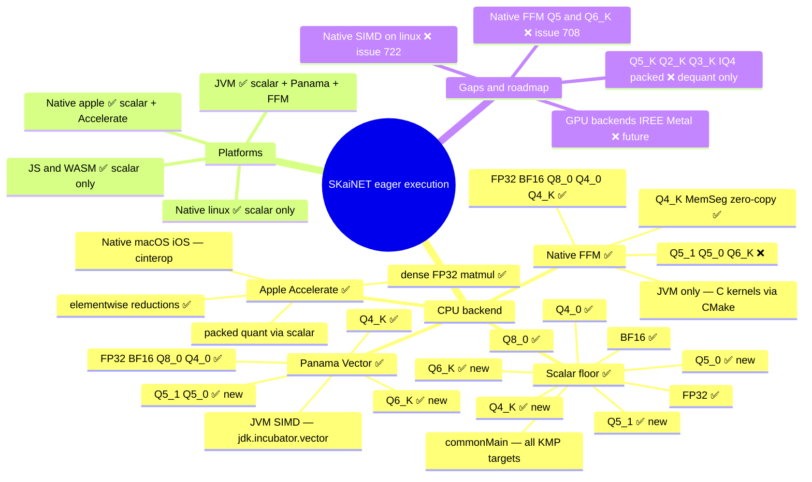

# Eager execution: backends & kernels

A map of SKaiNET's **eager** compute path — the `TensorOps` backend and its pluggable
matmul **kernel providers** — showing what exists today (✅), what's in progress (🚧), and
what's missing (❌). The eager path is `DirectCpuExecutionContext → DefaultCpuOps* →
KernelRegistry → KernelProvider`, distinct from the StableHLO/IREE export path.

Legend: ✅ available · 🚧 partial / works via a legacy path · ❌ missing.

## Kernel × provider (matmul, FP32 activations)

| Weight format | Scalar (all targets) | Panama Vector (JVM SIMD) | Native FFM (JVM) |
|---|:--:|:--:|:--:|
| FP32 | ✅ | ✅ | ✅ |
| BF16 | ✅ | ✅ | ✅ |
| Q8_0 | ✅ | ✅ | ✅ |
| Q4_0 | ✅ | ✅ | ✅ |
| Q4_K | ✅ | ✅ | ✅ |
| Q6_K | ✅ | ✅ | ❌ |
| Q5_1 | ✅ | ✅ | ❌ |
| Q5_0 | ✅ | ✅ | ❌ |
| Q5_K / Q2_K / Q3_K / Q8_K / IQ4 | ❌ (dequant-to-FP32 only) | ❌ | ❌ |

Resolution is by priority: **Native FFM (100) → Panama (50) → Scalar (0)** — the best
*available* provider that carries the kernel wins; otherwise it cascades down.

## Platform × what runs

| Target | Providers available | Notes |
|---|---|---|
| **JVM / Android(JVM)** | Scalar + Panama + Native-FFM | full SIMD/native acceleration |
| **Kotlin/Native — linux x64/arm64** | Scalar | no SIMD yet (scalar floor) |
| **Kotlin/Native — macOS/iOS** | Scalar + Apple Accelerate | Accelerate accelerates *dense* FP32; packed-quant via scalar |
| **JS / WASM (Js, Wasi)** | Scalar | no SIMD |

**Packed-quant matmul now works on every target** (Q4_K/Q6_K/Q5_1/Q5_0 gained a commonMain
scalar kernel, and `DefaultCpuOpsBase` dispatches packed weights via the registry). Before,
those formats were JVM-only and broke on Native.

## In progress / missing (with trackers)

- ❌ **Native FFM Q5_1/Q5_0/Q6_K** — the C kernel set covers FP32/BF16/Q8_0/Q4_0/Q4_K only. Tracked by **SKaiNET#708** (core kernel) and **SKaiNET-transformers#170** (converter wiring).
- ❌ **Native SIMD on linux** — Kotlin/Native linux targets run the scalar floor; no cinterop/OpenBLAS or SIMD path (Apple has Accelerate for dense ops). Tracked by **SKaiNET#722**.
- ❌ **Other GGML quant formats** (Q5_K, Q2_K, Q3_K, Q8_K, IQ4_NL/XS) — loadable via dequant-to-FP32, but no packed matmul kernel.
- ❌ **Non-CPU eager backends** (IREE, Metal, GPU) — the `KernelProvider` SPI anticipates them, but none are implemented for the eager path today.

> This mindmap is a hand-authored overview. Its companion
> [kernel × platform support matrix](modules/ROOT/pages/reference/kernel-support-matrix.adoc) is
> **machine-generated** from the registered `KernelProvider`s (`KernelSupportMatrixTest` →
> `kernel-support.json` → `generateKernelMatrix`, the kernel-side analogue of the
> `operators.json` → `ops-status-matrix.adoc` pipeline) and gated against scalar-floor drift,
> so the per-platform coverage stays in sync with the code.
