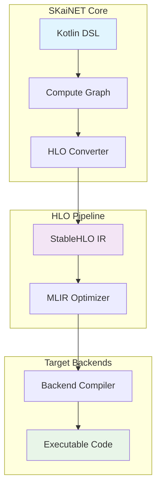
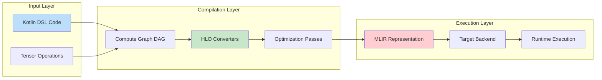
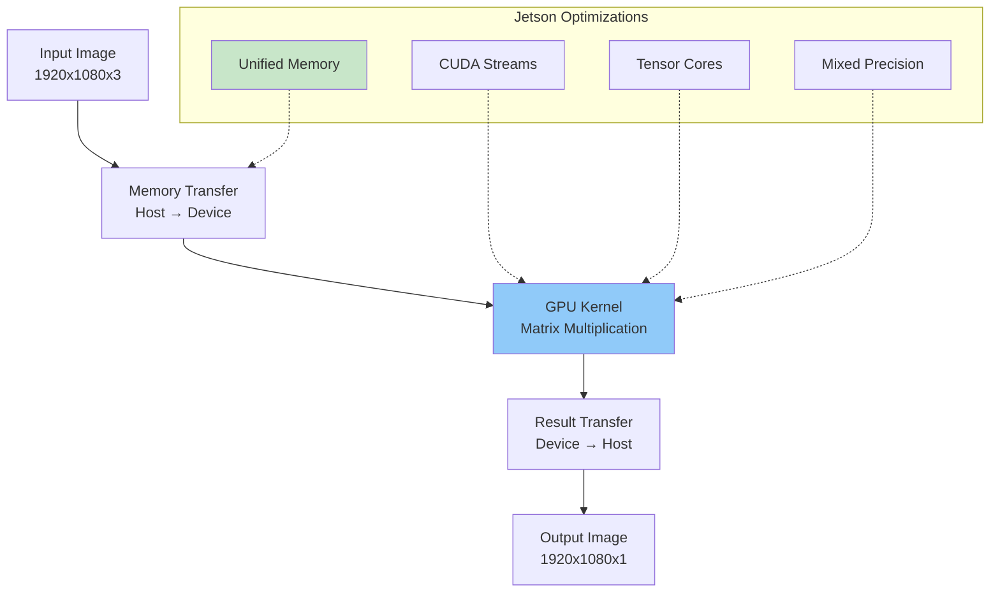

# Getting Started with HLO in SKaiNET

## What is HLO?

HLO (High-Level Operations) is SKaiNET's intermediate representation for neural network computations, based on [StableHLO](https://github.com/openxla/stablehlo) - the portable high-level operation set for machine learning. HLO serves as a bridge between SKaiNET's Kotlin DSL and various execution backends, enabling optimizations and cross-platform deployment.

### Key Benefits

- **Portability**: Write once, run on CPU, GPU, TPU, and other accelerators
- **Optimization**: Enable advanced compiler optimizations and fusion
- **Interoperability**: Compatible with XLA, JAX, and TensorFlow ecosystems
- **Performance**: Leverage hardware-specific optimizations through MLIR compilation

## Architecture Overview

SKaiNET's HLO compilation pipeline transforms high-level Kotlin DSL operations into optimized, executable code:



### Data Flow Architecture



## Building Blocks

### 1. HLO Converters

Converters transform SKaiNET operations into StableHLO operations:

- **MathOperationsConverter**: Basic arithmetic operations
- **LinalgOperationsConverter**: Linear algebra operations  
- **ActivationOperationsConverter**: Neural network activations
- **NeuralNetOperationsConverter**: High-level NN operations
- **ConstantOperationsConverter**: Constant value operations

### 2. Type System

HLO uses a strict type system for tensors:

```kotlin
// SKaiNET tensor type
Tensor<Float32, Shape4D> // Batch, Channel, Height, Width

// Converts to HLO type
tensor<1x3x224x224xf32> // StableHLO representation
```

### 3. Optimization Framework

The optimization pipeline includes:

- **Shape inference and propagation**
- **Constant folding and dead code elimination**
- **Operation fusion for performance**
- **Memory layout optimization**

## Practical Example: RGB to Grayscale Conversion

Let's walk through converting a color image tensor `Tensor<B,C,H,W>` to grayscale using matrix multiplication.

### Step 1: Define the Operation in Kotlin DSL

```kotlin
// From: skainet-lang/skainet-lang-models/src/commonMain/kotlin/sk/ainet/lang/model/compute/Rgb2GrayScaleMultiply.kt
fun Tensor<Float32, Shape4D>.rgb2GrayScaleMatMul(): Tensor<Float32, Shape4D> {
    // RGB to grayscale weights: [0.299, 0.587, 0.114]
    val grayWeights = constant(
        floatArrayOf(0.299f, 0.587f, 0.114f),
        Shape1D(3)
    ).reshape(Shape2D(3, 1))
    
    // Reshape input from [B,C,H,W] to [B,H,W,C] for matrix multiplication
    val reshaped = this.transpose(intArrayOf(0, 2, 3, 1))
    
    // Matrix multiply: [B,H,W,3] × [3,1] = [B,H,W,1]
    val gray = reshaped.matmul(grayWeights)
    
    // Reshape back to [B,1,H,W]
    return gray.transpose(intArrayOf(0, 3, 1, 2))
}
```

### Step 2: HLO Conversion Process

The conversion pipeline transforms this operation:

```mermaid
sequenceDiagram
    participant DSL as Kotlin DSL
    participant DAG as Compute Graph
    participant Conv as HLO Converter
    participant HLO as StableHLO IR
    participant Opt as Optimizer
    
    DSL->>DAG: rgb2GrayScaleMatMul()
    DAG->>Conv: MatMul + Transpose ops
    Conv->>HLO: stablehlo.dot_general
    Conv->>HLO: stablehlo.transpose
    HLO->>Opt: Unoptimized IR
    Opt->>HLO: Optimized IR
    
    Note over Conv,HLO: Type inference:<br/>tensor<BxCxHxWxf32> → tensor<Bx1xHxWxf32>
```

### Step 3: Generated StableHLO IR

The converter produces MLIR code like this:

```mlir
func.func @rgb2grayscale(%input: tensor<?x3x?x?xf32>) -> tensor<?x1x?x?xf32> {
  // Define grayscale conversion weights
  %weights = stablehlo.constant dense<[[0.299], [0.587], [0.114]]> : tensor<3x1xf32>
  
  // Transpose input: [B,C,H,W] -> [B,H,W,C]
  %transposed = stablehlo.transpose %input, dims = [0, 2, 3, 1] : 
    (tensor<?x3x?x?xf32>) -> tensor<?x?x?x3xf32>
  
  // Matrix multiplication: [B,H,W,3] × [3,1] -> [B,H,W,1]
  %gray = stablehlo.dot_general %transposed, %weights, 
    contracting_dims = [3] x [0] : 
    (tensor<?x?x?x3xf32>, tensor<3x1xf32>) -> tensor<?x?x?x1xf32>
  
  // Transpose back: [B,H,W,1] -> [B,1,H,W]
  %result = stablehlo.transpose %gray, dims = [0, 3, 1, 2] : 
    (tensor<?x?x?x1xf32>) -> tensor<?x1x?x?xf32>
  
  return %result : tensor<?x1x?x?xf32>
}
```

## Compilation to CUDA and Jetson Deployment

### Prerequisites

1. **NVIDIA CUDA Toolkit** (11.8+): [Download here](https://developer.nvidia.com/cuda-downloads)
2. **XLA with GPU support**: [Installation guide](https://www.tensorflow.org/xla/tutorials/compile)
3. **Jetson SDK**: [NVIDIA Jetson Developer Kit](https://developer.nvidia.com/embedded/jetson-developer-kit)

### Step 1: Configure CUDA Backend

```bash
# Install CUDA toolkit
wget https://developer.download.nvidia.com/compute/cuda/repos/ubuntu2004/x86_64/cuda-ubuntu2004.pin
sudo mv cuda-ubuntu2004.pin /etc/apt/preferences.d/cuda-repository-pin-600
sudo apt-key adv --fetch-keys https://developer.download.nvidia.com/compute/cuda/repos/ubuntu2004/x86_64/3bf863cc.pub
sudo add-apt-repository "deb https://developer.download.nvidia.com/compute/cuda/repos/ubuntu2004/x86_64/ /"
sudo apt-get update
sudo apt-get -y install cuda

# Verify installation
nvcc --version
nvidia-smi
```

### Step 2: Build SKaiNET with CUDA Support

```bash
# Clone and build SKaiNET
git clone https://github.com/skainetproject/skainet.git
cd skainet

# Build with CUDA backend (when available)
./gradlew :skainet-backends:skainet-backend-cuda:build

# Generate HLO for your model
./gradlew :skainet-compile:skainet-compile-hlo:generateHlo \
  -Pmodel=rgb2grayscale \
  -Ptarget=cuda
```

### Step 3: Compile to GPU Executable

```bash
# Use XLA to compile HLO to GPU code
xla_compile \
  --input_format=hlo \
  --output_format=executable \
  --platform=gpu \
  --input_file=rgb2grayscale.hlo \
  --output_file=rgb2grayscale.gpu
```

### Step 4: Deploy to Jetson

```bash
# Transfer to Jetson device
scp rgb2grayscale.gpu jetson@192.168.1.100:~/models/

# On Jetson: Run the model
ssh jetson@192.168.1.100
cd ~/models
./skainet-runtime --model=rgb2grayscale.gpu --input=image.jpg --output=gray.jpg
```

### Performance Optimization for Jetson



## Advanced Topics

### Custom HLO Operations

Extend SKaiNET with custom operations:

```kotlin
// Define custom operation
@HloOperation("custom.rgb_enhance")
class RgbEnhanceOp : HloConverter {
    override fun convert(context: ConversionContext): String {
        return """
        %enhanced = custom_call @rgb_enhance(%input) : 
          (tensor<?x3x?x?xf32>) -> tensor<?x3x?x?xf32>
        """
    }
}
```

### Debugging HLO

Use SKaiNET's built-in debugging tools:

```kotlin
// Enable HLO debugging
val optimizer = StableHloOptimizer(debugMode = true)
val optimizedHlo = optimizer.optimize(hloModule)

// Visualize computation graph
optimizer.dumpGraphviz("rgb2gray.dot")
```

## Resources and References

- [StableHLO Specification](https://github.com/openxla/stablehlo/blob/main/docs/spec.md)
- [MLIR Documentation](https://mlir.llvm.org/docs/)
- [XLA Compilation Guide](https://www.tensorflow.org/xla)
- [NVIDIA Jetson Documentation](https://docs.nvidia.com/jetson/)
- [SKaiNET HLO Examples](./examples/hlo/)

## Next Steps

1. **Explore Examples**: Check `skainet-compile/skainet-compile-hlo/src/commonMain/kotlin/sk/ainet/compile/hlo/examples/`
2. **Run Tests**: Execute `./gradlew :skainet-compile:skainet-compile-hlo:test`
3. **Contribute**: Add new HLO converters for missing operations
4. **Optimize**: Profile and optimize your models using HLO tools

For more detailed information, see the [HLO Optimization Guide](./OPTIMIZATION.md) and [API Documentation](https://docs.skainet.sk/hlo/).