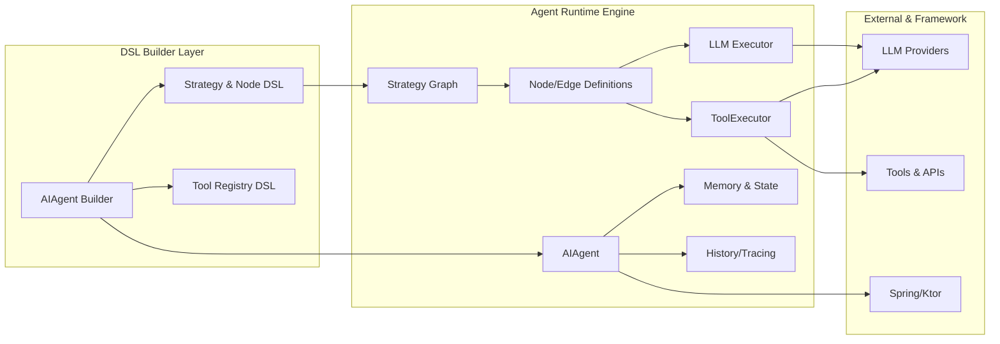
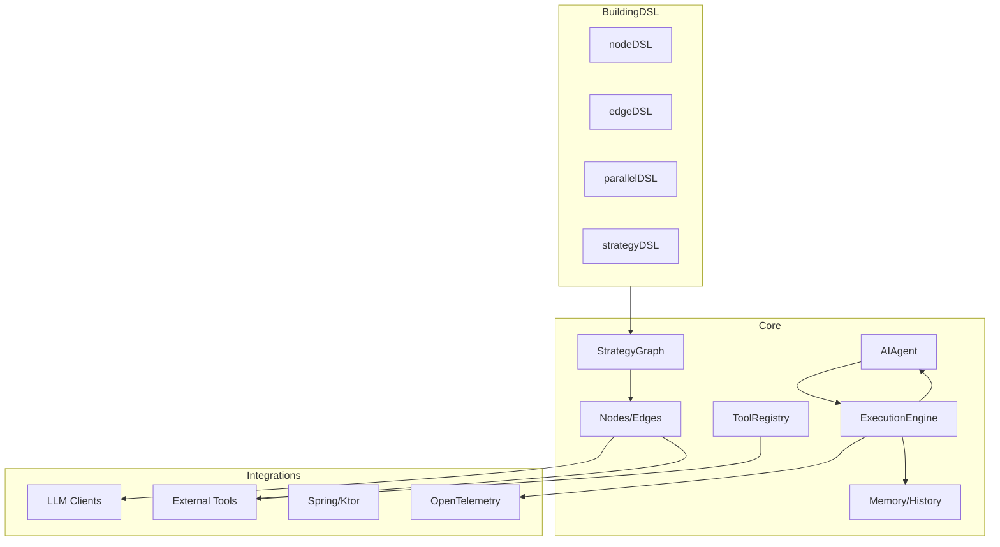
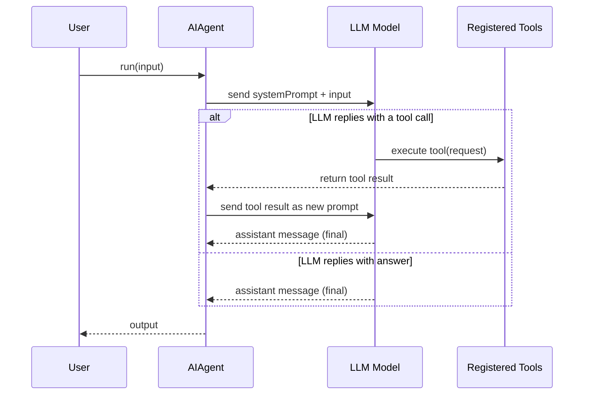
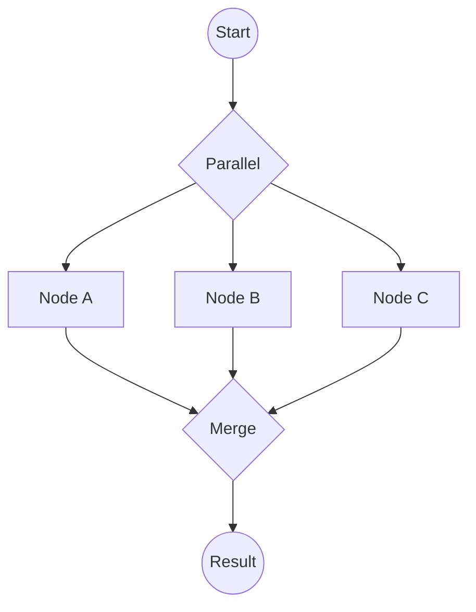

1. Introduction and Goals
Koog is a Kotlin-based framework and DSL for building AI agents using an idiomatic, type-safe Kotlin API[1][2]. It provides a graph-based workflow DSL (via strategy{} blocks) and tools for orchestrating LLM calls, tool invocations, and data transformations. The goal is to enable developers to define complex agent behaviors in pure Kotlin (using generics and builders) and run them reliably on the JVM (and Kotlin multiplatform targets[3]). In this analysis we describe Koog’s DSL architecture to inform the design of a similar type-safe data-processing DSL (e.g. supporting images, voice, tensors, parallel branches/joins).

2. Requirements and Constraints
Koog’s DSL is built on Kotlin, requiring at least JDK 17, and targets Kotlin Multiplatform (JVM, JS/WasmJS, Android, iOS)[3]. It must interoperate with various LLM clients and provide enterprise integrations (Spring Boot, Ktor)[4]. The DSL enforces static type-safety: users declare AIAgent<Input,Output> and each node/edge in a strategy is generically typed to ensure compile-time consistency[5][6]. Agents can fail or need persistence, so fault-tolerance (built-in retries, snapshot persistence) is a cross-cutting concern[7]. Parallel execution and efficient data flow are also key: Koog must support running independent branches concurrently with merge strategies. Overall, constraints include the Kotlin type system, coroutines-based concurrency, and modular extensibility (features, tools) for rich pipeline behaviors[3][2].

3. System Scope & Context
Koog’s scope is an embedded agent framework inside a host application. An AIAgent instance is configured with an LLM client (prompt executor), optional tools (via a ToolRegistry), and a strategy or functional logic. At runtime the agent receives input (e.g. text, or in principle any Kotlin type) and processes it through a Perceive–Cognition–Act loop: sending prompts to an LLM, interpreting responses, invoking tools, and returning outputs. The DSL sits at the boundary between user code and execution engine: it defines what happens, while the engine handles how it runs. In context, Koog agents rely on external LLM providers (OpenAI, Google, Anthropic, etc.)[8], and interact with domain tools via Kotlin functions or annotated classes. Koog also integrates cross-cutting capabilities (memory, tracing, OpenTelemetry, moderation) that can influence execution but lie outside the core DSL.

Figure – Koog Component Structure: The major components are shown below. The DSL builders (left) let the developer create agents, strategies, nodes, and edges. At runtime (right), the AIAgent engine executes the strategy graph by calling the LLM and tools, using features like memory, history compression, and event handlers as needed.

4. Solution Strategy
Koog’s DSL uses Kotlin builder patterns and generics to define agent logic. There are two main DSL styles:
• Functional agents: AIAgent<Input,Output>(...) with a functionalStrategy { input -> ... } lambda.
• Graph-based strategies: Using a strategy<Input,Output>("name") { ... } block to declaratively build a directed graph of nodes and edges.

Parallel and conditional composition are first-class. A special parallel<Input,Output>(nodeX, nodeY, ...) { mergeStrategy } builder runs multiple branches concurrently and merges their results.

5. Building-Block View
Koog’s codebase is modular. The core consists of:
• AIAgent and Config
• Strategy/Workflow
• Tools
• Execution Engine
• Memory and Persistence
• Infrastructure

6. Runtime View
At runtime, a Koog agent processes input step-by-step through its strategy. Conceptually, the execution is a loop of "send to LLM → possibly call tool → back to LLM" until an answer emerges.

7. Deployment View
Koog agents are deployed as library code within applications. Because Koog is Kotlin Multiplatform, the same agent code can run on different platforms.

8. Cross-cutting Concepts
• Type safety
• Data flow and state management
• Parallel composition
• Reliability and monitoring
• Extensibility

Figure – Parallel Branch Execution

[1] Overview - Koog https://docs.koog.ai/ [2] [7] Key features - Koog https://docs.koog.ai/key-features/ [3] [4] [8] [25] GitHub - JetBrains/koog: Koog is the official Kotlin framework for building predictable, fault-tolerant and enterprise-ready AI agents across all platforms – from backend services to Android and iOS, JVM, and even in-browser environments. Koog is based on our AI products expertise and provides proven solutions for complex LLM and AI problems https://github.com/JetBrains/koog [5] [9] Functional agents - Koog https://docs.koog.ai/functional-agents/ [6] [10] [12] [13] [17] [18] Build predictable AI agents using Koog graphs | kt.academy https://blog.kotlin-academy.com/how-to-design-a-flexible-graph-based-strategy-in-koog-52b1fb24802d?gi=f72fd9820535 [11] [19] [20] [21] [23] Custom strategy graphs - Koog https://docs.koog.ai/custom-strategy-graphs/ [14] [15] [16] [22] Parallel node execution - Koog https://docs.koog.ai/parallel-node-execution/ [24] ai.koog.agents.core.dsl.extension https://api.koog.ai/agents/agents-core/ai.koog.agents.core.dsl.extension/index.html
