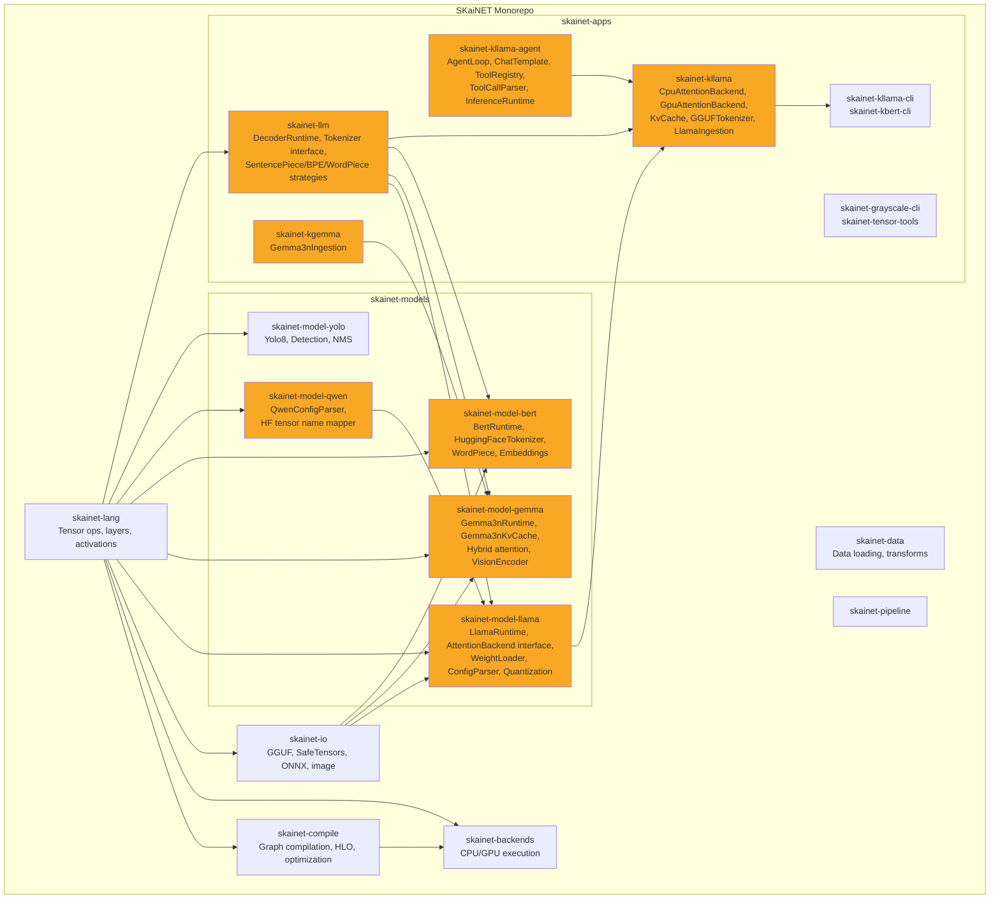
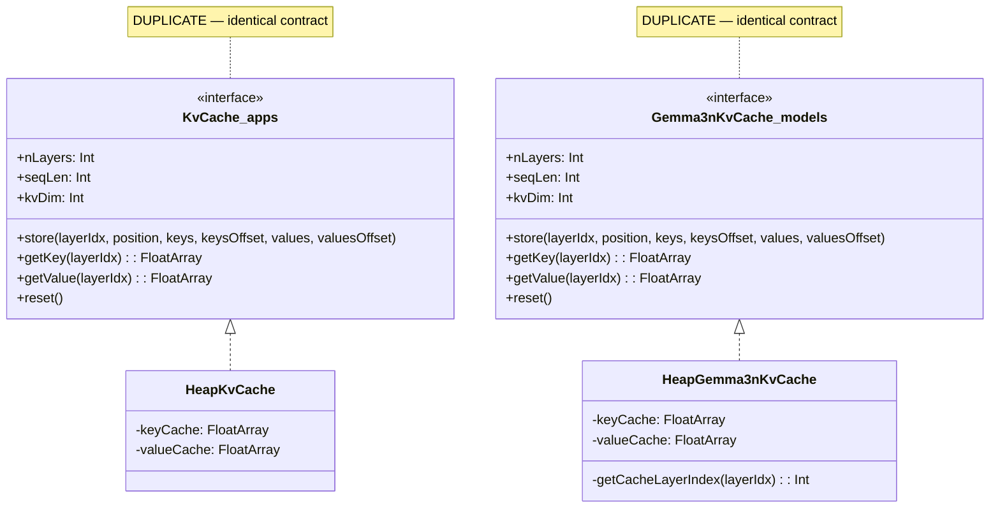
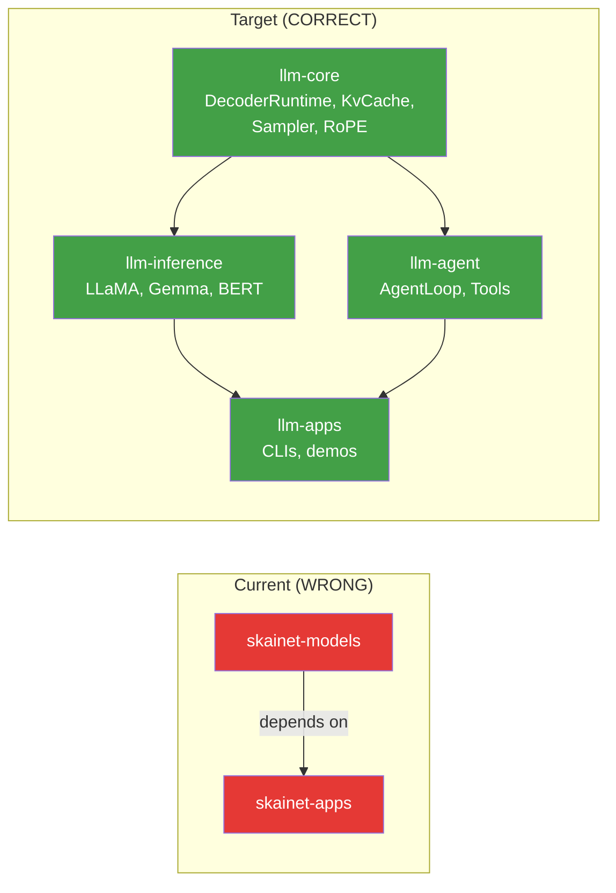
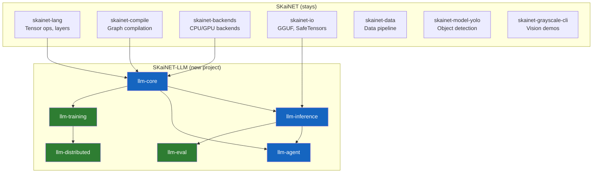
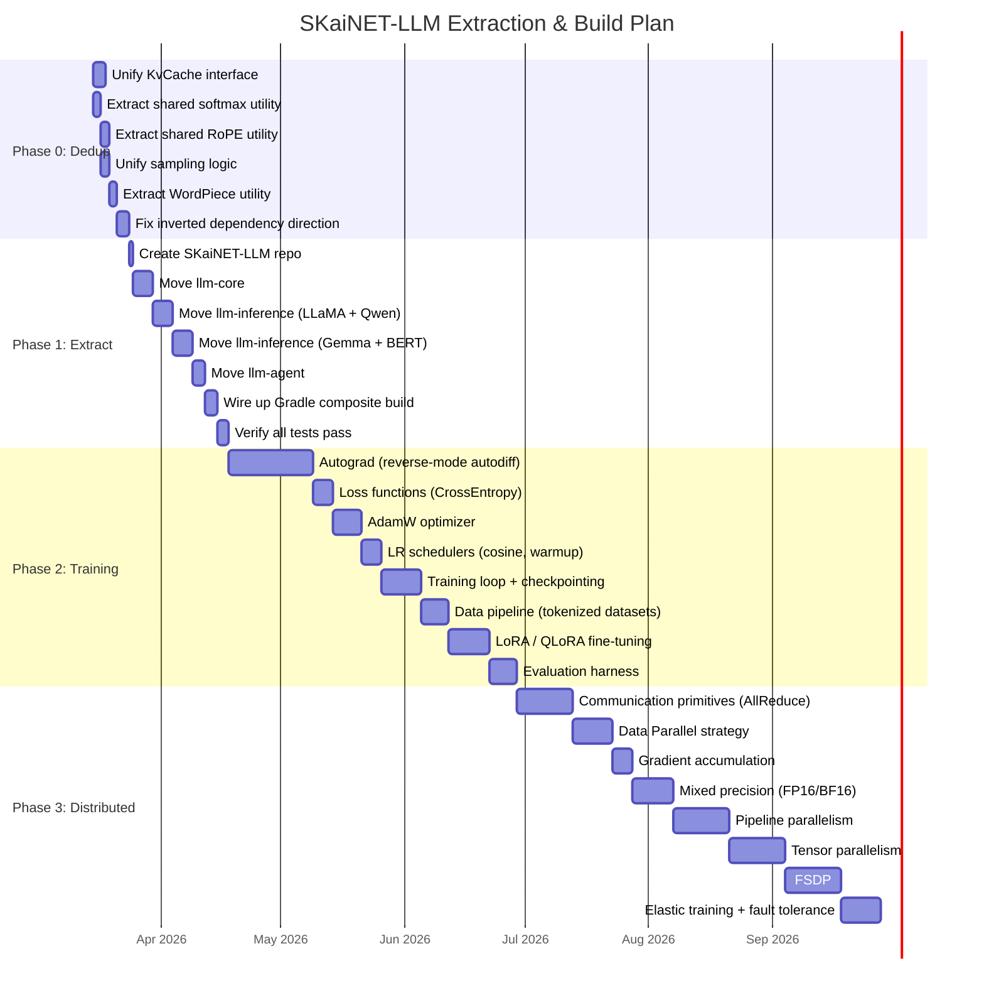
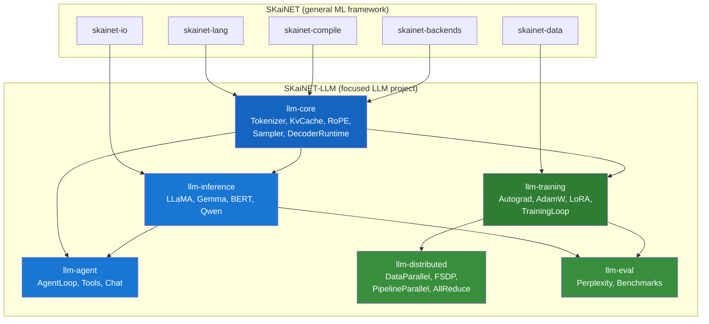
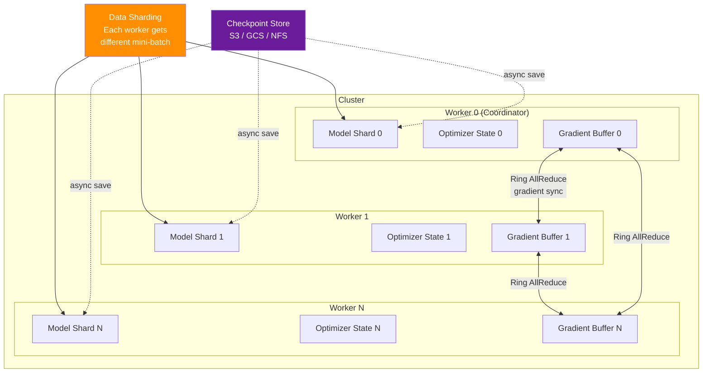
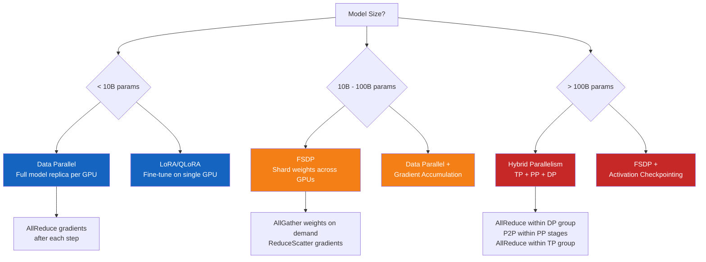

# SKaiNET LLM Extraction & Rework Plan

## 1. Current Architecture



**Yellow = LLM-related code to be extracted.**

---

## 2. Identified Duplications

### 2.1 KvCache Interface — HIGH severity

Two nearly identical interfaces with identical method signatures (`store`, `getKey`, `getValue`, `reset`) and identical fields (`nLayers`, `seqLen`, `kvDim`).

| | skainet-apps | skainet-models |
|---|---|---|
| **Interface** | `KvCache` in `skainet-kllama/…/KvCache.kt:13-61` | `Gemma3nKvCache` in `skainet-model-gemma/…/Gemma3nKvCache.kt:10-58` |
| **Heap impl** | `HeapKvCache` (lines 69-111) | `HeapGemma3nKvCache` (lines 72-150) |
| **Difference** | None | Adds `getCacheLayerIndex()` for layer sharing |



**Fix:** Unify into a single `KvCache` interface. Gemma extends it with layer-sharing support.

### 2.2 Softmax — HIGH severity

Three independent implementations of numerically-stable softmax (find max, subtract, exp, normalize):

| Location | File | Lines |
|---|---|---|
| CpuAttentionBackend | `skainet-apps/skainet-kllama/…/CpuAttentionBackend.kt` | 189-206 |
| DecoderRuntime.sample() | `skainet-apps/skainet-llm/…/DecoderRuntime.kt` | 153-165 |
| GenerateExtensions | `skainet-apps/skainet-kllama-agent/…/GenerateExtensions.kt` | 96-108 |

**Fix:** Extract a single `softmaxInPlace(values: FloatArray, length: Int)` utility.

### 2.3 Sampling Logic — MEDIUM severity

Two independent implementations of greedy + temperature-scaled sampling:

| Location | File | Lines |
|---|---|---|
| DecoderRuntime.sample() | `skainet-apps/skainet-llm/…/DecoderRuntime.kt` | 138-173 |
| sampleFromLogits() | `skainet-apps/skainet-kllama-agent/…/GenerateExtensions.kt` | 76-116 |

Both have identical greedy path (`temperature <= 1e-6f` -> argmax) and identical softmax-then-random path.

**Fix:** Single `Sampler` utility used by both.

### 2.4 WordPiece Tokenization — MEDIUM severity

Two implementations of greedy longest-match-first with `##` prefix (~85% identical):

| Location | File | Lines |
|---|---|---|
| HuggingFaceTokenizer | `skainet-models/skainet-model-bert/…/HuggingFaceTokenizer.kt` | 233-276 |
| GGUFTokenizer | `skainet-apps/skainet-kllama/…/GGUFTokenizer.kt` | 605-662 |

**Fix:** Extract shared `WordPieceEncoder` utility.

### 2.5 RoPE Frequency Computation — MEDIUM severity

Same formula `freq = pos / base^(2*pair/dim)` duplicated in three files:

| Location | File | Lines |
|---|---|---|
| CpuAttentionBackend | `skainet-apps/skainet-kllama/…/CpuAttentionBackend.kt` | 108-120 |
| GpuAttentionBackend | `skainet-apps/skainet-kllama/…/GpuAttentionBackend.kt` | 60-81 |
| Gemma3nAttentionBackend | `skainet-models/skainet-model-gemma/…/Gemma3nAttentionBackend.kt` | 114-167 |

**Fix:** Shared `RopeCalculator` with pre-computed frequency tables.

### 2.6 Inverted Dependency — Architectural Smell

`skainet-models` depends on `skainet-apps` (backwards):

- `skainet-model-llama/build.gradle.kts:51` -> `skainet-apps:skainet-llm` (for `DecoderRuntime`)
- `skainet-model-llama/build.gradle.kts:52` -> `skainet-apps:skainet-kllama-agent` (for `InferenceRuntime`)

Models (architecture definitions) should NOT depend on apps (application code).



---

## 3. Extraction Plan: SKaiNET-LLM

### 3.1 Target Project Structure



**Blue = extracted from SKaiNET. Green = new functionality.**

### 3.2 Module Breakdown

#### `llm-core` — Shared LLM Primitives

```
llm-core/
├── tokenizer/          # Tokenizer interface + strategies (BPE, SentencePiece, WordPiece)
├── sampling/           # Greedy, temperature, top-k, top-p, beam search
├── kv-cache/           # KvCache interface + HeapKvCache, OffheapKvCache, PagedKvCache
├── rope/               # RoPE utilities (standard, NTK-scaled, YaRN, dual-frequency)
├── attention/          # AttentionBackend interface, softmax utilities
└── runtime/            # DecoderRuntime base class, InferenceRuntime interface
```

**Source mapping:**

| From | To |
|---|---|
| `skainet-apps/skainet-llm/…/DecoderRuntime.kt` | `llm-core/runtime/` |
| `skainet-apps/skainet-llm/…/Tokenizer.kt` | `llm-core/tokenizer/` |
| `skainet-apps/skainet-llm/…/tokenizer/*Strategy.kt` | `llm-core/tokenizer/` |
| `skainet-apps/skainet-kllama/…/KvCache.kt` | `llm-core/kv-cache/` |
| `skainet-apps/skainet-kllama-agent/…/InferenceRuntime.kt` | `llm-core/runtime/` |
| `skainet-apps/skainet-kllama-agent/…/GenerateExtensions.kt` | `llm-core/sampling/` (deduplicated) |
| `skainet-models/skainet-model-llama/…/AttentionBackend.kt` | `llm-core/attention/` |
| RoPE code (3 locations) | `llm-core/rope/` (unified) |
| Softmax code (3 locations) | `llm-core/attention/` (unified) |

#### `llm-inference` — Model Runtimes

```
llm-inference/
├── llama/              # LlamaRuntime, CpuAttentionBackend, GpuAttentionBackend
│   │                   # LlamaConfigParser, LlamaWeightLoader, GGUFTokenizer
│   │                   # QuantizedTensorFactory, GraphAccelerator
│   └── qwen/           # QwenConfigParser, QwenHfTensorNameMapper (thin layer)
├── gemma/              # Gemma3nRuntime, Gemma3nAttentionBackend
│   │                   # Gemma3nConfig, Gemma3nKvCache (extends KvCache)
│   └── multimodal/     # VisionEncoder, AudioEncoder
├── bert/               # BertRuntime, HuggingFaceTokenizer, BertIngestion
└── loader/             # LlamaIngestion, Gemma3nIngestion (unified loading facade)
```

**Source mapping:**

| From | To |
|---|---|
| `skainet-models/skainet-model-llama/…/*` | `llm-inference/llama/` |
| `skainet-apps/skainet-kllama/…/CpuAttentionBackend.kt` | `llm-inference/llama/` |
| `skainet-apps/skainet-kllama/…/GpuAttentionBackend.kt` | `llm-inference/llama/` |
| `skainet-apps/skainet-kllama/…/GGUFTokenizer.kt` | `llm-inference/llama/` |
| `skainet-apps/skainet-kllama/…/LlamaIngestion.kt` | `llm-inference/loader/` |
| `skainet-models/skainet-model-gemma/…/*` | `llm-inference/gemma/` |
| `skainet-apps/skainet-kgemma/…/*` | `llm-inference/gemma/` |
| `skainet-models/skainet-model-bert/…/*` | `llm-inference/bert/` |
| `skainet-models/skainet-model-qwen/…/*` | `llm-inference/llama/qwen/` |

#### `llm-agent` — Agentic Framework

```
llm-agent/
├── chat/               # ChatTemplate, ChatMLTemplate, Llama3ChatTemplate, ChatMessage
├── tools/              # Tool, ToolDefinition, ToolCall, ToolCallParser, ToolRegistry
├── loop/               # AgentLoop, AgentConfig, AgentListener
└── memory/             # (future) Conversation memory, RAG integration
```

**Source:** all from `skainet-apps/skainet-kllama-agent/`

#### `llm-training` — NEW: Training Infrastructure

```
llm-training/
├── autograd/           # Reverse-mode autodiff on tensor graph
│   ├── GradTensor.kt           # Tensor wrapper tracking computation graph
│   ├── BackwardGraph.kt        # Backward pass graph builder
│   └── GradientAccumulator.kt  # Gradient aggregation
├── loss/               # Loss functions
│   ├── CrossEntropyLoss.kt     # Standard next-token prediction loss
│   └── LabelSmoothing.kt       # Regularization
├── optimizer/          # Optimizers
│   ├── AdamW.kt                # Default LLM optimizer
│   ├── SGD.kt                  # Baseline
│   └── LRScheduler.kt          # Cosine annealing, warmup, linear decay
├── data/               # Training data pipeline
│   ├── TokenizedDataset.kt     # Pre-tokenized dataset
│   ├── DataLoader.kt           # Batching, shuffling, prefetching
│   └── PackedSequences.kt      # Efficient packing of variable-length sequences
├── trainer/            # Training orchestration
│   ├── TrainingLoop.kt         # Forward -> loss -> backward -> step
│   ├── Checkpointing.kt        # Save/resume training state
│   └── MetricsTracker.kt       # Loss, perplexity, throughput logging
└── fine-tune/          # Parameter-efficient fine-tuning
    ├── LoRA.kt                 # Low-Rank Adaptation
    ├── QLoRA.kt                # Quantized LoRA
    └── AdapterLayer.kt         # Pluggable adapter pattern
```

#### `llm-distributed` — NEW: Distributed Training

```
llm-distributed/
├── communication/      # Collective operations
│   ├── AllReduce.kt            # Ring-AllReduce for gradient sync
│   ├── AllGather.kt            # Weight gathering for FSDP
│   ├── P2P.kt                  # Point-to-point for pipeline parallelism
│   └── Transport.kt            # gRPC / TCP / NCCL (via JNI) backends
├── strategy/           # Parallelism strategies
│   ├── DataParallel.kt         # Replicate model, split data
│   ├── PipelineParallel.kt     # Split layers across workers
│   ├── TensorParallel.kt       # Split within layers (attention heads, FFN columns)
│   └── HybridParallel.kt       # Combine DP + PP + TP
├── sharding/           # Memory optimization
│   ├── FSDP.kt                 # Fully Sharded Data Parallel
│   ├── ShardingPlan.kt         # Which params go where
│   └── GatherScatter.kt       # On-demand weight materialization
├── cluster/            # Cluster management
│   ├── WorkerRegistry.kt       # Discovery and health checks
│   ├── FaultTolerance.kt       # Elastic training, checkpoint recovery
│   └── K8sIntegration.kt       # Kubernetes operator support
└── mixed-precision/    # Precision management
    ├── FP16Training.kt         # FP16 forward/backward, FP32 master weights
    ├── BF16Training.kt         # BFloat16 support
    └── GradientScaling.kt      # Loss scaling to prevent underflow
```

#### `llm-eval` — NEW: Evaluation

```
llm-eval/
├── perplexity/         # Perplexity computation on validation sets
├── benchmarks/         # MMLU, HellaSwag, ARC, TruthfulQA runners
└── harness/            # Evaluation harness orchestration
```

---

## 4. Phased Execution Plan



---

## 5. Phase 0: Deduplication Details

### 5.1 Unify KvCache

```kotlin
// llm-core/kv-cache/KvCache.kt
public interface KvCache {
    public val nLayers: Int
    public val seqLen: Int
    public val kvDim: Int
    public fun store(layerIdx: Int, position: Int, keys: FloatArray, keysOffset: Int, values: FloatArray, valuesOffset: Int)
    public fun getKey(layerIdx: Int): FloatArray
    public fun getValue(layerIdx: Int): FloatArray
    public fun reset()
}

// llm-core/kv-cache/HeapKvCache.kt
public class HeapKvCache(override val nLayers: Int, override val seqLen: Int, override val kvDim: Int) : KvCache { ... }

// llm-inference/gemma/SharedLayerKvCache.kt  (extends KvCache with layer sharing)
public class SharedLayerKvCache(
    override val nLayers: Int, override val seqLen: Int, override val kvDim: Int,
    private val sharingStartLayer: Int
) : KvCache {
    private fun getCacheLayerIndex(layerIdx: Int): Int = ...
}
```

### 5.2 Unify Softmax + Sampling

```kotlin
// llm-core/sampling/SamplingUtils.kt
public fun softmaxInPlace(values: FloatArray, length: Int) { ... }

public fun sampleFromLogits(logits: FloatArray, temperature: Float, random: Random = Random.Default): Int { ... }
```

### 5.3 Unify RoPE

```kotlin
// llm-core/rope/RopeFrequencies.kt
public class RopeFrequencies(
    public val dim: Int,
    public val base: Float = 10000f,
    public val maxSeqLen: Int = 4096
) {
    private val cosTable: FloatArray = ...  // pre-computed
    private val sinTable: FloatArray = ...

    public fun cos(pair: Int, pos: Int): Float = cosTable[pos * (dim / 2) + pair]
    public fun sin(pair: Int, pos: Int): Float = sinTable[pos * (dim / 2) + pair]

    public fun applyRotary(q: FloatArray, k: FloatArray, pos: Int, nHeads: Int, nKvHeads: Int) { ... }
}
```

---

## 6. Technical Decisions for Distributed Training

| Decision | Recommendation | Rationale |
|---|---|---|
| **Communication** | gRPC + raw binary protocol | JVM-native; protobuf for control plane, raw ByteBuffer for tensor data |
| **Tensor transfer** | Off-heap `ByteBuffer` / `MemorySegment` | Avoid GC pressure on large gradient buffers |
| **GPU collective ops** | JNI to NCCL | NVIDIA AllReduce is 10-100x faster than custom TCP |
| **Cluster orchestration** | Kubernetes + custom operator | Standard for JVM services, supports auto-scaling and elastic training |
| **Checkpointing** | Async to object storage (S3/GCS) | Non-blocking, durable, resumable |
| **Fault tolerance** | Elastic training with checkpoint resume | Workers can join/leave without full restart |
| **Serialization** | Custom binary (not protobuf for tensors) | Protobuf adds overhead for large float arrays |

---

## 7. Dependency Graph After Extraction



---

## 8. Migration Strategy

### Gradle Composite Build (transitional)

During migration, use Gradle composite builds so SKaiNET and SKaiNET-LLM can coexist:

```kotlin
// SKaiNET/settings.gradle.kts (during transition)
includeBuild("../SKaiNET-LLM") {
    dependencySubstitution {
        substitute(module("sk.ainet.llm:llm-core")).using(project(":llm-core"))
        substitute(module("sk.ainet.llm:llm-inference")).using(project(":llm-inference"))
        substitute(module("sk.ainet.llm:llm-agent")).using(project(":llm-agent"))
    }
}
```

### What Stays in SKaiNET

- `skainet-lang/` — general tensor library (foundation for all ML, not just LLM)
- `skainet-compile/` — graph compilation
- `skainet-backends/` — CPU/GPU execution
- `skainet-io/` — format readers (GGUF, SafeTensors, ONNX, image)
- `skainet-data/` — data pipeline
- `skainet-models/skainet-model-yolo` — vision model (not LLM)
- `skainet-apps/skainet-grayscale-cli` — vision demo
- `skainet-apps/skainet-tensor-tools` — general model analysis tools
- `skainet-pipeline/` — general pipeline
- `skainet-test/` — test infrastructure

### What Moves to SKaiNET-LLM

| SKaiNET module | SKaiNET-LLM target | Notes |
|---|---|---|
| `skainet-apps/skainet-llm` | `llm-core` | DecoderRuntime, Tokenizer, strategies |
| `skainet-apps/skainet-kllama-agent` | `llm-agent` | AgentLoop, tools, chat templates |
| `skainet-apps/skainet-kllama` | `llm-inference/llama` | Attention backends, KvCache, tokenizer, ingestion |
| `skainet-apps/skainet-kllama-cli` | `llm-inference/llama` (or separate cli module) | CLI entry points |
| `skainet-apps/skainet-kgemma` | `llm-inference/gemma` | Gemma ingestion |
| `skainet-apps/skainet-kbert-cli` | `llm-inference/bert` | BERT CLI |
| `skainet-models/skainet-model-llama` | `llm-inference/llama` | Merge with kllama |
| `skainet-models/skainet-model-gemma` | `llm-inference/gemma` | Merge with kgemma |
| `skainet-models/skainet-model-bert` | `llm-inference/bert` | Merge with kbert |
| `skainet-models/skainet-model-qwen` | `llm-inference/llama/qwen` | Thin wrapper, fold into llama |

---

## 9. Distributed Training Architecture



### Parallelism Strategy Selection Guide


