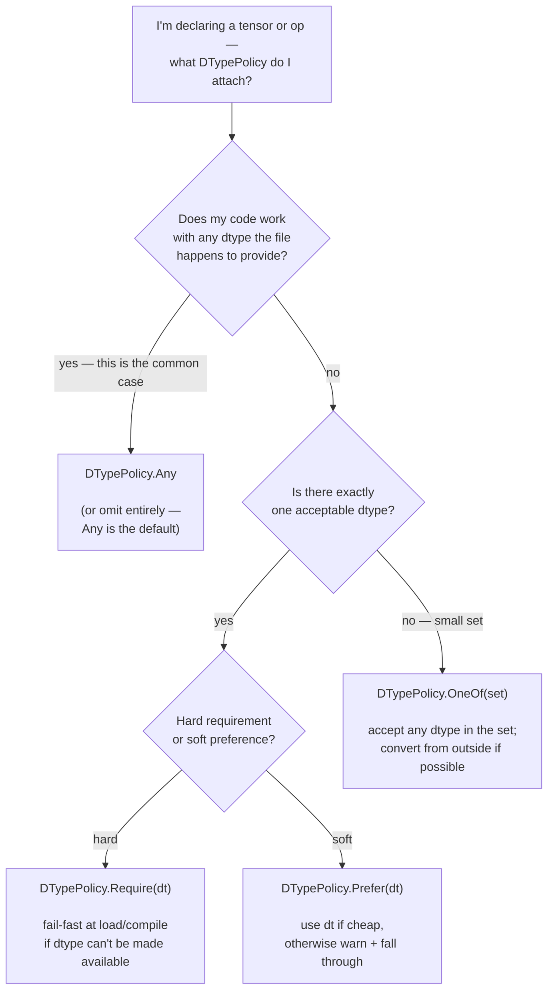
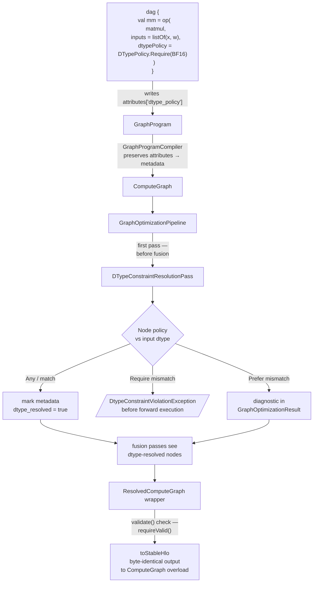
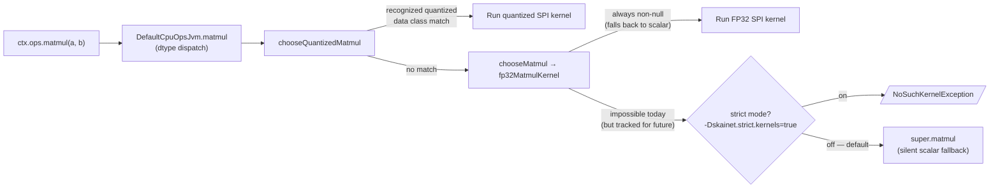
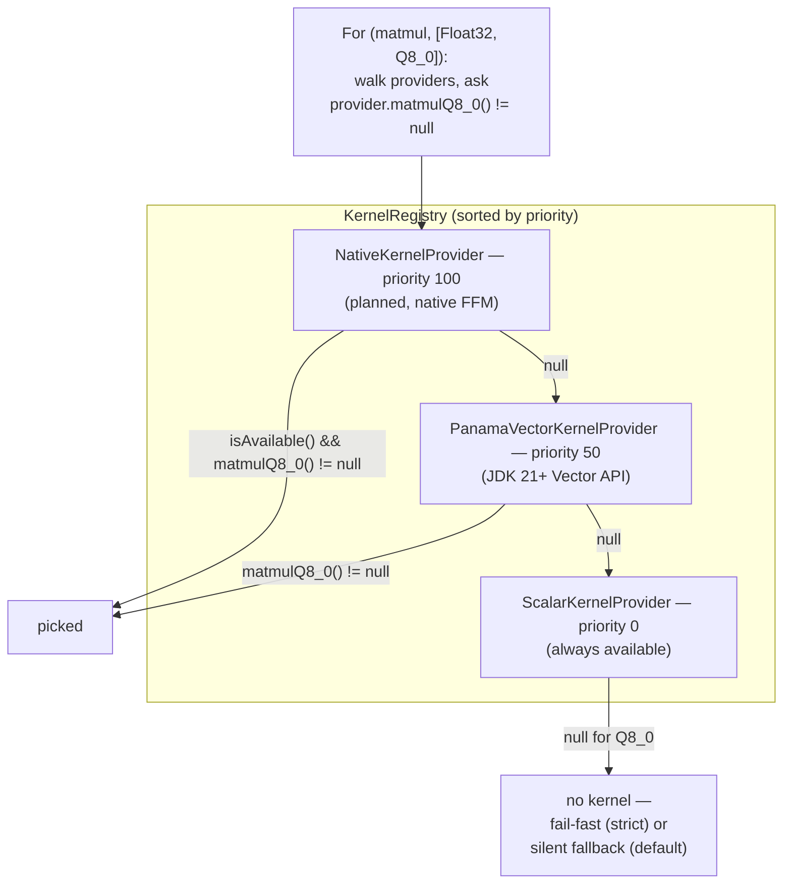

# The SKaiNET DType Model

> **Status**: shipped in [#615](https://github.com/SKaiNET-developers/SKaiNET/issues/615) / [#616](https://github.com/SKaiNET-developers/SKaiNET/pull/616). This document was originally the **RFC** that proposed the hybrid adaptive DSL with optional dtype constraints; now that the design is implemented, the page explains *how the model works* and *what to use when*.
>
> For the maintainer-facing reference (every concept mapped to its SKaiNET file path), see [`docs/modules/ROOT/pages/contributing/dtype-model.adoc`](docs/modules/ROOT/pages/contributing/dtype-model.adoc).

## TL;DR

SKaiNET is **architecture-first** by default — your DSL describes the model, dtype follows whatever the file actually stored. When some op or backend genuinely *requires* a specific dtype (NPU int8, a fused BF16 attention kernel, …), you attach a small `DTypePolicy` instead of rewriting the model. The loader or the constraint-resolution pass either satisfies the policy or **fails before forward execution** — never silently during it.

Four moving parts:

1. **`DTypePolicy`** — the four-arm sealed type (`Any` / `Require` / `Prefer` / `OneOf`) you attach to loaders, ops, or graph nodes.
2. **Loaders** — `SafeTensorsParametersLoader.withPolicy(policy)` and `StreamingGgufParametersLoader.withPolicy(policy)` enforce the policy at load time.
3. **`DTypeConstraintResolutionPass`** — runs inside the graph optimization pipeline before fusion; enforces per-node policies and produces a `ResolvedComputeGraph`.
4. **`KernelStrictness`** + `KernelProvider.supports(...)` — runtime fail-fast for cases where graph-prep didn't run.

## The four dtype concepts

Every tensor in SKaiNET carries dtype information at four conceptual stages of its life. Each stage is implemented somewhere concrete.

```mermaid
flowchart LR
    File[(Model file<br/>.gguf / .safetensors)]
    File -->|"GGMLQuantizationType<br/>SafeTensors DataType"| Source["source dtype<br/>(what the file stores)"]
    Source -->|"loader picks TensorData subtype<br/>per source dtype + policy"| Logical["logical dtype<br/>Tensor.dtype: KClass&lt;T&gt;<br/>(what the engine sees)"]
    Logical -->|"DSL declares per-op constraint<br/>via dtypePolicy(...)"| Required["required dtype<br/>(what the op/backend needs)"]
    Required -->|"constraint resolution +<br/>KernelRegistry.bestAvailable"| Lowered["lowered dtype<br/>(what the kernel actually gets)"]
    Lowered --> Kernel[(SIMD kernel<br/>Panama / scalar / native)]
```



| Stage | Lives in | Notes |
|---|---|---|
| source dtype | `GGMLQuantizationType`, SafeTensors `DataType` | what's on disk (`F32`, `BF16`, `Q4_K`, `Q8_0`, …) |
| logical dtype | `Tensor<T : DType, V>.dtype: KClass<T>` | explicit metadata, never inferred from packed-byte shape |
| required dtype | `DTypePolicy.Require(dt)` etc. on DSL node `attributes["dtype_policy"]` | optional; absent = adaptive |
| lowered dtype | whatever `KernelRegistry.bestAvailable()?.matmul*()` returns | post-resolution; matches a registered kernel |

The whole point of the four-stage split is to keep the loader's job (what does the file say?) separate from the op's job (what dtype do I need?) separate from the runtime's job (what kernel do I actually have?). Each can change independently.

## When to use which `DTypePolicy`

Use this decision tree:



Concrete examples:

| Situation | Policy |
|---|---|
| "Load this GGUF however it ships." | `DTypePolicy.Any` — adaptive default; same model definition loads Q4_K, Q8_0, or FP16. |
| "This SafeTensors file *must* keep BF16 native because my matmul kernel routes on it." | `DTypePolicy.Require(BF16)` |
| "I'd prefer BF16 to avoid the 2× memory cost, but FP32 is fine if BF16 isn't available." | `DTypePolicy.Prefer(BF16)` |
| "My attention kernel accepts either FP32 or BF16, nothing else." | `DTypePolicy.OneOf(setOf(FP32, BF16))` |
| "NPU backend only runs int8; reject anything else at load." | `DTypePolicy.Require(Int8)` (fails fast today — no Int8 cast kernel ships in #615) |

## Loader workflow: file → policy → tensor

Both loaders (SafeTensors and GGUF) accept the same `DTypePolicy` shape. They validate it eagerly at construction time, then enforce it per-tensor as they iterate the file.

```mermaid
flowchart TD
    Start([Open model file]) --> Build["SafeTensorsParametersLoader.withPolicy(policy)<br/>or<br/>StreamingGgufParametersLoader.withPolicy(policy)"]
    Build --> Validate{Policy<br/>satisfiable<br/>by this loader?}
    Validate -->|no — e.g. Require(FP16) on GGUF| FailEarly[/IllegalArgumentException<br/>before any tensor is read/]
    Validate -->|yes| Iter[Iterate tensors]
    Iter --> Source{Source dtype<br/>vs policy}
    Source -->|"Any, or match"| Native["Native TensorData subtype<br/>Q4_KBlockTensorData /<br/>Q8_0BlockTensorData /<br/>Bf16DenseTensorData /<br/>FloatArrayTensorData"]
    Source -->|"Require mismatch +<br/>no cast kernel"| FailLoad[/IllegalArgumentException<br/>fail at load/]
    Source -->|"Prefer mismatch"| Soft[Warn + dequant to fallback]
    Native --> Tensor([Tensor with explicit<br/>logical shape + dtype])
    Soft --> Tensor
```

Key property: **logical shape is set from the file header, not from the packed-byte length**. A Q4_K tensor's `Q4_KBlockTensorData.shape` is its multi-dimensional logical shape; its `packedData: ByteArray` is the implementation detail. The graph sees the logical shape.

## Graph workflow: DSL → policy → resolved graph → HLO

Once a tensor is in the engine, the DSL lets you attach per-op or per-node policies. The constraint-resolution pass enforces them at graph-prep time, then the resolved graph flows into the HLO converter (and any future backend).



The `dtype_resolved` marker is the proof that the pass ran. The `ResolvedComputeGraph` wrapper's `validate()` checks for it; the `toStableHlo(ResolvedComputeGraph)` overload calls `validate()` by default.

## Runtime kernel dispatch + fail-fast

Inside `ctx.ops.matmul(a, b)`, the runtime walks the registered providers by priority. If nothing matches and strict mode is on, you get a clean error instead of a silent scalar fallback.





`KernelProvider.supports(opName, dtypeKeys)` is the introspection query the resolution pass uses to decide whether a `Require` constraint can be satisfied via an existing kernel.

## End-to-end: putting it all together

A worked example showing all four layers in one inference session:

```kotlin
import sk.ainet.context.DirectCpuExecutionContext
import sk.ainet.io.RandomAccessSource
import sk.ainet.io.safetensors.SafeTensorsParametersLoader
import sk.ainet.lang.dag.dag
import sk.ainet.lang.dag.op
import sk.ainet.lang.tensor.ops.MatmulOperation
import sk.ainet.lang.tensor.ops.TensorSpec
import sk.ainet.lang.types.BF16
import sk.ainet.lang.types.DTypePolicy
import sk.ainet.lang.types.FP32

// 1. LOAD with an explicit dtype policy
val ctx = DirectCpuExecutionContext.create()
val loader = SafeTensorsParametersLoader.withPolicy(
    sourceProvider = { RandomAccessSource.open("model.safetensors") },
    policy = DTypePolicy.Require(BF16),       // keep BF16 native, fail if file lacks it
)
loader.load(ctx, BF16::class) { name, tensor ->
    // tensor.dtype == BF16::class
    // tensor.data is Bf16DenseTensorData with explicit logical shape
    registerWeight(name, tensor)
}

// 2. DECLARE the graph with a per-op policy
val program = dag {
    val input = input<FP32>("input", TensorSpec("input", listOf(1, 4096), "FP32"))
    val weight = parameter<BF16, Float>("attn_proj") { shape(4096, 4096) { ones() } }
    val projection = op(
        operation = MatmulOperation<FP32, Float>(),
        inputs = listOf(input, weight),
        dtypePolicy = DTypePolicy.Require(BF16),   // attn projection must run BF16
    )
    output(projection.first())
}

// 3. COMPILE — constraint resolution runs before fusion
val graph = GraphProgramCompiler().compile(program)        // ComputeGraph
val resolved = GraphOptimizationPipeline.createDefault()
    .optimize(graph)                                       // includes DTypeConstraintResolutionPass
    .graph                                                 // throws DtypeConstraintViolationException if mismatch

// 4. EXECUTE — runtime fail-fast as a backstop
System.setProperty("skainet.strict.kernels", "true")       // optional: surface missing kernels
val output = ctx.ops.matmul(inputTensor, weightTensor)     // dispatch via KernelRegistry
```

Each layer enforces the contract for the layer below:

- The loader guarantees every produced tensor has the right *source*-loaded dtype.
- The resolution pass guarantees every graph node has the right *required* dtype on its inputs (or fails).
- The runtime dispatch guarantees the right *lowered* kernel runs (or fails if strict mode is on).

## Where the implementation lives

| Piece | Path |
|---|---|
| `DTypePolicy` sealed type | `skainet-lang/skainet-lang-core/src/commonMain/kotlin/sk/ainet/lang/types/DTypePolicy.kt` |
| `SafeTensorsParametersLoader.withPolicy(...)` | `skainet-io/skainet-io-safetensors/src/commonMain/kotlin/sk/ainet/io/safetensors/SafeTensorsParametersLoader.kt` |
| `StreamingGgufParametersLoader.withPolicy(...)` | `skainet-io/skainet-io-gguf/src/commonMain/kotlin/sk/ainet/io/gguf/StreamingGgufParametersLoader.kt` |
| `dag { ... dtypePolicy(...) }` DSL extension | `skainet-lang/skainet-lang-dag/src/commonMain/kotlin/sk/ainet/lang/dag/DtypePolicyDsl.kt` |
| `DTypeConstraintResolutionPass` | `skainet-compile/skainet-compile-opt/src/commonMain/kotlin/sk/ainet/compile/opt/passes/DTypeConstraintResolutionPass.kt` |
| `ResolvedComputeGraph` | `skainet-compile/skainet-compile-dag/src/commonMain/kotlin/sk/ainet/lang/graph/ResolvedComputeGraph.kt` |
| `toStableHlo(ResolvedComputeGraph)` overload | `skainet-compile/skainet-compile-hlo/src/commonMain/kotlin/sk/ainet/compile/hlo/dag2hlo.kt` |
| `KernelProvider.supports(...)` capability query | `skainet-backends/skainet-backend-api/src/commonMain/kotlin/sk/ainet/backend/api/kernel/KernelProvider.kt` |
| `KernelStrictness` system-property fail-fast | `skainet-backends/skainet-backend-api/src/jvmMain/kotlin/sk/ainet/backend/api/kernel/KernelStrictness.kt` |
| Runtime check in `ctx.ops.matmul` | `skainet-backends/skainet-backend-cpu/src/jvmMain/kotlin/sk/ainet/exec/tensor/ops/DefaultCpuOpsJvm.kt` |

## What's intentionally not here

Three categories of work that the model is *shaped for* but doesn't ship today:

- **Cast kernels** (Q4_K → Int8, FP32 → BF16, …). When a `Require` constraint needs a cast that isn't registered, the resolution pass fails fast — exactly what the RFC prescribed. Concrete casts are bound up with precision / lossy-conversion policy and live in their own track.
- **Layout-aware capability queries** on `KernelProvider`. The `supports(opName, dtypeKeys)` API is dtype-aware only; future layout-aware variants are a follow-up.
- **NPU backend and MLIR / native code lowering**. The compiled path terminates at StableHLO today.

## Related

- [`docs/.../contributing/dtype-model.adoc`](docs/modules/ROOT/pages/contributing/dtype-model.adoc) — maintainer-facing reference: every concept's file path, the loader audit tables, the anti-patterns the model prevents.
- [`docs/.../contributing/benchmarks.adoc`](docs/modules/ROOT/pages/contributing/benchmarks.adoc) — engine benchmark program that exercises the kernel SPI the dispatch chain calls into.
- [Issue #615](https://github.com/SKaiNET-developers/SKaiNET/issues/615) / [PR #616](https://github.com/SKaiNET-developers/SKaiNET/pull/616) — implementation history.
