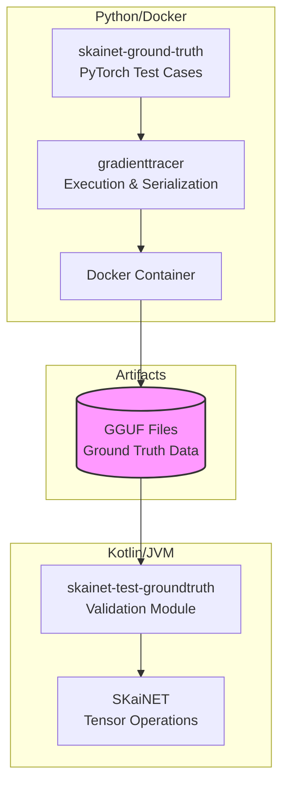
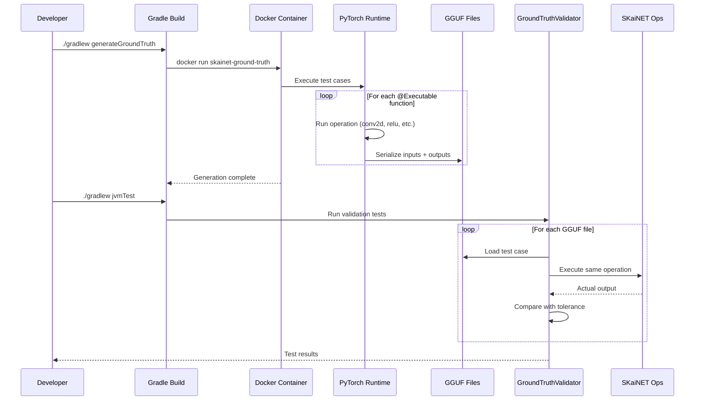
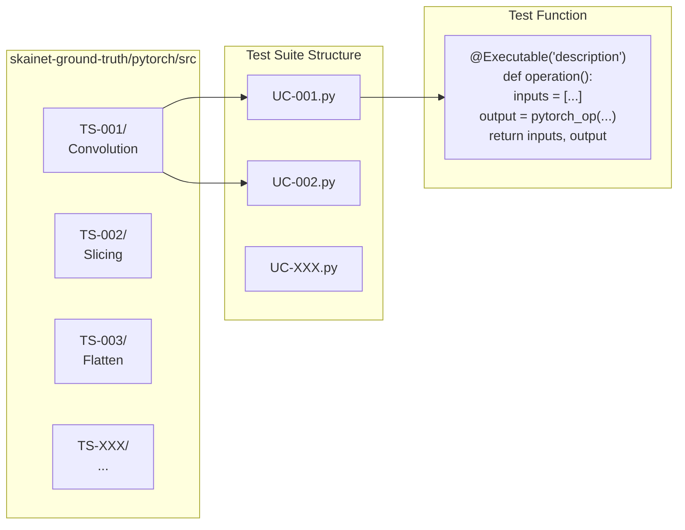
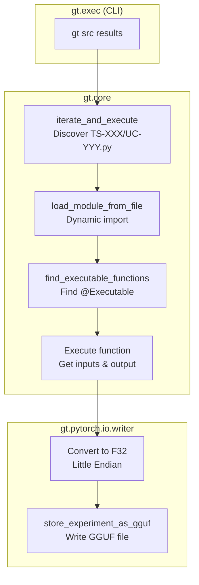
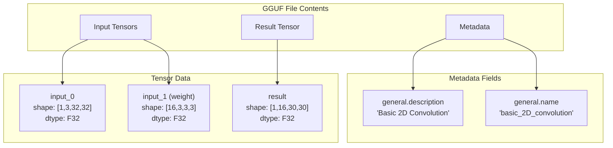
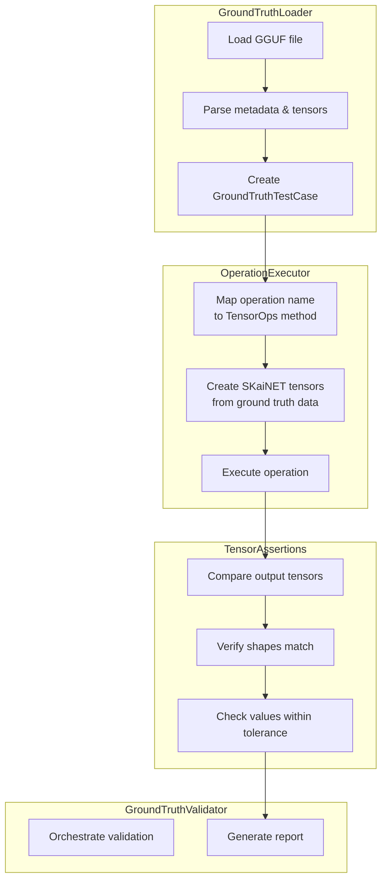
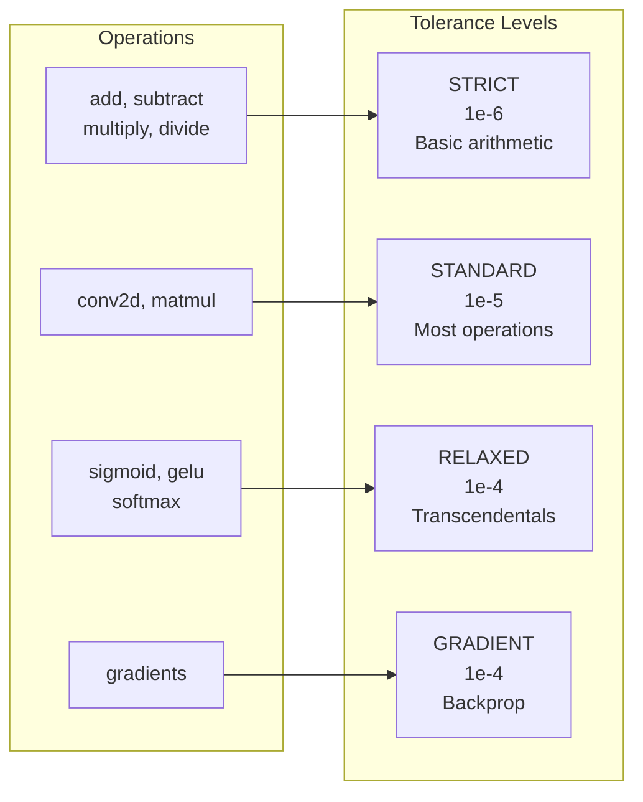
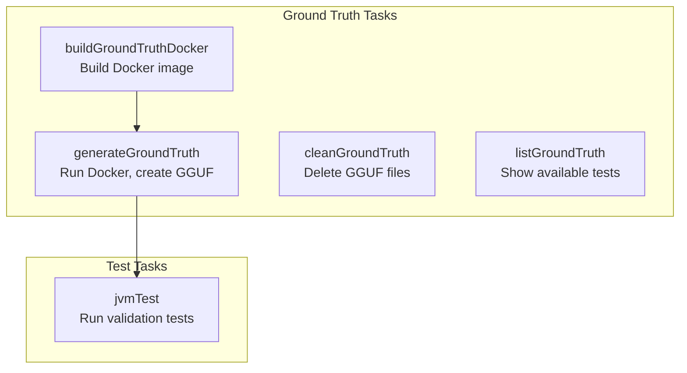
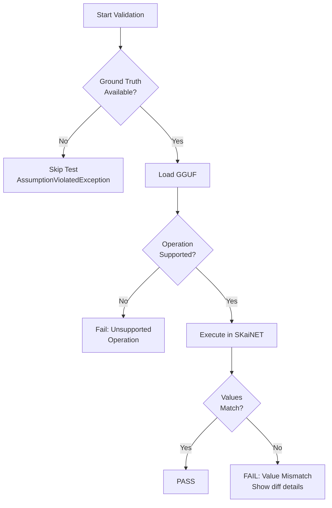

# SKaiNET Ground Truth Testing Architecture

This document describes the testing infrastructure for validating SKaiNET tensor operations against PyTorch ground truth.

## Overview

The ground truth testing system ensures that SKaiNET operations produce identical results to PyTorch. It consists of three projects working together:



## Projects & Responsibilities

| Project | Language | Responsibility |
|---------|----------|----------------|
| **gradienttracer** | Python | Core framework: test discovery, execution, GGUF serialization |
| **skainet-ground-truth** | Python | Test case definitions organized by test suite |
| **skainet-test-groundtruth** | Kotlin | GGUF loading, validation, SKaiNET comparison |

## Data Flow



## Component Architecture

### 1. Ground Truth Generation (Python)



### 2. Execution & Serialization (gradienttracer)



### 3. GGUF File Structure



### 4. Validation (Kotlin)



## Tolerance Configuration

Different operations require different tolerances due to floating-point precision:



## Test Suite Organization

```
skainet-ground-truth/pytorch/
├── Dockerfile              # Docker image definition
├── pyproject.toml          # Python dependencies
├── requirements.txt
├── src/
│   ├── TS-001/            # Convolution operations
│   │   ├── UC-001.py      # Basic conv2d
│   │   ├── UC-002.py      # Strided conv2d
│   │   └── ...
│   ├── TS-002/            # Slicing operations
│   ├── TS-003/            # Flatten operations
│   ├── TS-006/            # Broadcasting
│   └── TS-007/            # Advanced slicing
└── results/               # Generated GGUF files (not in git)
    ├── TS-001/
    │   ├── TS_001_UC_001.basic_2D_convolution.gguf
    │   └── ...
    └── ...
```

## Gradle Tasks



### Usage

```bash
# First time setup: build Docker image
./gradlew :skainet-test:skainet-test-groundtruth:buildGroundTruthDocker

# Generate ground truth GGUF files
./gradlew :skainet-test:skainet-test-groundtruth:generateGroundTruth

# Run validation tests
./gradlew :skainet-test:skainet-test-groundtruth:jvmTest

# List available test suites
./gradlew :skainet-test:skainet-test-groundtruth:listGroundTruth

# Clean generated files
./gradlew :skainet-test:skainet-test-groundtruth:cleanGroundTruth
```

## Adding New Test Cases

### 1. Create Python Test (in skainet-ground-truth)

```python
# src/TS-001/UC-009.py
import torch
from gt.core import Executable

@Executable("Dilated Convolution with stride 2")
def dilated_conv_stride2():
    x = torch.randn(1, 3, 32, 32, requires_grad=True)
    conv = torch.nn.Conv2d(3, 16, kernel_size=3, stride=2, dilation=2)
    y = conv(x)
    return [x, conv.weight, conv.bias], y
```

### 2. Regenerate Ground Truth

```bash
./gradlew generateGroundTruth
```

### 3. Add Kotlin Validation (optional - for specific params)

```kotlin
@Test
fun `validate dilated conv with stride 2`() {
    val testCase = GroundTruthLoader.load("path/to/test.gguf")
    validator.assertValid(testCase, params = operationParams {
        stride(2)
        dilation(2)
    })
}
```

## Validation Report Format

```
============================================================
Validation Report: Basic 2D Convolution
============================================================
Operation: conv2d
Test Suite: TS-001
Use Case: UC-001
Source: results/TS-001/TS_001_UC_001.basic_2D_convolution.gguf

Forward Pass: PASSED
  Max absolute difference: 2.384185e-07
  Max relative difference: 1.192092e-06

Overall: PASSED
============================================================
```

## Error Handling



## CI/CD Integration

```yaml
# .github/workflows/ground-truth.yml
name: Ground Truth Validation

on: [push, pull_request]

jobs:
  validate:
    runs-on: ubuntu-latest
    steps:
      - uses: actions/checkout@v4

      - name: Set up Docker
        uses: docker/setup-buildx-action@v3

      - name: Build ground truth Docker image
        run: ./gradlew buildGroundTruthDocker

      - name: Generate ground truth
        run: ./gradlew generateGroundTruth

      - name: Run validation tests
        run: ./gradlew :skainet-test:skainet-test-groundtruth:jvmTest

      - name: Upload test reports
        uses: actions/upload-artifact@v4
        with:
          name: ground-truth-reports
          path: '**/build/reports/tests/**'
```

## Summary

The ground truth testing architecture provides:

1. **Isolation**: PyTorch runs in Docker, no Python setup needed in SKaiNET
2. **Reproducibility**: GGUF files capture exact tensor values
3. **Automation**: Gradle tasks handle Docker orchestration
4. **Flexibility**: Easy to add new test cases in Python
5. **Detailed Reporting**: Clear pass/fail with numerical differences
6. **CI-Ready**: Integrates with standard CI/CD pipelines
